```{r setup, include=FALSE}
knitr::opts_chunk$set(echo = FALSE)
```

## Matter is conserved
<hr>

<div style="float: left; width: 45%;">

* **Law of the conservation of mass**

<br />

* **Chemical elements are essential requirements for living organisms**

<br />

* **Elements move between atmosphere, soils, organisms and bodies of water**

<br />

</div>


## Importance of biogeochemical cycling
<hr>


## Nutrient cycling: Basics
<hr>


## Carbon cycle: small scale
<hr>

## Carbon cycle: global
<hr>

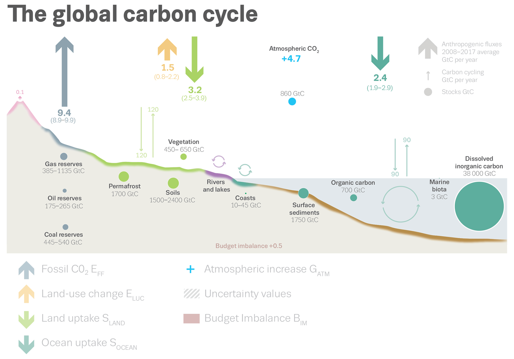

## Nitrogen cycle: small scale
<hr>

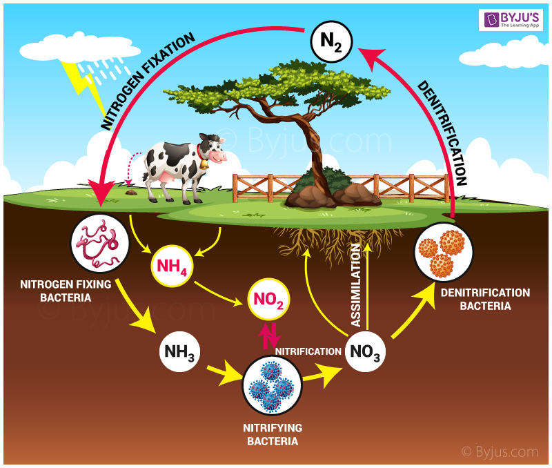

## Nitrogen cycle: global
<hr>

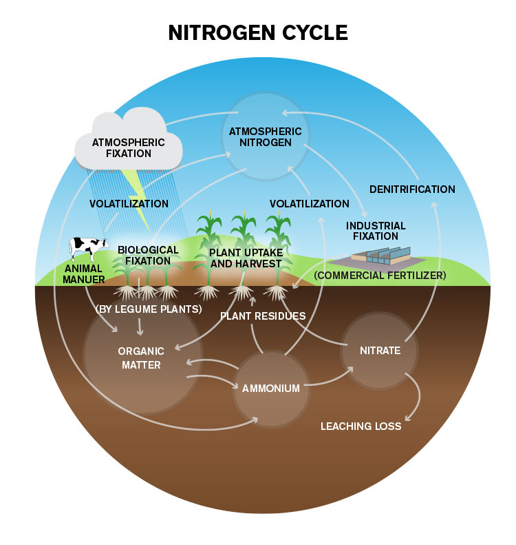

## Ecosystem Carbon
<hr>
<br />


## Global Ecosystem Carbon: IPCC
<hr>
<br />


##
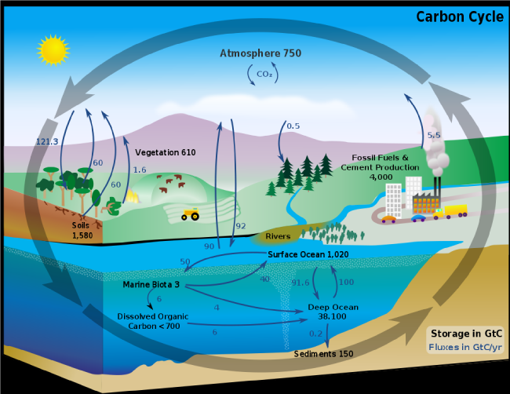

## Carbon inputs to ecosystems
<hr>
<br />
<br />


<div style="float: left; width: 45%;">
* Driven by plant photosynthesis

<br />

* C from photosynthesis = 50% of Earth's organic matter

<br />

*  Living biomass holds ~1,000 gigatons of C (mostly wood) 

<br />

*  Dead biomass holds ~1,200 gigatons of C
</div>

##
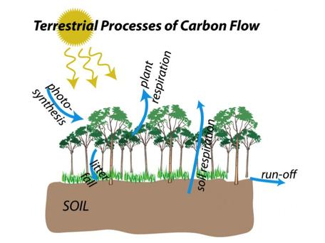

## Gross Primary Production (GPP)
<hr> 
<br />

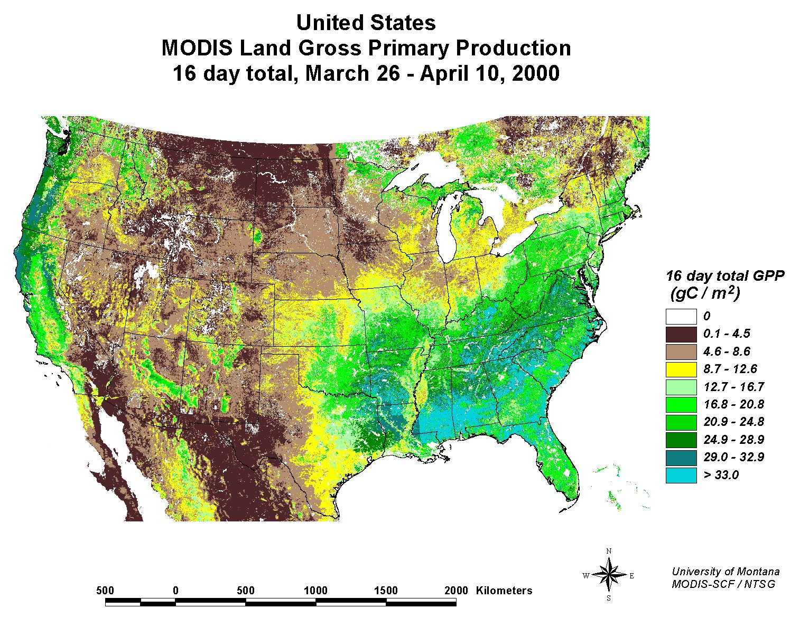


<div style="float: left; width: 45%;">
>- Sum of net photosynthesis by all tissue at a given scale

<br />

>- Canopy processes + environmental factors

<br />

>- Canopy gradients are key but not always straightforwards

<br />

>- Water availability at larger scales RULES

<br />

>- Hard to physically measure

</div>


## Essential Nutrients required for plant growth
<hr>
<br />


## Macro vs Micro- nutrients
<hr>
<br />

* **Macronutrients required in largest amounts**
  + commonly limit plant growth

<br />

* **Micro-nutrients are required, but in small amounts**

<br />

* **Beneficial nutrients enhance growth under specific conditions**
  + ferns required aluminum
  + nitrogen-fixing plants need cobalt

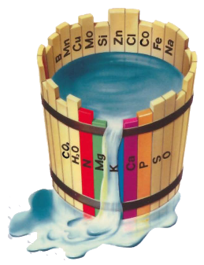

## Nutrient limitation on ecosystem scale
<hr>
<br />

<div style="float: left; width: 45%;">

* **Most vegetation on Earth struggles to reach optimum productivity**
  + sparse nutrients, such as N or P
  
  <br />

* **Global vegetation productivity -25% compared to a completely fertile Earth**

<br />

* **How do we define plant nutrient limitation?**

<br />

* **How do ecosystems respond to Δ in nutrients?**
</div>

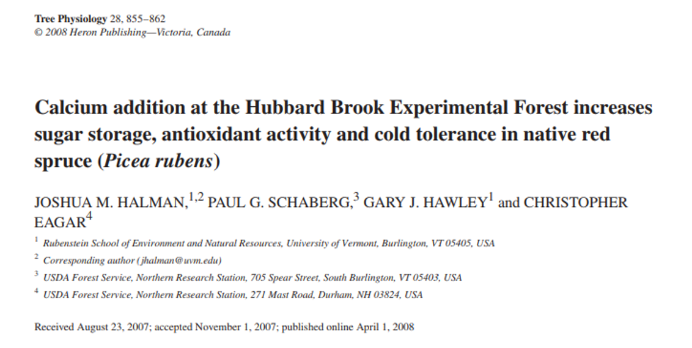


## Nutrient limitation in plants
<hr>


## Fine roots: Biomes
<hr>
<br />

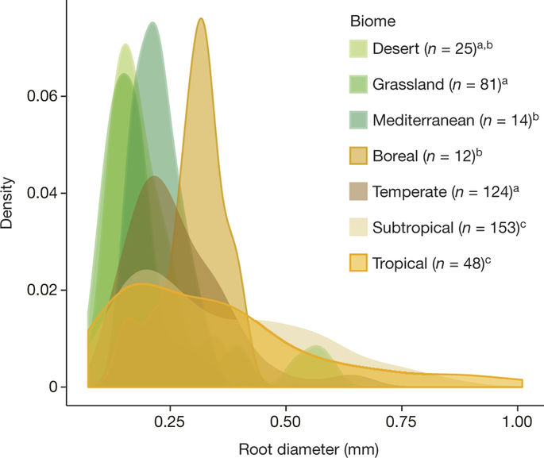

## Mycorrhizal symbiosis with plant roots
<hr>

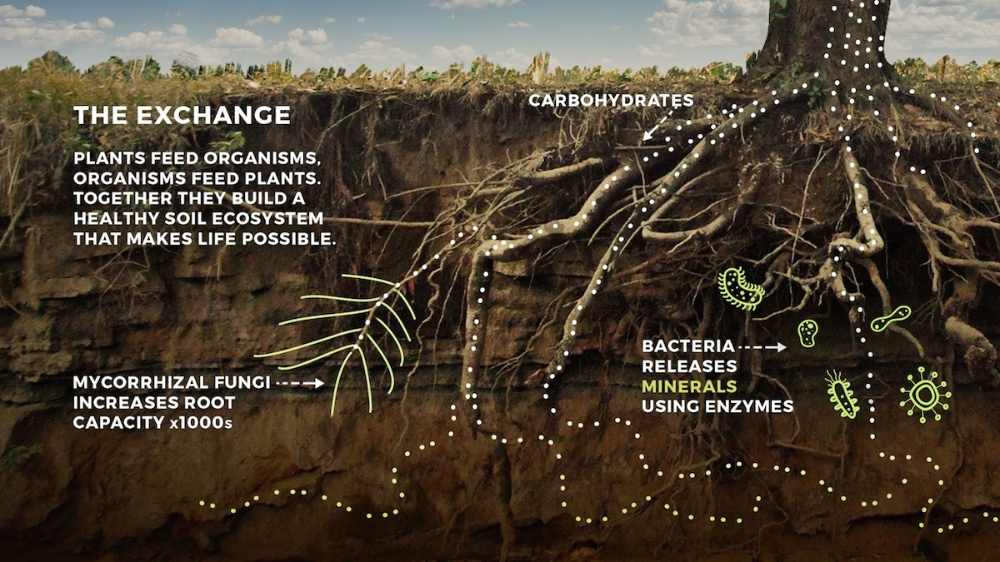

## Mycorrhizae
<hr>
<br />
<br />

<div style="float: left; width: 45%;">

* **Extrension of roots systems into bulk soil**
  + carbon source for fungus
  + nutrients passed to plants
  + <strong><span style="color:green">adds 1-15m per 1cm of root</span></strong>

<br />
<br />
<br />

* **Most plants associate with mycorrhizae**
  + 80% angiosperms
  + all gymnosperms
  + many ferns

</div>

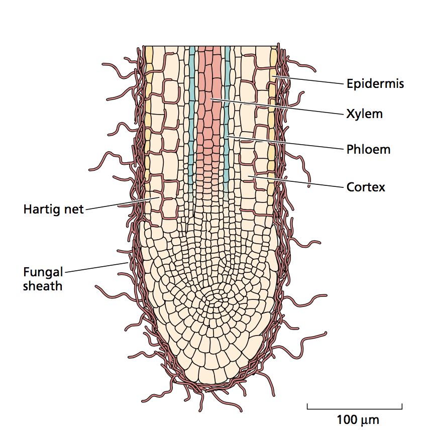

## Nitrogen fixing plants
<hr>
<br />
<br />
<br />

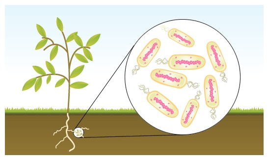

* **Symbiosis with N-fixing bacteria**
  + similar trade as mycorrhizae

<br />

* **N instead fixed from atmosphere**
  + energetically expensive

<br />

* **Common to high light / low N sites**


## Ecosystem Nutrient Cycling
<hr>

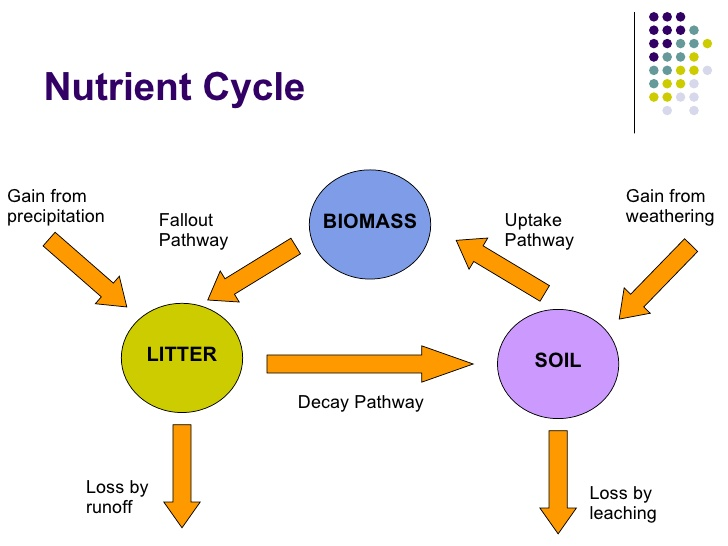


## Ecosystem Nutrient Cycling
<hr>
<br />
<br />

<div style="float: left; width: 40%;">

* **Entry of nutrients into system**
  + biological fixation
  + weathering
  + deposition

<br />

* **Internal transfer**
  + plants, microbes, consumers & environment
  + decomposition
 
 <br />
 
* **Loss**

</div>


## Ecosystem Nitrogen Cycling
<hr>
<br />


## Nitrogen inputs: Fixation
<hr>
<br />
<br />


<div style="float: left; width: 45%;">

* **Energetically expensive**
  + can be highly advantageous

<br />

* **N fixers limited by other resources**
  + co-limitation of P
  + limited once canopies closed (light)
  
<br />

* **These factors reduce the competitive advantageof N fixers**
  + N absorption becomes cheaper
 
 </div>   

## Nitrogen inputs: Deposition
<hr>
<br />

* **Humans**
  + fertilizers
  + animal husbandry
  + fossil fuels
  + released as NH3 & NOx
 
 <br /> 
  
* **Precipitation**

 <br /> 
 
* **Dust / aerosols**
  


## Nitrogen inputs: Clean air act (1970)
<hr>
<br />

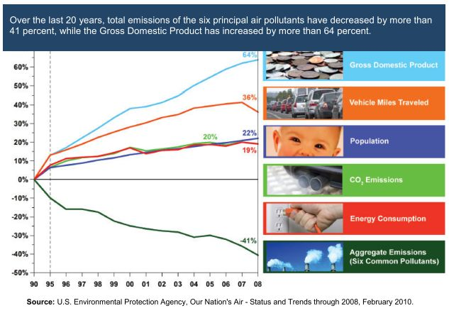


## Decomposition: Leaching / Fragmentation / Alteration
<hr>


## Decomposition rate: Ecosystems
<hr>
<br />

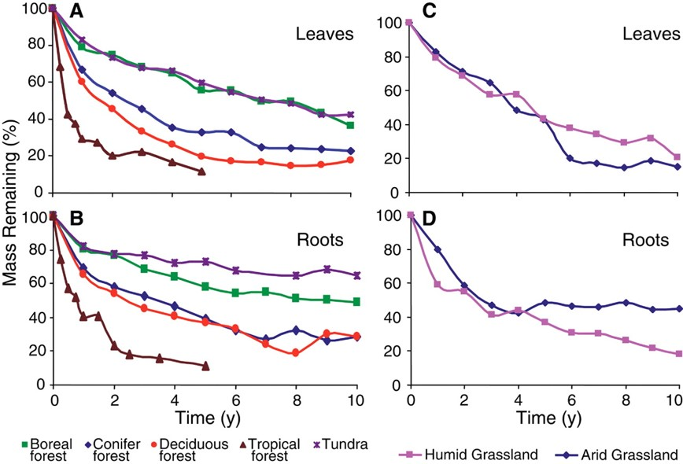

 
## Soil Nitrogen Pool
<hr>
<br />
<br />
<br />


<div style="float: left; width: 45%;">

* **N availability determines fate**
  + organic N → NH<sub>4</sub> → NO<sub>3</sub>
  + Shifts in mycorrhizal contribution
  
  Release inorganic NH<sub>4</sub> into soil
 
 <br />
 
* **When N availability ↓:**
  + competition !!!

 </div> 
 
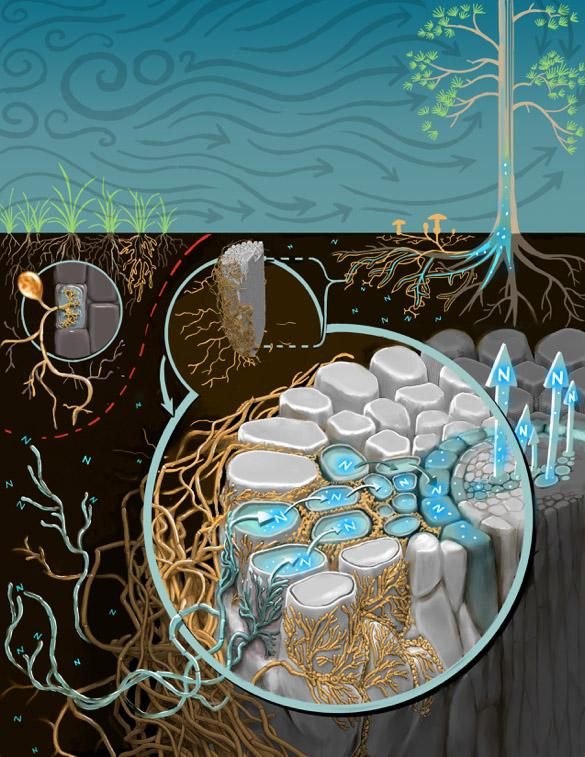

## Pathways of N loss
<hr>
<br />

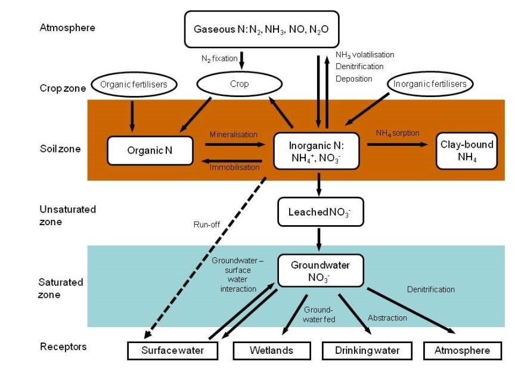

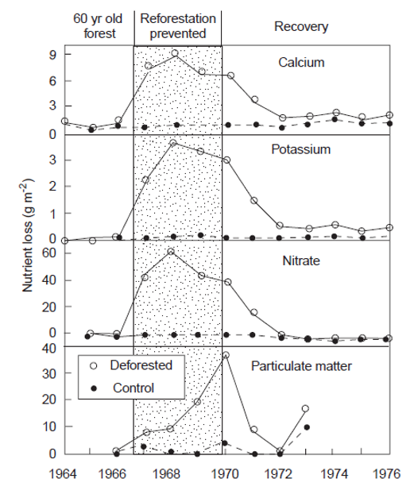

## Agriculture: N solution losses
<hr>


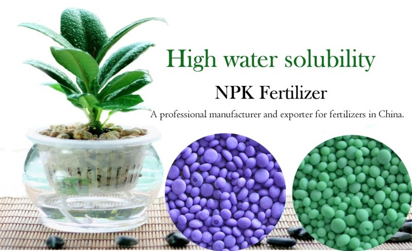

