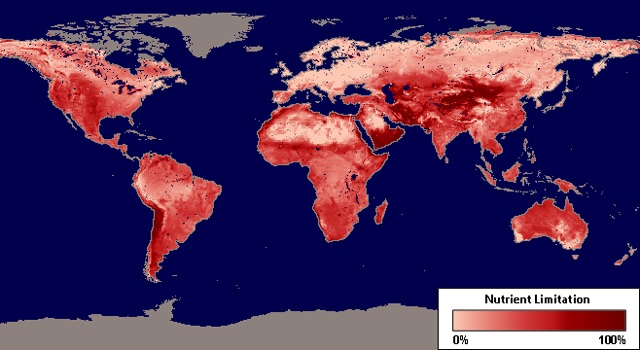
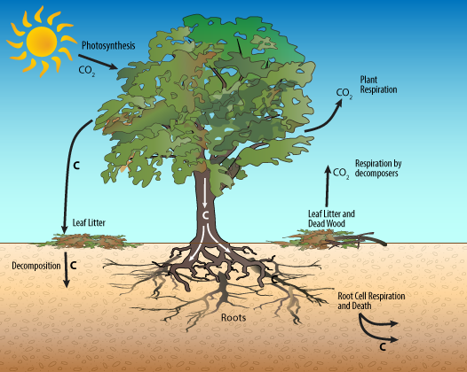

```{r setup, include=FALSE}
knitr::opts_chunk$set(echo = FALSE)
```

## Matter is conserved
<hr>
<br />
<br />
<br />
<br />

<div style="float: left; width: 45%;">

* **Law of the conservation of mass**

<br />

* **Chemical elements are essential requirements for living organisms**

<br />

* **Elements move between atmosphere, soils, organisms and bodies of water**

<br />

</div>


## Importance of biogeochemical cycling
<hr>



## Energy flows, but matter is recycled.
<hr>


## Ecosystem Nutrient Cycling
<hr>
<br />
<br />

<div style="float: left; width: 40%;">

* **Entry of nutrients into system**
  + biological fixation
  + weathering
  + deposition

<br />

* **Internal transfer**
  + plants, microbes, consumers & environment
  + decomposition
 
 <br />
 
* **Loss**

</div>


## Carbon cycle: small scale
<hr>




## Carbon cycle: global 
<hr>


## Carbon cycle: global 2018
<hr>


## Ecosystem Carbon Storage
<hr>
<br />


## Ecosystem Carbon Storage
<hr>
<br />


## Global Ecosystem Carbon: IPCC
<hr>
<br />


##


## Nitrogen cycle: small scale
<hr>


## Nitrogen cycle: global
<hr>


## Ecosystem Nitrogen Cycling
<hr>
<br />


## Nitrogen inputs: Deposition & Fixation
<hr>
<br />

* **Humans**
  + fertilizers
  + animal husbandry
  + fossil fuels
  + released as NH3 & NOx
 
 <br /> 
  
* **Precipitation**

 <br /> 
 
* **Dust / aerosols**


  

## Decomposition: Leaching / Fragmentation / Alteration
<hr>


## Decomposition rate: Ecosystems
<hr>
<br />


## Internal transfer: Mycorrhizal and Roots - SOIL N
<hr>
<br />


## N solution losses: Leaching and Agriculture
<hr>


