## Climate vs Weather

## Elements of weather

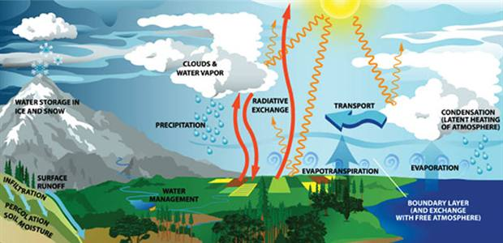

## What drives global climate zones?

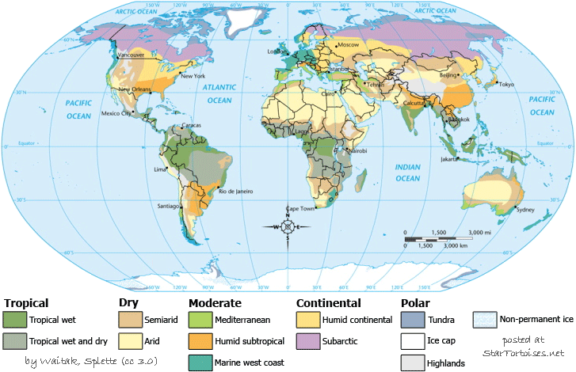

## Slope of Earth's surface causes uneven heating

 

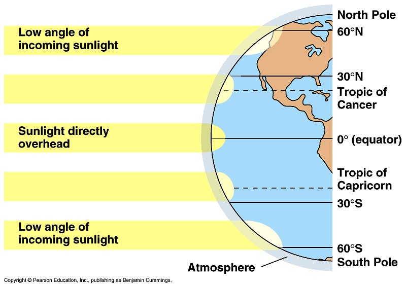

## Atmosphere circulation affects rainfall

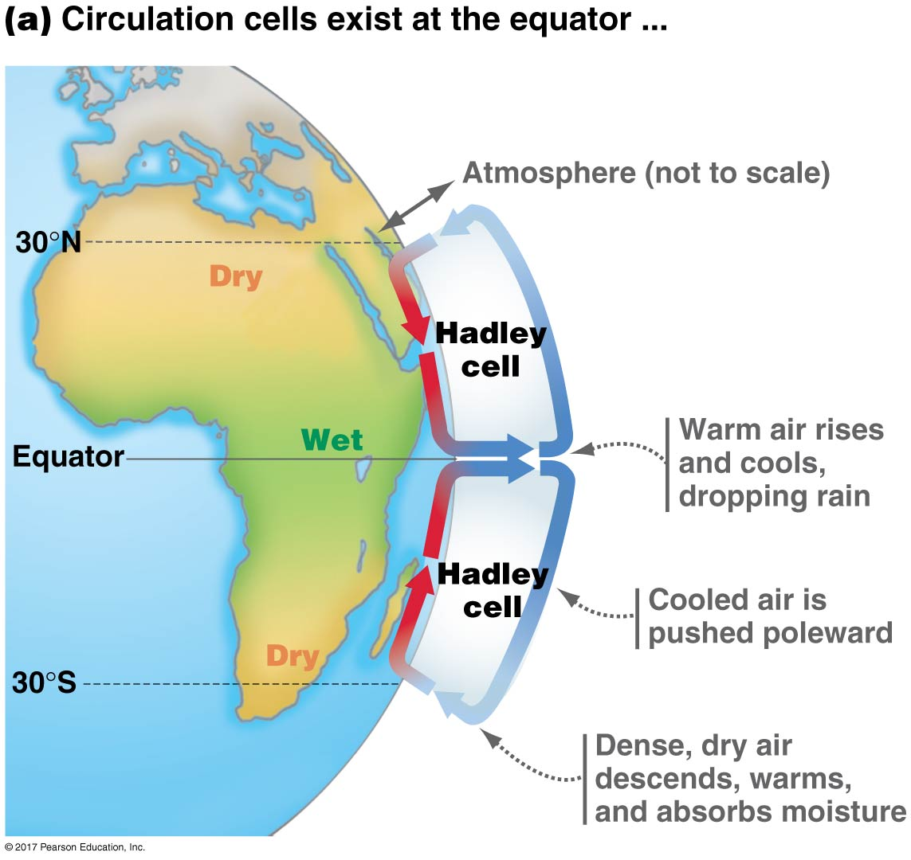

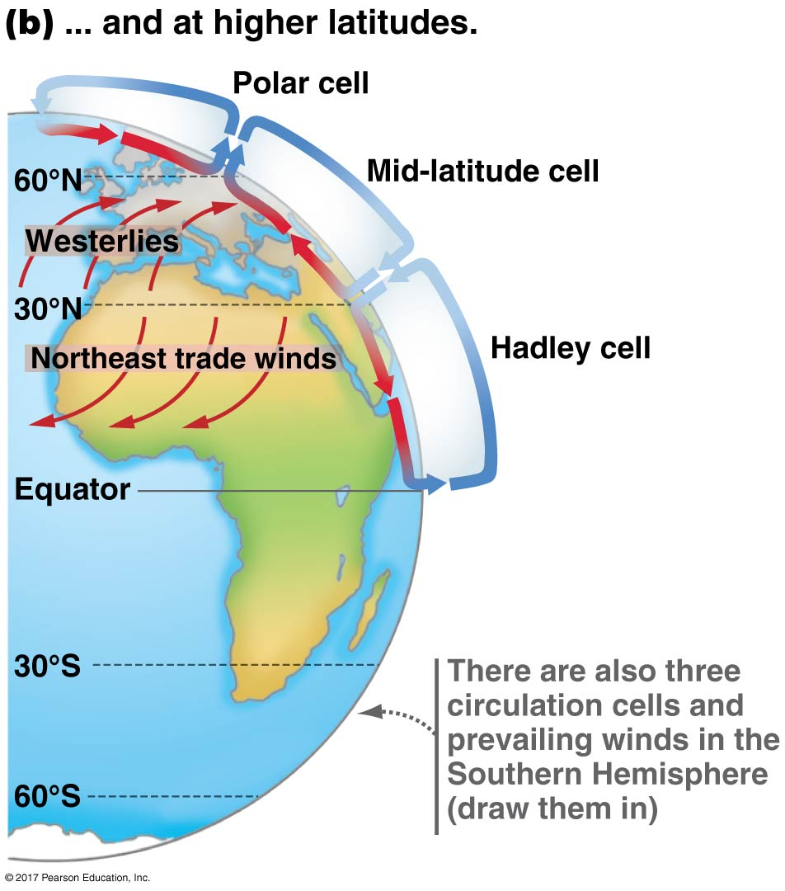

## Climate variability: Long time scales

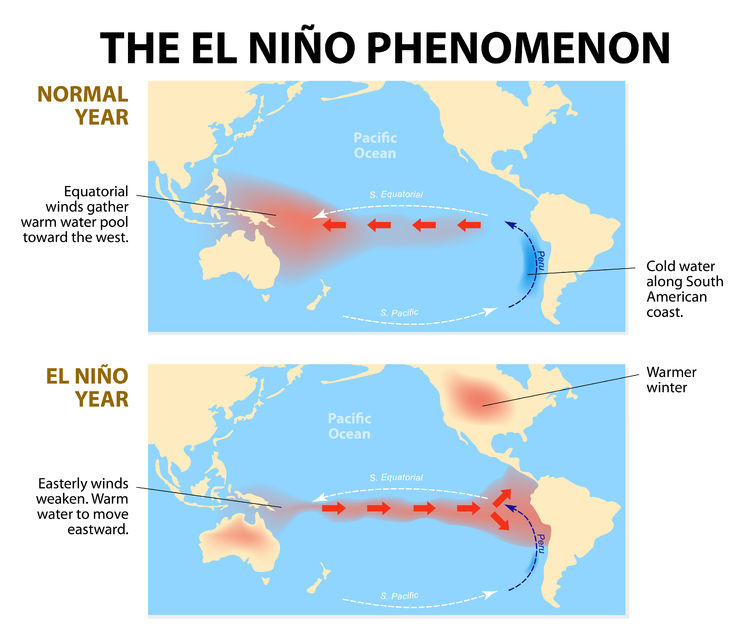

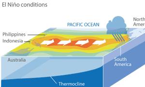

## Climate variability: Long time scales

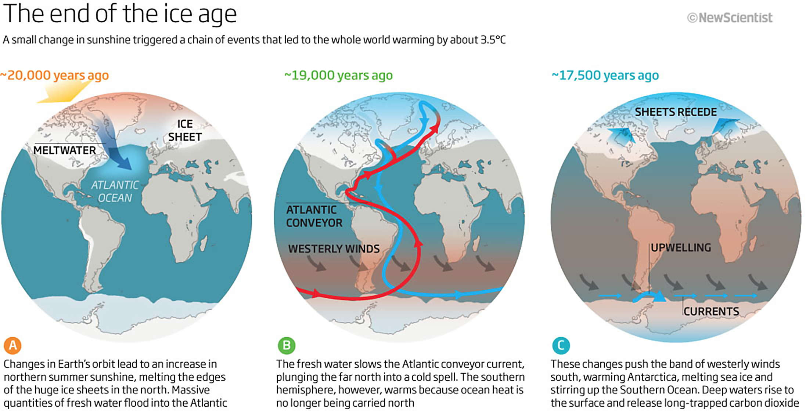

## Climate variability: Long time scales

## Climate Variability: Short time scales = Seasons

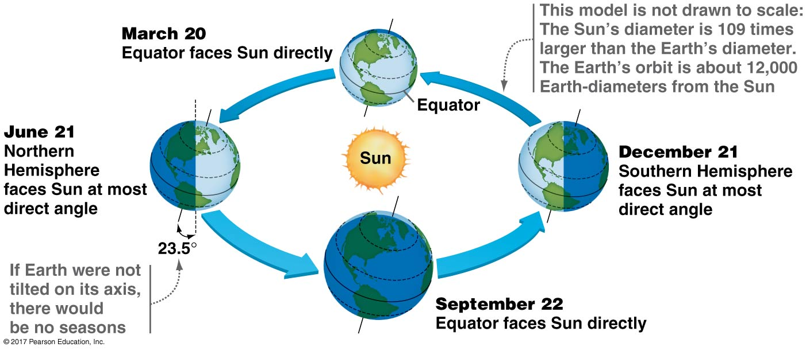

## Climate Variability: Short time scales = Weather

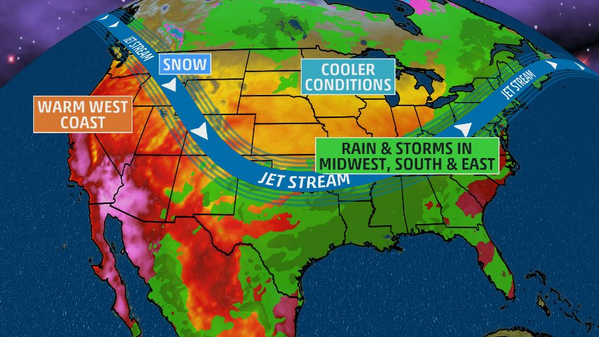

## Landform impacts climate: Rain Shadow

## Landform impacts weather: Hurricane

<iframe width="560" height="315" src="https://www.youtube.com/embed/h1eRp0EGOmE" frameborder="0" allow="autoplay; encrypted-media" allowfullscreen></iframe>

## Ocean impacts climate

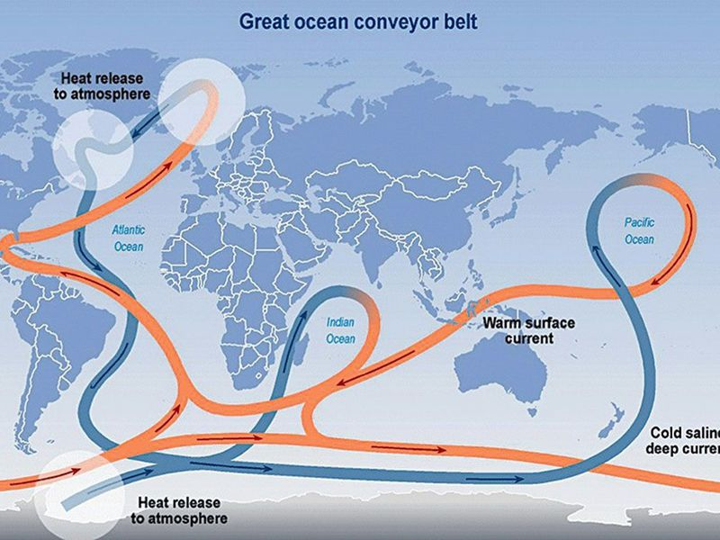

## Vegetation effects on climate

https://www.youtube.com/watch?v=Y3OWgb0Bv-A

## How does climate impact ecology?

## How does weather impact ecology?

<strong>Extreme weather such as hurricanes, torrential downpours and droughts will increases the risk for species extinction, especially in diverse ecosystems such as coral reefs and tropical rainforests.</strong>

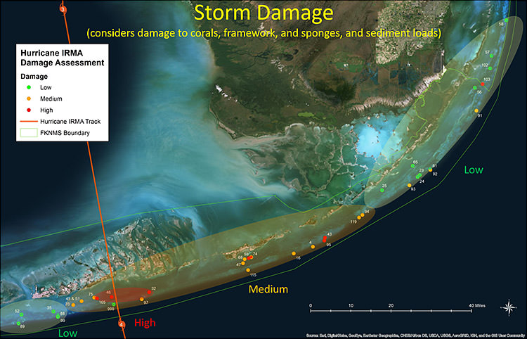

## Climate is a **Hot** Topic

<iframe width="560" height="315" src="https://www.youtube.com/embed/wXrYvd-LBu0" frameborder="0" allow="autoplay; encrypted-media" allowfullscreen></iframe>

## We are *modifiying* Earth's climate and weather

 

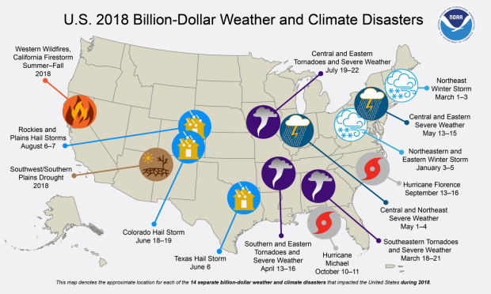

**notes**
* <strong>Changes in climate alter ecosystem processes</strong>
  + subtly and not so subtly
* <strong>USA 2017</strong>
  + Fire and storm frequency
  + Hurricane strength -- ?WHY?

## Atmosphere: Rotation → Corilis effect

<iframe width="560" height="315" src="https://www.youtube.com/embed/i2mec3vgeaI?start=6" frameborder="0" allow="autoplay; encrypted-media" allowfullscreen></iframe>

## Global Precipitation

<iframe width="560" height="315" src="https://www.youtube.com/embed/c2-iquZziPU?rel=0&amp;start=52" frameborder="0" allow="autoplay; encrypted-media" allowfullscreen></iframe>

