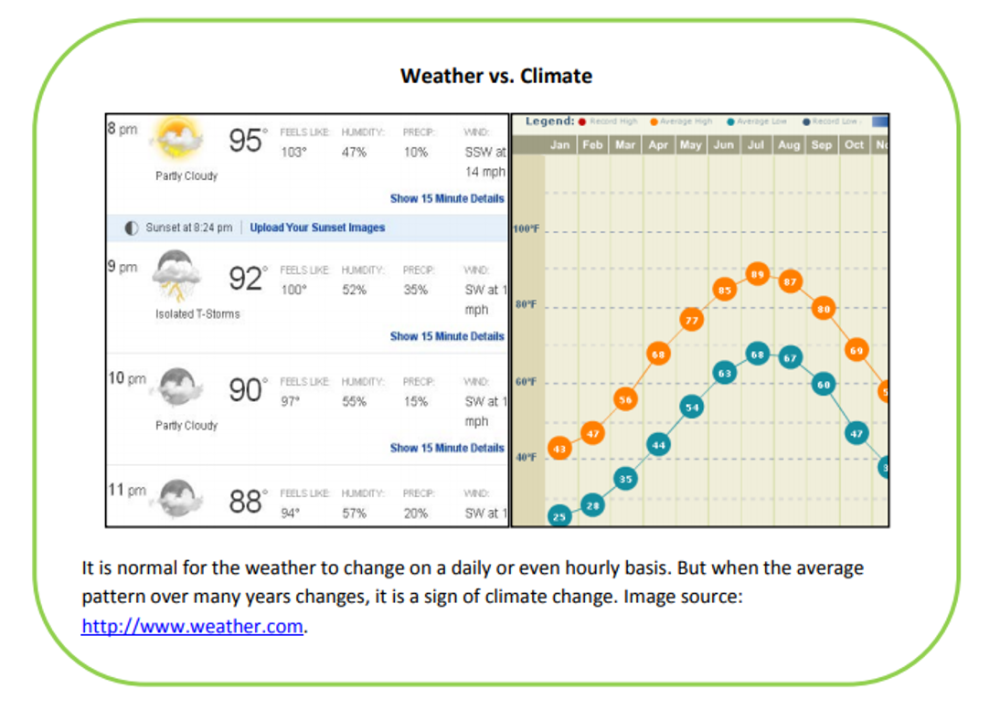
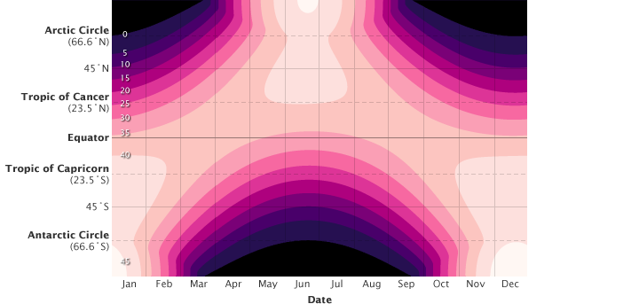
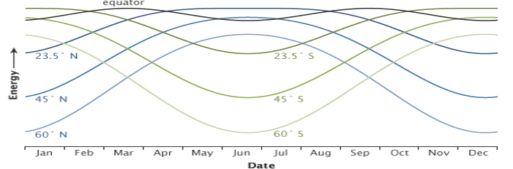
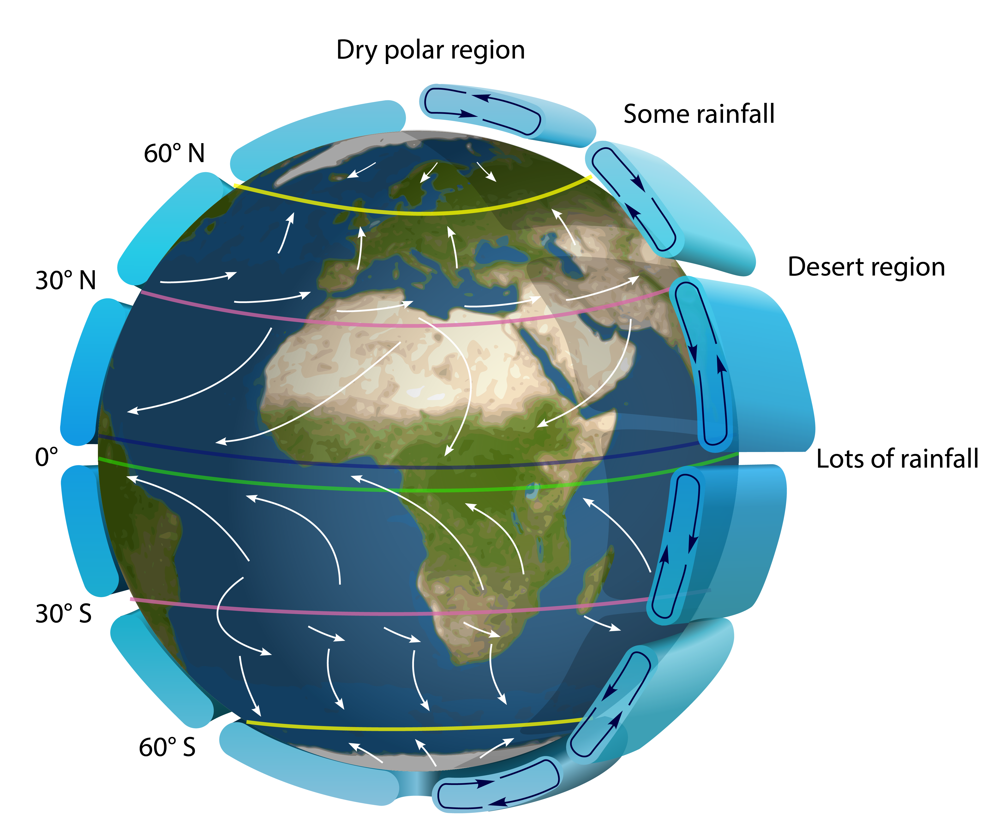
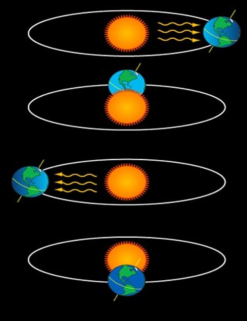
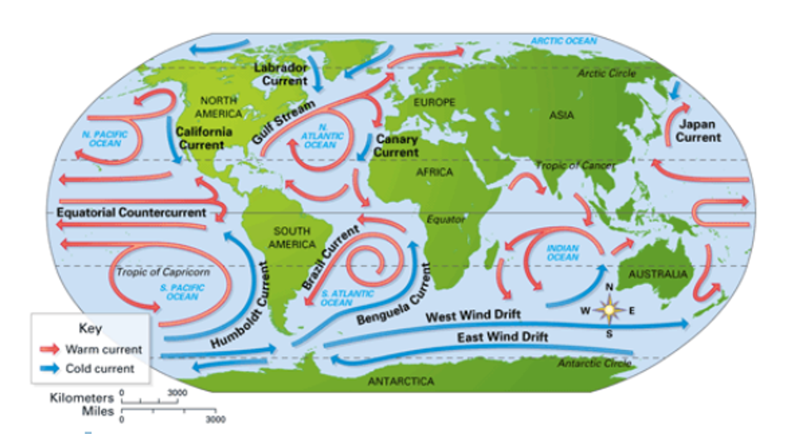
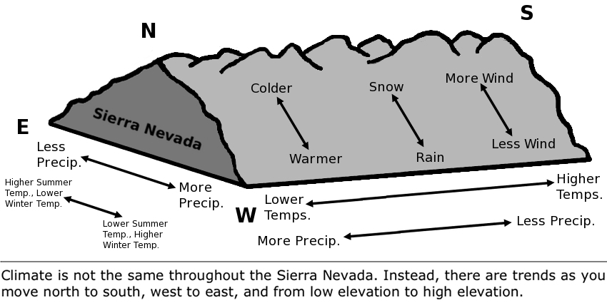
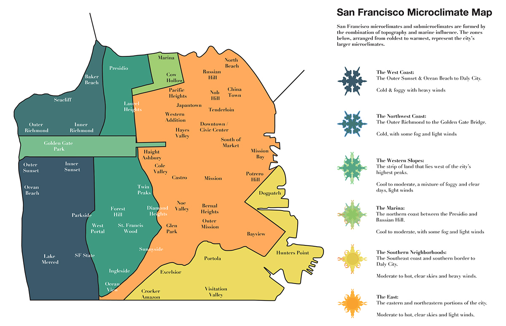
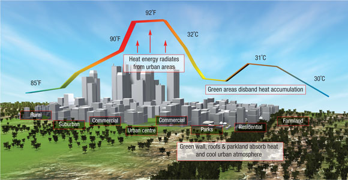

## Climate vs Weather

## Current vs Collective state of the atmosphere

## Elements of climate and weather

 

* **Precipitation**
    * process that ends with the fall of water to the earth’s surface.

 

* **Temperature**
  * amount of heat energy in the air

 

* **Atmospheric pressure**
    * force exerted on a surface by the weight of the atmosphere. 
    * faries vertically; decrease as you ascend

* **Wind**
    * moving air. 
    * dries humidity, causesg storms, and contribes to evaporation

 

* **Solar radiation**
    * provides heat

 

* **Cloudiness**
    * form when humid air cools to dew point & water/ice attaches to dust, ash, etc.
    * type and # are important

## Elements of climate and weather

## Global climate zones

## What drives climate zones?

## What drives global climate zones?

## Slope of Earth's surface causes uneven heating

## Uneven heating

## Atmosphere circulation impacts climate via "Air Donuts"

## Earth's atmosphere contains six rotating "Air Donuts"

## Earth's axial tilt (23.5&deg;) contributes to climate patterns

## Changes in axial tilt may cause ice ages...

# Ocean currents impact climate via wind patterns and Earth's rotation

## Why is the United Kingdom not freezing?

## Global climate variability: El Nino

## These phenomenon also alter weather

## Climate zones are scale dependent

## San Francisco climate and weather can vary 30&deg;C

## Land alters climate: Rain shadow

## Land impacts weather: Atlantic hurricanes

<iframe width="560" height="315" src="https://www.youtube.com/embed/h1eRp0EGOmE" frameborder="0" allow="autoplay; encrypted-media" allowfullscreen></iframe>

## Vegetation alters on climate

https://www.youtube.com/watch?v=Y3OWgb0Bv-A

## How does climate impact ecology?

## How does weather impact ecology?

<strong>Extreme weather such as hurricanes, torrential downpours and droughts will increases the risk for species extinction, especially in diverse ecosystems such as coral reefs and tropical rainforests.</strong>

## Earth's climate and weather is changing

 

<!-- ## Atmosphere: Rotation → Corilis effect -->
<!-- 
 -->

<!-- <iframe width="560" height="315" src="https://www.youtube.com/embed/i2mec3vgeaI?start=6" frameborder="0" allow="autoplay; encrypted-media" allowfullscreen></iframe> -->

<!-- ## Global Precipitation -->
<!-- 
 -->

<!-- <iframe width="560" height="315" src="https://www.youtube.com/embed/c2-iquZziPU?rel=0&amp;start=52" frameborder="0" allow="autoplay; encrypted-media" allowfullscreen></iframe> -->

