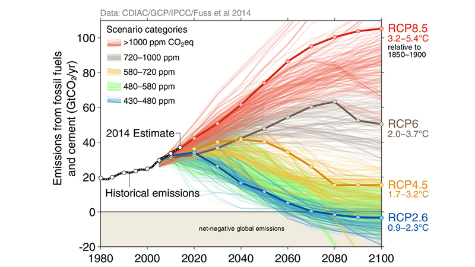

## Climate vs Weather

## What drives global climate zones?

## Slope of Earth's surface causes uneven heating

 

## Atmosphere Circulation affects rainfall

## Climate Variability: Longer time scales

## Climate Variability: Longer time scales

## Climate Variability: Longer time scales

## Climate Variability: Shorter time scales =  seasons

## Climate Variability: Shorter time scales = Weather

## Climate drives distribution of biomes

 

## Climate and vegetation

 

* Vegetaion struture varies within and among biomes due to climate
  + Predictable!
  
   
   
  
* Examples:

 

* Remember: boundaries caused by climate are not discrete
  + Gradients of growth forms, leaf types, life forms, etc.
  
## Climate and diversity

<strong>Species Diversity declines from tropics and from low-high elevation</strong>

##
<iframe width="560" height="315" src="https://www.youtube.com/embed/h1eRp0EGOmE" frameborder="0" allow="autoplay; encrypted-media" allowfullscreen></iframe>

## Landform effect on climate

## Ocean effect on climate

## Vegetation effects on climate

 

* <strong>Variable albedo</strong>
  + issues with land use change
  
   
  
* <strong>Vegetation structure</strong>
  + Tropical recycled rain
  + https://www.youtube.com/watch?v=Y3OWgb0Bv-A
  

## Precipation Shifts?

<iframe width="560" height="315" src="https://www.youtube.com/embed/ipOcTpNl5rs?rel=0&amp;" frameborder="0" allow="autoplay; encrypted-media" allowfullscreen></iframe>

## Climate: Hot Topic

<iframe width="560" height="315" src="https://www.youtube.com/embed/wXrYvd-LBu0" frameborder="0" allow="autoplay; encrypted-media" allowfullscreen></iframe>

## We are *modifiying* Earth's climate

 

 
 

* <strong>Changes in climate alter ecosystem processes</strong>
  + subtly and not so subtly
 
 
* <strong>USA 2017</strong>
  + Fire and storm frequency
  + Hurricane strength -- ?WHY?

## Climate: Hot Topic

 

 
 
<strong>http://www.ipcc.ch/</strong>

## Global Precipitation

<iframe width="560" height="315" src="https://www.youtube.com/embed/c2-iquZziPU?rel=0&amp;start=52" frameborder="0" allow="autoplay; encrypted-media" allowfullscreen></iframe>

## Atmosphere: Rotation → Corilis effect

<iframe width="560" height="315" src="https://www.youtube.com/embed/i2mec3vgeaI?start=6" frameborder="0" allow="autoplay; encrypted-media" allowfullscreen></iframe>

## How does weather impact ecosystems

<strong>Extreme weather such as hurricanes, torrential downpours and droughts will become more frequent in pace with global warming. This increases the risk for species extinction, especially in bio diverse ecosystems such as coral reefs and tropical rainforests.</strong>

