```{r setup, include=FALSE}
knitr::opts_chunk$set(echo = FALSE)
```

## Ecosystems and how the function
<hr>

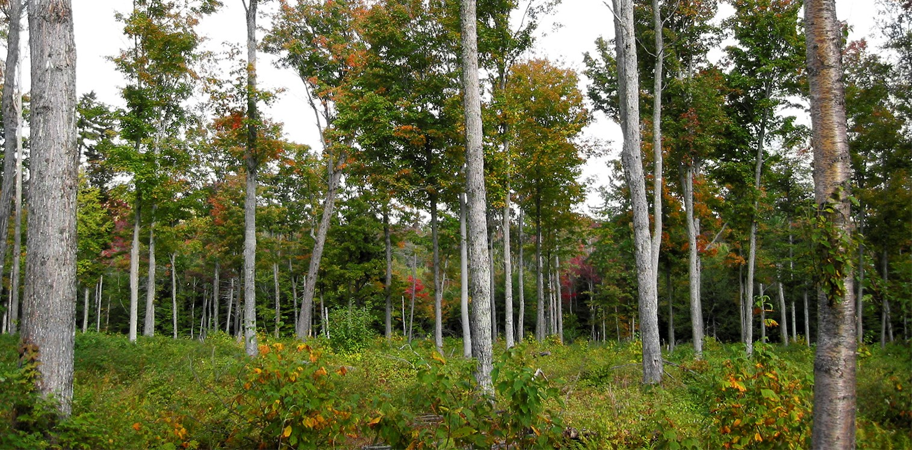

##

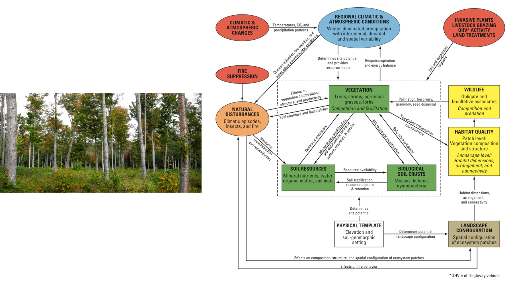


## Succession in ecosystems
<hr>


## Disturbance & succession
<hr>

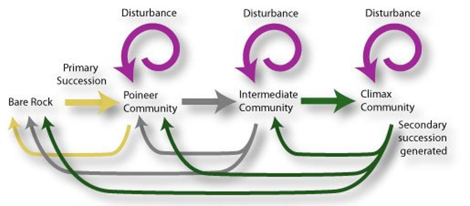

## Disturbance
<hr>
<br/>
<br/> 

<div style="float: left; width: 45%;">

* **Discrete event in time that:**
    + Removes biomass
    + alters populations & communities
    + alters structure of ecosystems 
    + changes resources availability
    + changes physical environment

<br/>

* **Disturbance vs normal function?**

</div>
  


## Human vs natural disturbance types
<hr>

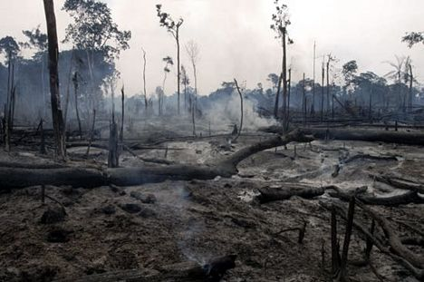


## Impact of disturbance: size / intensity / frequency 
<hr>
<br/>
<br/>
<br/>


<div style="float: right; width: 45%;">

* **Tree blow down -- Forest removal**

<br/>

* **Intensity**
    + magnitude in physical force of the event
    + duration

<br/>

* **Natural pattern of periodic disturbances**
    + fires, floods or pests
 
</div>

## Impact of disturbance: severity
<hr>
<br/>


## Impact of disturbance: severity
<hr>
<br/>


## Disturbance maintains communites in non-equilbrium (Connell)
<hr>

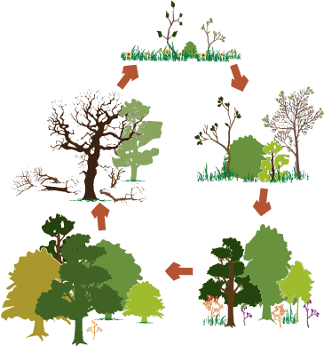

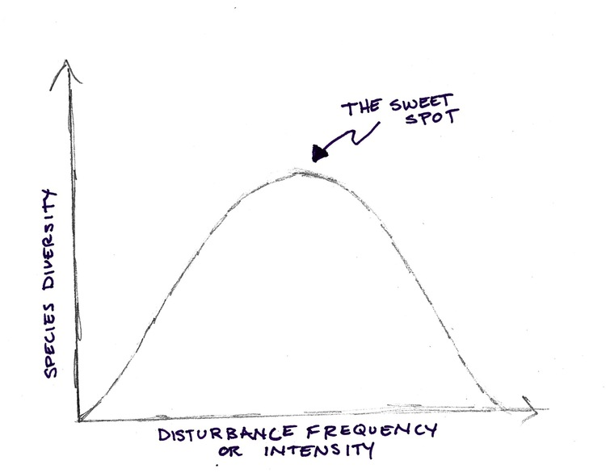

## Primary succession
<hr>
<br/>
<br/>
<br/>

* **After severe disturbances**
    + remove or bury biomass

<br/>

* **Glacial retreat, mudflows, floodplains, lava flows**

<br/>

* **Colonization:**
    + species that handle stresses
    + low nutrients / poor soil
    
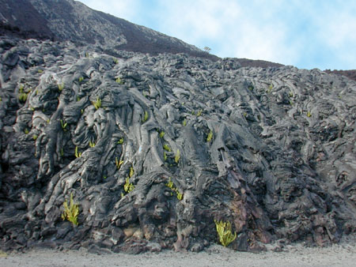

## Primary succession
<hr>
<br/>
<br/>
<br/>

* **Initial Species composition:**
    + nitrogen fixing plants
    + **Facilitation**
 
 <br/>
 
* **Colonizers disperse to site**
    + wind dispersed seeds/spores
    + algae & lichens
    + small seeded plants
    + recruitment distance


## Secondary succession
<hr>

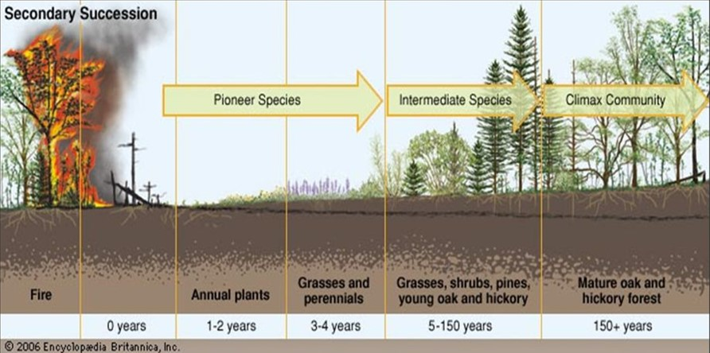

## Secondary succession: pioneer species
<hr>
<br/>
<br/>
<br/>
<br/>

<div style="float: right; width: 40%;">

* **Potential growth rate:**

<br/>

* **Tolerance:**

<br/>

* **Seed size & Number:**

<br/>

* **Longevity:**
</div>

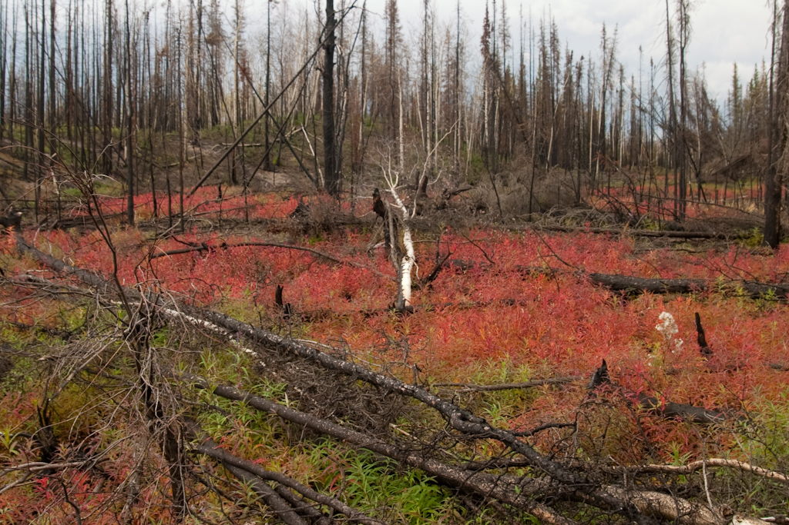

## Late succession: inhibition & tolerance increase
<hr>

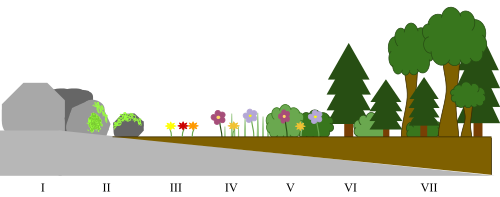

## Wildlife succession
<hr>

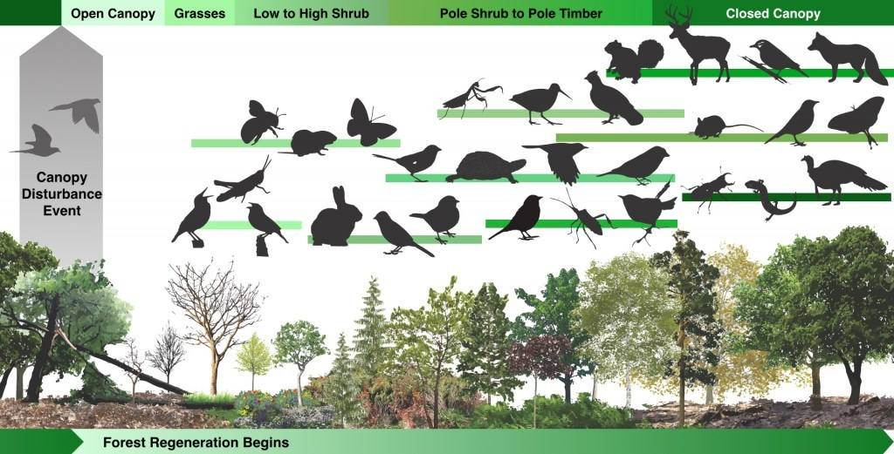

## The Boreal: forests shaped by fire
<hr>

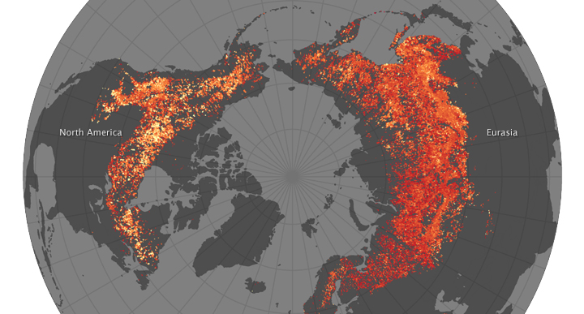

## Boreal forest: Secondary succesion
<hr>

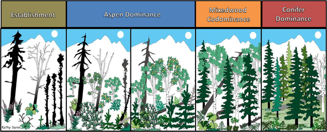

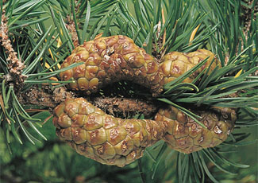

## Boreal forest: Secondary succesion
<hr>

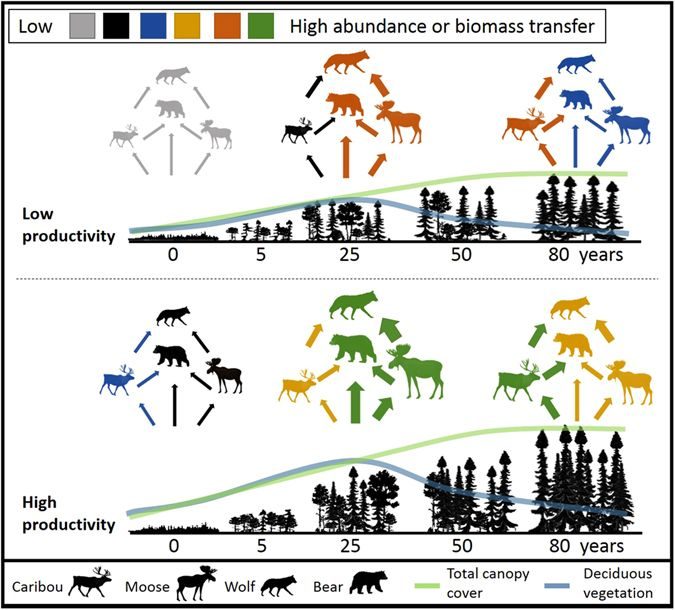

## The future of boreal forests
<hr>

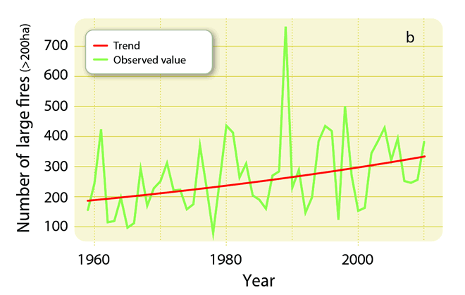

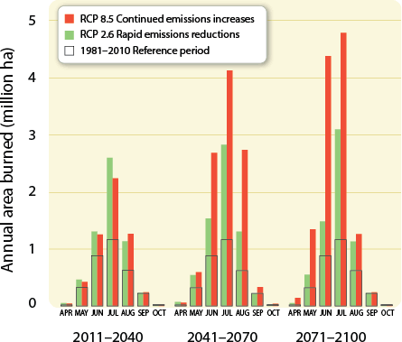

## Glacial retreat: Glacier Bay, Alaska
<hr>

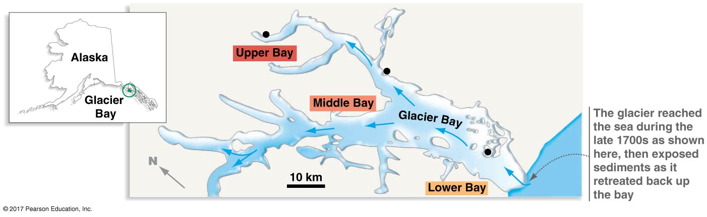

## Glacier Bay, Alaska: succession
<hr>


## Glacier Bay: community dynamics
<hr>

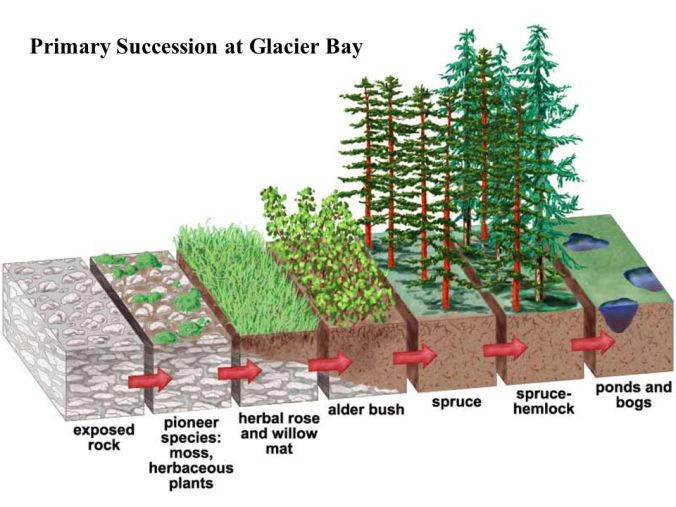

## Glacier Bay: community dynamics
<hr>

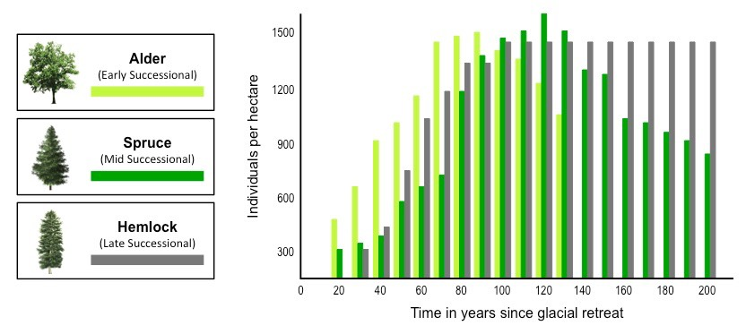

<!-- ## Community dynamics: species effects -->
<!-- <hr> -->
<!-- <br/> -->
<!-- <br/> -->
<!-- <div style="float: right; width: 50%;"> -->

<!-- 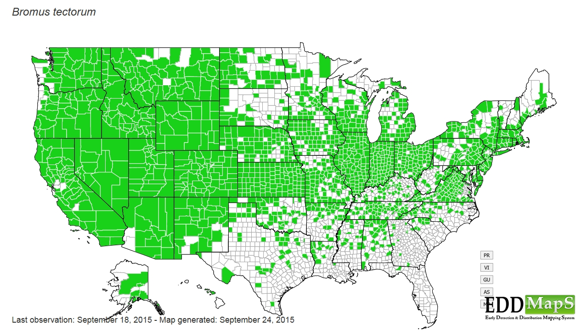 -->

<!-- 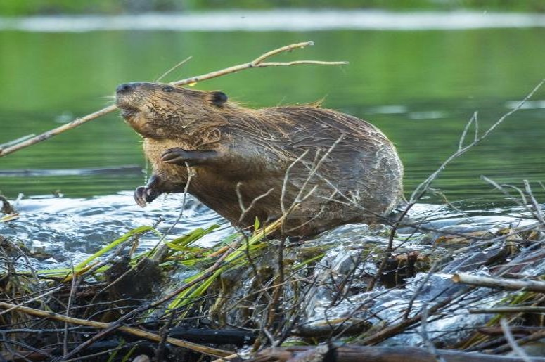 -->

## Fire regimes and humans
<hr>

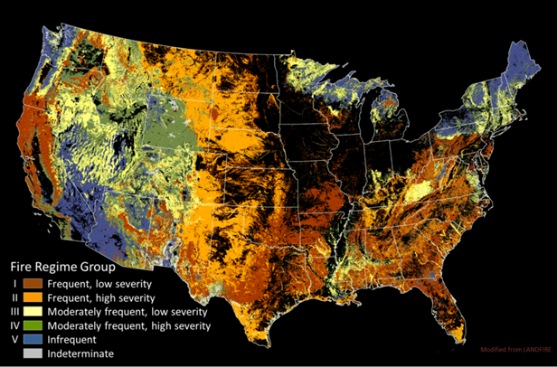

## Fire regimes and humans
<hr>

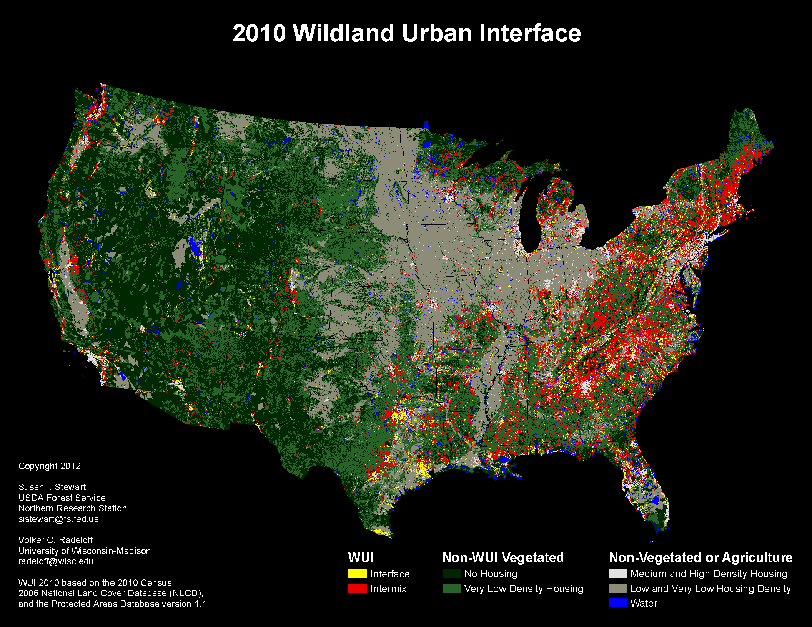

<!-- ## Human disturbance and ecosystem recovery -->
<!-- <hr> -->

<!--  -->
