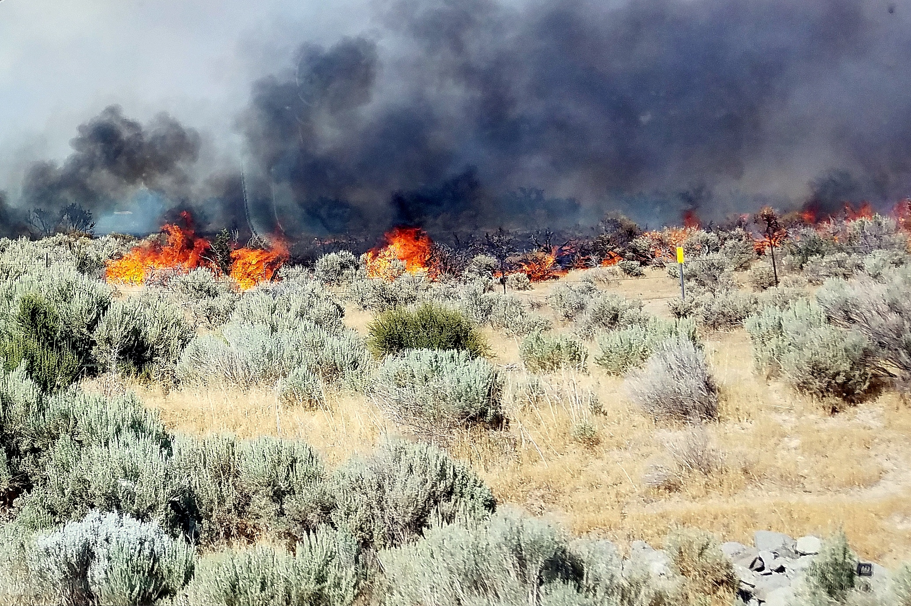
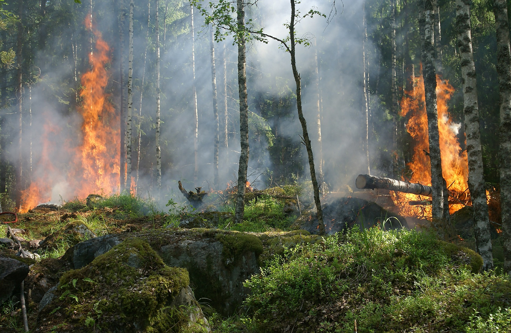
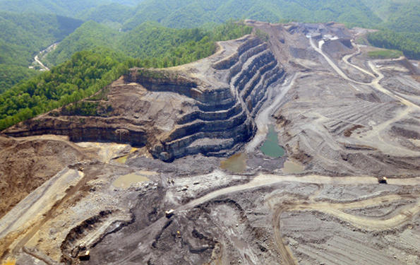
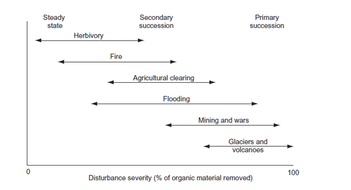
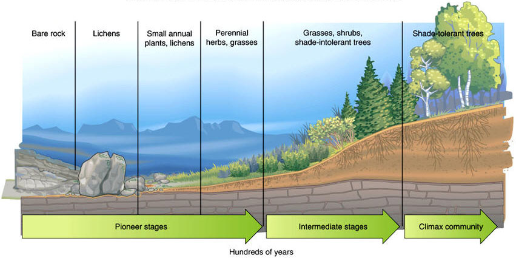
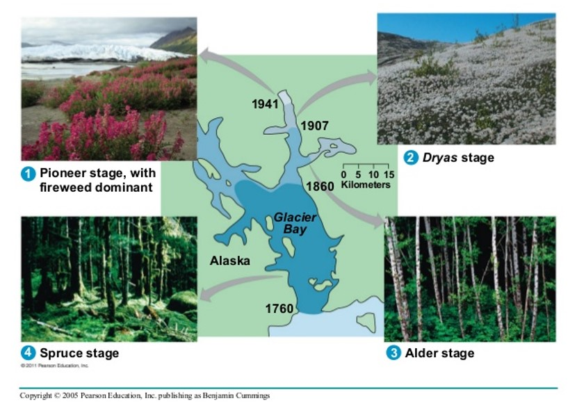

```{r setup, include=FALSE}
knitr::opts_chunk$set(echo = FALSE)
```

## Alternative Stable States
<hr>
<br/>
<br/>

<div style="float: left; width: 45%;">

* **Given environment can support more than one potential state of an ecosystem**

<br/>

* **Ecosystems = complex adaptive systems**
    + changes in properties adapt to changes imposed on it

<br/>

* **Historical legacy vs Future trajectory**

<br/>

* **Visual evidence of alternative stable states on any forest walk**
    + heterogeneity
  
</div>
  

  

## Ecosystem Resilience
<hr>


## Limits to Resilience
<hr>
<br/>
<br/>
<br/>
<div style="float: right; width: 45%;">

* **When change exceeds resilence**
    + Examples:
    
<br/>

* **Adaptive range of a system can decrease/shrink**
    + no longer buffer the ecosystem
  
<br/>
  
* **Directional shifts exceeds the adaptive range of the system**
</div>
  
  


## ABOVE: Climate Resilience in Artic & Boreal ecosystems
<hr>
<div class="centered">
https://above.nasa.gov/implementation_plan/framework.html
</div>

 


## Regime Shifts
<hr>
<br/>
<br/>

<div style="float: left; width: 45%;">

* <strong><span style="color:blue">Behavior of a ball on a surface</span></strong>
    + Location = system state relative to variable

<br/>

* **Resilience = tendency of system to remain in state**
    + despite fluctuations (a)
    + size of adaptive range (b)
  
<br/>

* **Events can push system into new state (c)**
    + extreme drought, insect outbreaks, etc.
    
</div>  


## Cheatgrass
<hr>



##Disturbance
<hr>
<br/>

<div style="float: left; width: 45%;">

* **Discrete event in time that:**
    + Removes plant biomass
    + alters populations & communities
    + alters structure of ecosystems 
    + changes resources availability
    + changes physical environment

<br/>

* **Major cause of long-term fluctuations in ecoystem function**

<br/>

* **What is the dividing line betweem disturbance and normal function?**

</div>
  



##Human vs Natural Disturbance Types
<hr>





##Landuse change
<hr>


##Impact of Disturbance: Size / Intensity / Frequency 
<hr>
<br/>


<div style="float: right; width: 45%;">

* **Gaps -- Stand Replacing**

<br/>

* **Intensity: magnitude in physical force of the event**
    + duration of the event

<br/>

* **Whats left after**
    + islands of undisturbed vegetation
    + seed banks
 
 <br/>
 
* **Intermediate Disturbance Hypothesis**
</div>

##Impact of Disturbance: Severity
<hr>
<br/>





## Recovery and Renewal
<hr>
<br/>

<div style="float: left; width: 45%;">

* **Who will survive, grow & reproduce?**
    + dependent on type and severity

<br/>

* **Recruitment becomes important**

<br/>

* **Species traits define response**
    + Serotiny
    + Seed size
  
  <br/>
  
* **Novel disturbances lead to slow recovery**
</div>


## Recovery and Renewal
<hr>


## Succession in Ecosystems
<hr>



## Disturbance & Succession
<hr>


## Basics: Primary Succession
<hr>


## 1^o^ Succession: Ecosystem Structure
<hr>
<br/>
<br/>

* **Occurrs after severe disturbances**
    + remove or bury products of ecosystem processes

<br/>

* **Glacial retreat, mudflows, floodplains, dunes**

<br/>

* **Initial composition:**
    + plants that handle stresses
    + low nutrients 
    + poor soil
    


## 1^o^ Succession: Ecosystem Composition
<hr>
<br/>

* **Initial Species composition:**
    + nitrogen fixing plants
    + facilitation
 
 <br/>
 
* **Colonizers disperse to site**
    + wind dispersed seeds/spores
    + algae & lichens
    + small seeded woody plants
    + distance to seed source
 
 <br/>
 
* **Humans affect availability of propagules**
    + alter successional trajectory
    


## Basics: Secondary Succession
<hr>


## 2^o^ Succession: Ecosystem Structure
<hr>
<br/>
<br/>
<br/>

* **Starts on existing soils**
    + nutrient pulse after disturbance
    + less vegetation to uptake (mineralization)
    + ash
    
 <br/>
 
* **Colonizers already present**
    + Seed bank
    + Seedling bank
    + Nearby dispersal


## 2^o^ Succession: Life history traits
<hr>

<div class="centered"><strong><span style="color:blue">
Trait based framework to understand ecosystem succession
</span></strong></div>

<br/>
<br/>

* **Seed size & Number:**

<br/>

* **Potential growth rate:**

<br/>

* **Maximum Size:**

<br/>

* **Longevity:**


## Glacial Retreat Case Study
<hr>



## Glacial Retreat Case Study
<hr>


## Disturbance: Water & Energy Exchange
<hr>
<br/>
<div style="float: left; width: 45%;">
* **Removing biomass reduces evapotranspiration**
    + Runoff increases
    
    <br/>

* **Effects of forest cutting and overgrazing**
    + Management tool???

<br/>

* **Discharge reduced as succession progresses**
    + high N, photosynthesis & leaf area of early species
    + root proliferation
    + complex canopy development
    + increases evapotranpspiration
 </div>   


## Disturbance: Water & Energy Exchange
<hr>
<br/>

<div style="float: right; width: 40%;">

* **Energy Budget dominated by surface temperatures**
    + high emission of long-wave radiation 
    + sensible heat high

<br/>

**1. Low albedo of recently distubed sites**

<br/>

**2. Low leaf area, hydraulic conductance and root mass decreases 
energy dissipated by transpiration**

<br/>

**3. Smooth surfaces decreases turbulence**
</div>


## Nutrient Cycling: Succession
<hr>
<br/>

<div style="float: left; width: 45%;">
* **Initial accumulation of N in plants/soils**
    + mostly atmospheric inputs
    + N most limiting

<br/>

* **Litter accumulates with new N**
    + N cycles closes
    + plants & microbes efficient @ keeping nutrients

<br/>

* **Leaching eventually balances cycling**
</div>


## Nutrient Cycling: 2^o^ Succession
<hr>


## Nutrient Cycling: Human disturbances
<hr>


