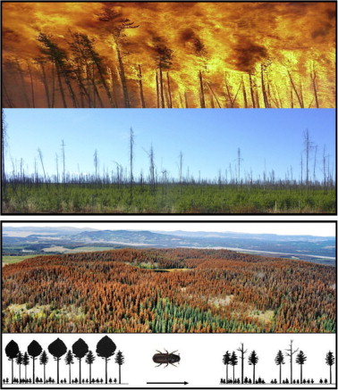
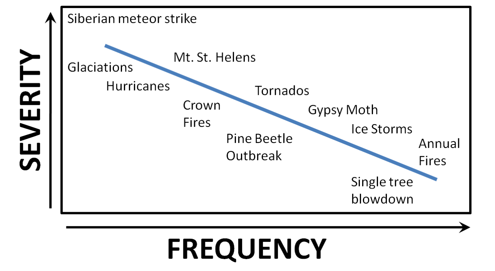

```{r setup, include=FALSE}
knitr::opts_chunk$set(echo = FALSE)
```


## Succession in Ecosystems
<hr>


## Disturbance & Succession
<hr>


##Disturbance
<hr>
<br/>
<br/> 

<div style="float: left; width: 45%;">

* **Discrete event in time that:**
    + Removes biomass
    + alters populations & communities
    + alters structure of ecosystems 
    + changes resources availability
    + changes physical environment

<br/>

* **Disturbance vs normal function?**

</div>
  


##Human vs Natural Disturbance Types
<hr>


##Impact of Disturbance: Size / Intensity / Frequency 
<hr>
<br/>
<br/>
<br/>



<div style="float: right; width: 45%;">

* **Small gaps -- Forest removal**

<br/>

* **Intensity**
    + magnitude in physical force of the event
    + duration

<br/>

* **Natural pattern of periodic disturbances**
    + fires, floods or pests
 
</div>

## Disturbance maintains communites in non-equilbrium (Connell)
<hr>


##Impact of Disturbance: Severity
<hr>
<br/>


##Impact of Disturbance: Severity
<hr>
<br/>



## Primary Succession
<hr>
<br/>
<br/>
<br/>

* **After severe disturbances**
    + remove or bury biomass

<br/>

* **Glacial retreat, mudflows, floodplains, lava flows**

<br/>

* **Colonization:**
    + plants that handle stresses
    + low nutrients / poor soil
    


## Primary Succession
<hr>
<br/>
<br/>
<br/>

* **Initial Species composition:**
    + nitrogen fixing plants
    + **Facilitation**
 
 <br/>
 
* **Colonizers disperse to site**
    + wind dispersed seeds/spores
    + algae & lichens
    + small seeded plants
    + recuitment distance


## Secondary Succession
<hr>


## Secondary Succession: Pioneer species
<hr>
<br/>
<br/>
<br/>
<br/>

<div style="float: right; width: 40%;">

* **Seed size & Number:**

<br/>

* **Potential growth rate:**

<br/>

* **Tolerance:**

<br/>

* **Longevity:**
</div>


## Late Succession: Inhibition & Tolerance pick ups
<hr>


## Wildlife Succession
<hr>


## The Boreal: A forest shaped by fire
<hr>


## Boreal Forest: Secondary succesion
<hr>


## Boreal Forest: Secondary succesion
<hr>


## The Future of Boreal Forests
<hr>


## Glacial Retreat: Glacier Bay Alaska
<hr>


## Glacier Bay Alaska: Succession
<hr>


## Glacier Bay: Community Dynamics
<hr>


## Glacier Bay: Community Dynamics
<hr>


## Community Dynamics: Species Effects
<hr>
<br/>
<br/>
<div style="float: right; width: 50%;">


## Fire Regimes and Humans
<hr>


## Fire Regimes and Humans
<hr>


## Human Disturbance and Community Recovery
<hr>


