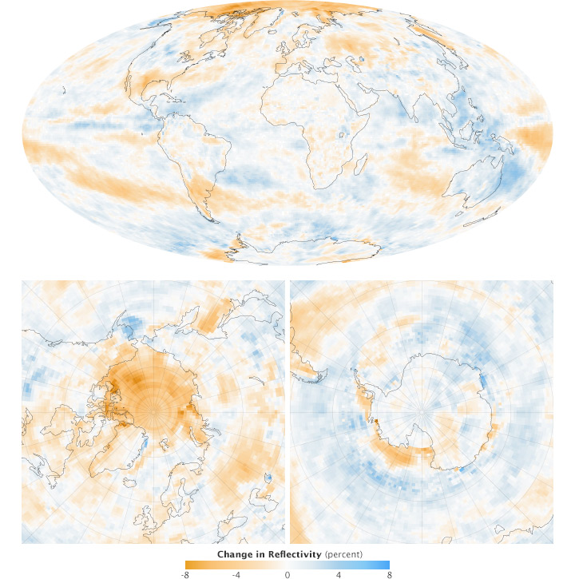
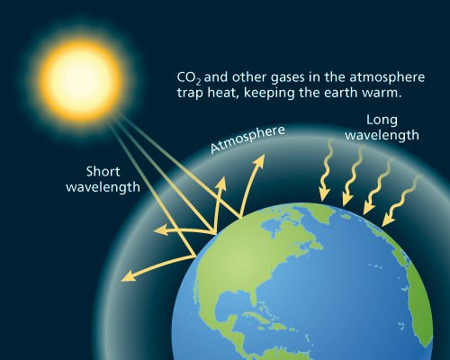
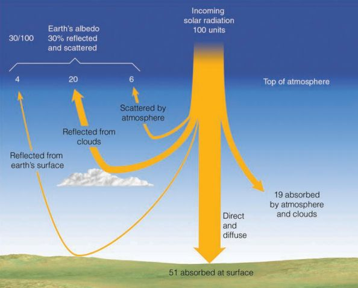
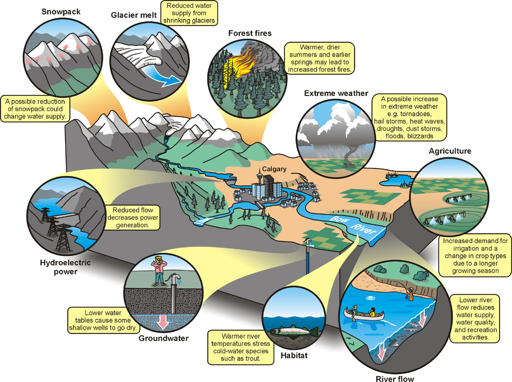

```{r setup, include=FALSE}
knitr::opts_chunk$set(echo = FALSE)
```

##
<div class="centered"><span style="color:black">The relationships of organisms to one another and to their surroundings</span></div>


<br />
<br />
<br />
<br />
<br />
<br />
<br />
<br />
<br />
<br />
<br />
<br />
<br />
<br />
<br />
<br />
<br />
<br />

<div class="centered"><span style="color:green">"A thing is right when it tends to preserve the integrity, stability, and beauty of the biotic community. It is wrong when it tends otherwise" -Aldo Leopold </span></div>

## What does ecology have to do with me?
<hr>


##


##


## Albedo
<hr>


##


<div class="item-absolute">Earth's average albedo is ~0.3, but it is changing. What does this actually mean? </div>
</div>

## Sun is Earth's primarily form of heat, bathing us with radiation
<hr>
<br />
<br />
<br />

<div style="float: left; width: 45%;">

* **Roughly one third of sunlight energy reflects back to space**

<br />

* **Rest is absorbed by land, ocean and atmosphere**

<br />

* **Exact amount absorbed depends on reflectivity of atmosphere and surface**
</div>



##


## Earth's Energy Budget: Balance
<hr>

* <strong>Earth normally close to radiative balance</strong> 
    + temperatures should remain constant
  
<br />

* **Atmospheric heating**
    + absorption of some solar radiation by active gases
  
<br />
  
* **Recent large increases in active atmospheric gases**
    + fossil fuels, industry and agriculture
    + atmosphere traps more energy = **enhances greenhouse effect**
  
<br />

* **Disrupts radiative balance (.2-.3%)**
    + excess energy absorbed by oceans

## Greenhouse effect
<hr>
<br />



## Greenhouse effect

<iframe width="560" height="315" src="https://www.youtube.com/embed/VYMjSule0Bw" frameborder="0" allow="autoplay; encrypted-media" allowfullscreen></iframe>

## Earth's Energy Budget: Atmosphere Absorption
<hr>
<br />


## Atmosphere: Composition
<hr>
<br />


<div style="float: right; width: 50%;">
<br />

* <strong>Most gases have long residence times</strong>
  + constant around the world
  + N<sub>2</sub> = 13 mil and O<sub>2</sub> = 10,000 years
  + CO<sub>2</sub> = 5 years (?Good or Bad?)
  + methane = 8 years

<br />
<br />

* <strong>Water vapor is reactive and variable</strong>
  + seasonally and spatially

</div>

## Surface energy budget
<hr>
<br />
<div style="float: left; width: 40%;">

* **Energy transfered from surface**

<br />

* **Energy conducted into the soil**
  + Largest in regions with permafrost

<br />

* **Energy stored inside ecosystem**
  + photosynthetic chemical energy
</div> 



## Why clouds are cool...
<hr>
<br />


## Solar energy & water cycle interconnected
<hr>

<div class="centered"><strong><span style="color:orange">25% of incoming solar energy leaves the surface through evaporation</span></strong></div>


## Water vapor feedback
<hr>
<br />
<br />


<div style="float: left; width: 50%;">
* **Water vapor most abundant greenhouse gas**

<br />

* **NASA satellite data confirms heat-trapping effect of water in the air** 
  + critical component of climate change
  + most vapor collects at tropical latitudes

<br />

* **Potent enough to 2x climate warming caused by increased CO<sub>2</sub>**
</div> 


## Water vapor feedback loop
<hr>
<br />


## Evapotranspiration: Energetics of water movement
<hr>
<br />

<div style="float: left; width: 50%;">

* **Major role in linkage of water/energy budget**

<br />

* **Water has high specific heat**
  + 4x more energy to heat water than air
  + Summer temperatures near bodies of water?

<br />

* **Large energy fluxes when water changes state**
  + Evapotrans cools (leaves or other surfaces)
  + Condensation warms atmosphere

</div>


## Evapotranspiration
<hr>


## Water Cycle
<hr>


## Ecosystem Water Budgets: Big Buckets
<hr>


## Water Movements within Ecosystems
<hr>


## Water for Humans?
<hr>


## People and water cycle



## Hot topic: Groundwater supports 40% of agriculture
<hr>


## Hot topic: Fossilwater
<hr>


## In the news: Megadrought
<hr>

<iframe width="560" height="315" src="https://www.youtube.com/embed/ToY4eeWsdLc?rel=0" frameborder="0" allow="autoplay; encrypted-media" allowfullscreen></iframe>


