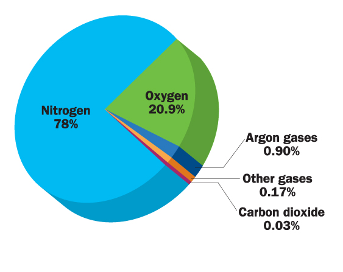

```{r setup, include=FALSE}
knitr::opts_chunk$set(echo = FALSE)
```

##


 

## Earth's Energy Budget
<hr>
<br />


## Short wave radiation vs long wave (add long)
<hr>
<br />


## Greenhouse effect
<hr>
<br />


## Greenhouse effect

<iframe width="560" height="315" src="https://www.youtube.com/embed/VYMjSule0Bw" frameborder="0" allow="autoplay; encrypted-media" allowfullscreen></iframe>

## Earth's Energy Budget: Balance
<hr>

* <strong>Earth normally close to radiative balance</strong> (emission = absorbtion)
  
<br />

* <strong>Atmospheric heating</strong>
  + <span style="color:green">longwave absorption by active gases</span>
  + absorption of some solar radiation
  + *latent heat flux*: 
  + *sensible heat flux*: 
  
<br />
  
* <strong><span style="color:green">Recent large increases in active atmospheric gases</span></strong>
  + fossil fuels, industry and agriculture
  + atmosphere traps more longwave = <strong>enhances greenhouse effect</strong>
  
* disrupts radiative balance (.2-.3%)
  + excess energy absorbed by oceans

## Earth's Energy Budget: Atmosphere Absorption
<hr>
<br />


## Atmosphere: Composition
<hr>
<br />



<div style="float: right; width: 50%;">
<br />

* <strong>Most gases have long mean residence times</strong>
  + constant around the world
  + N<sub>2</sub> = 13 mil and O<sub>2</sub> = 10,000 years
  + CO<sub>2</sub> = 5 years (?Good or Bad?)
  + methane = 8 years

<br />
<br />

* <strong>Water vapor is reactive and variable</strong>
  + seasonally and spatially

</div>

## Why clouds are cool...
<hr>
<br />


## Net radiation absorbed: In vs Out
<hr>
<br />
<br />
<br />

<div style="float: left; width: 45%;">

* **Surface absorbs ~48% of incoming sunlight**

<br />

* **3 processes remove an equivalent amount of energy from the Earth’s surface**
  + evaporation (25%)
  + convection (5%)
  + thermal infrared radiation, or heat (net 17%).

</div>


## Global net radiation
<hr>


## Radiation Partitioning
<hr>
<br />
<div style="float: left; width: 40%;">

* **Energy transfered from surface**
  + latent heat flux
  + sensible heat flux

<br />

* **Energy conducted into the soil**
  + ground heat flux
  + Largest in regions with permafrost

<br />

* **Energy stored inside ecosystem**
  + photosynthetic chemical energy
  + temperature flux of plants
</div> 


## Albedo


## Albedo feedbacks


## Water Cycle
<hr>


## Solar energy & water cycle interconnected
<hr>

<div class="centered"><strong><span style="color:orange">25% of incoming solar energy leaves the surface through evaporation</span></strong></div>

<br />
<br />
<br />
<br />
<br />
<br />
<br />
<br />
<br />
<br />
<br />
<br />
<br />
<br />
<br />
<br />
<br />

<div class="centered"><strong><span style="color:orange">Latent heat released once water vapor condenses</span></strong></div>


## Water for Humans?
<hr>


## Hot topic: Groundwater supports 40% of agriculture
<hr>


## Hot topic: Fossilwater
<hr>


## In the news: Megadrought
<hr>

<iframe width="560" height="315" src="https://www.youtube.com/embed/ToY4eeWsdLc?rel=0" frameborder="0" allow="autoplay; encrypted-media" allowfullscreen></iframe>

## Water vapor feedback
<hr>
<br />
<br />


<div style="float: left; width: 50%;">
* **Water vapor most abundant greenhouse gas**

<br />

* **NASA satellite data confirms heat-trapping effect of water in the air** 
  + critical component of climate change
  + most vapor collects at tropical latitudes

<br />

* **Potent enough to 2x climate warming caused by increased CO<sub>2</sub>**
</div> 


## Water vapor feedback loop
<hr>
<br />


## Evapotranspiration: Energetics of water movement
<hr>
<br />

<div style="float: left; width: 50%;">

* **Major role in linkage of water/energy budget**
  + Surface evaporation + leaf transpiration

<br />

* **Water has high specific heat**
  + 4x more energy to heat water than air
  + Summer temperatures near bodies of water?

<br />

* **Large energy fluxes when water changes state**
  + Evapotrans cools (leaves or other surfaces)
  + Condensation warms atmosphere

</div>


## Evapotranspiration
<hr>


## Ecosystem Water Budgets: Big Buckets
<hr>


## Water Movements within Ecosystems
<hr>


