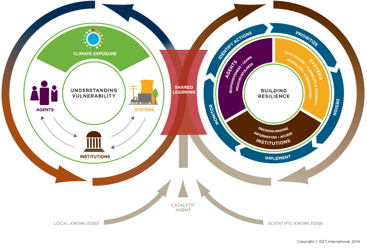

## Sustainability and System Science 

 

>- <strong>Consider that I give everyone 1 dollar each time you come to class</strong> 
  >- Is that sustainable?    
 

>- <strong>What information do we need?</strong>
  >- What is my 'stock' of money?
 

>- <strong>What if I spend $ on other stuff? </strong>  
  >- What is my 'input' of new money
  >- What is my 'turnover' time of money based on my consumption of money
 

>- <strong>What if the class size grows....because Im giving away money?</strong> 
 
 
>- <strong>This question relates to a 'system' which has a balancing point</strong>

## Climate Resilience: Human Interactions

 

## Restoration Ecology

