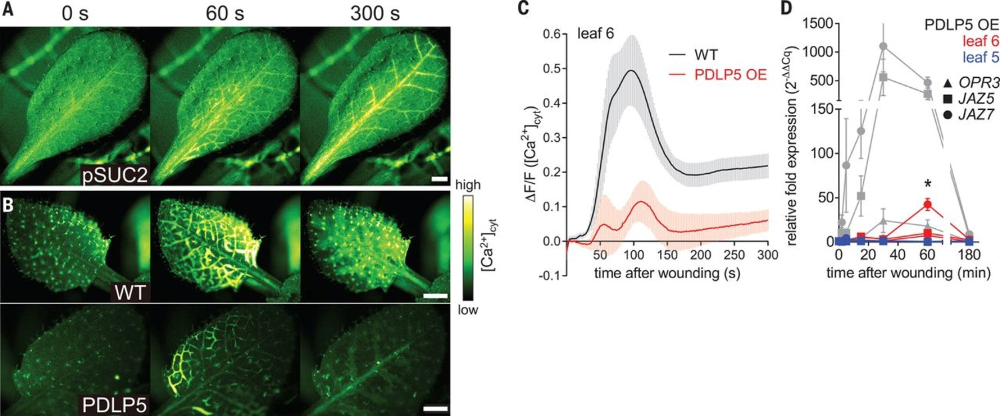

```{r setup, include=FALSE}
knitr::opts_chunk$set(echo = FALSE)
```

##

<iframe width="560" height="315" src="https://www.youtube.com/embed/Lzq-wRHCTKc" frameborder="0" allow="autoplay; encrypted-media" allowfullscreen></iframe>

## Wounding triggers transmission of Ca^2+^ to start systemic defense responses
<hr>
<br/>
Toyota et al. 2018. Science 361: 1112-1115.

