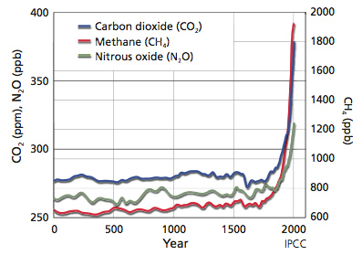
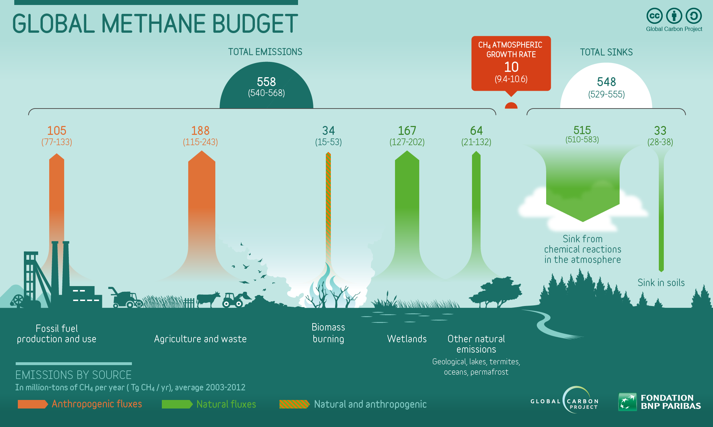
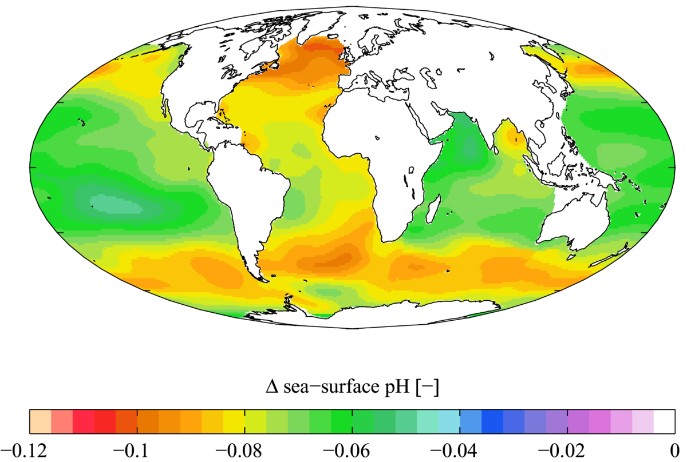

## Whats in a name...

## Global change at unprecedented rates

## Global change at unprecedented rates

## Dutch Elfstedentocht: February 1985

## 

## Last 4 years are the warmest ever (Ed Hawkins)

 
 
 
 
 
 
 
 

http://blogs.reading.ac.uk/climate-lab-book/files/2018/12/spiral_2018_WMO_large.gif

## Physical impacts of climate change

## Last 12 years are smallest sea ice extents (Ed Hawkins)

 
 
 
 
 
 
 
 
http://blogs.reading.ac.uk/climate-lab-book/files/2017/05/maparctic_sept.gif

##   

<!--  -->

## Haber-bosch process and human population

##

## Greenhouse gases (ice cores)

##

## Greenhouse gases: Carbon dioxide (CO~2~)

<!-- ## -->

<!--  -->

## Greenhouse gases: Methane (CH~4~)

<!--  -->

<!-- ## Nitrous oxide (N~2~O) -->
<!-- 
 -->

<!--  -->

<!--  -->

## Land use and biogeochemical cycles: Carbon

 

## Land use and biogeochemical cycles: Energy & water

## Land use and biogeochemical cycles: Water

## Land use and biogeochemical cycles: Nitrogen

## Biological effects of global change: Oceans

## Biological effects of global change: Homogenization

 

<!-- ## Ecoregions versus humans -->
<!-- 
 -->

<!--  -->

<!--  -->

##

##

##

<!-- ## Biological effects of global change: People -->
<!-- 
 -->
<!--  -->

## Is 1.5C global target reachable?

## What should you do....

 
 
 

* **If CO~2~ emissions stopped today:**
    + 50% absorbed by land/water in 30 yrs
    + 30% in atmosphere for centuries
    + 20% in atmosphere for 1000 yrs

 

* **Future warming is inevitable**
    + land sinks uncertain
    + ocean sinks weakening

## What should you do... (For Emma)

<!-- ## Climate and Weather changes -->
<!-- 
 -->
<!--  -->

<!-- ## Extremes - Heat Waves -->
<!-- 
 -->

<!-- 
 -->
<!-- Almost everywhere these heat waves are now warmer than a century ago -->
<!-- 
 -->

<!--  -->

<!-- ## Extremes - Precipitation in the USA -->
<!-- 
 -->
<!--   -->

<!--  -->

<!-- ## Extremes - Precipitation in the USA -->
<!-- 
 -->
<!--   -->

<!--  -->

<!-- ## Ocean evaporation going up -->
<!-- 
 -->

<!--  -->