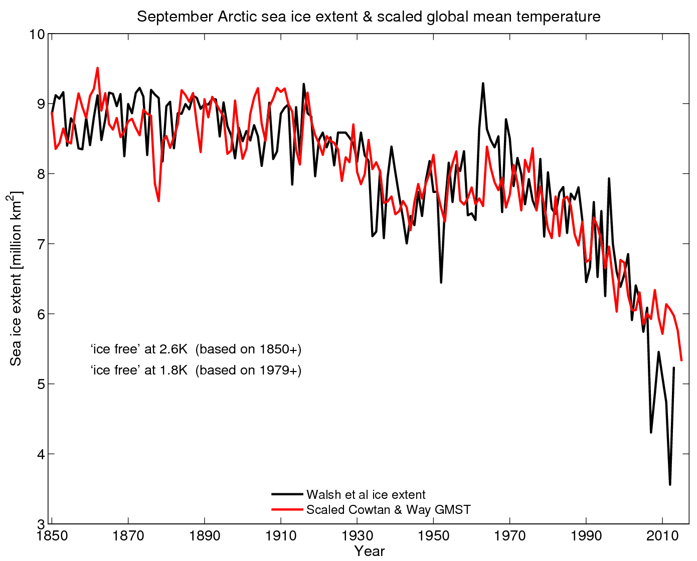
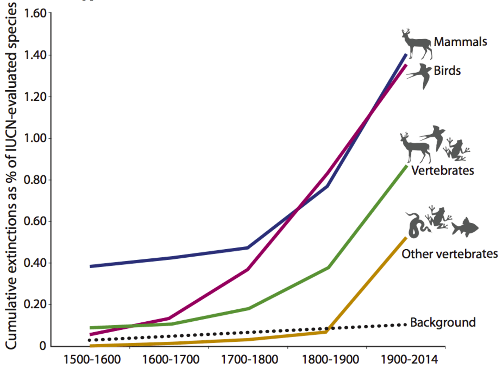

## Focal Issue

 

* **Human activites have dramatically altered elemental cycles**
    + fossil fuels = CO2, NOx & S
    + mining = C, N, P & S
    + agriculture = C, N, P & S
 
 

* **Changes in biogeo cycles affect climate**
    + global hydrological cycle
    + feedbacks (+ & -)

 

* **Alter ecosystems @ all scales**

## CO2_history: Long time scales

## Climate is a **Hot** Topic

<iframe width="560" height="315" src="https://www.youtube.com/embed/wXrYvd-LBu0" frameborder="0" allow="autoplay; encrypted-media" allowfullscreen></iframe>

## Historical Human Drivers

 

* **Agriculture started ~10,000 yrs ago**
      + Holocene inter-glacial period
      + stable climate period
      + population increased 100x till industrial period

 

* **Sedentary communities**
      + population increased 10x since industrial revolution
      + land cover changes = 50% surface

 

* **Population & consumption affects ecosystems**
    + dramatic since 1950

   

    
## 

##

## Historical Climate Shifts

## Current Warming

 

 
 
 
 

* **Unprecedented recent warming**
      + within last 1000 year period

 
 

* <strong>
Could we push Earth System to new state?</strong>

## Climate: Hot Topic

 

 
 
<strong>http://www.ipcc.ch/</strong>

## Climate Variability: People

 

## Regime Shifts

## Global Water Cycle: What is Vulnerable?

## Evaporation (1)

 

* **Global land flux = 15%**
    + although land = 30% surface
    + ocean evapotranspiration much greater

 

* **Large regional variation**
    + both land & ocean
    + related to climate
    + plant needs and physiology

 

* **MRT in atmosphere = 10d**

    
## Precipitation (2)

 

* **110,000 km^3^ year**
    + 40% from ocean
    + 60% recycled from land

 

* **Highly variable**
    + regional
    + seasonal
    + affects plant water use
    
 

* **Land-use change**
    + shift to sensible heat in tropics
    

## Precipation Shifts?

<iframe width="560" height="315" src="https://www.youtube.com/embed/ipOcTpNl5rs?rel=0&amp;" frameborder="0" allow="autoplay; encrypted-media" allowfullscreen></iframe>

    
## Ground Water (3)

 
 

    

* **Soil Moisture turns over ~ 2 months**
    + high regional variation

 

* **Soil moisture reduced in interior of continents during summer**
    + important areas of agriculture
    
 

* **Ground water turns over ~ 200 years**
    + likely not replenished from current climate

    
    
    
## Anthropogenic Changes in Water Cycle

 

* **Precipitation**
    + wet getting wetter
    + dry getting drier
    + warming air holds more water
 
* **Landuse change affects surface energy budget**
    + quantity of energy absorbed
    + pathway of energy loss
    + Δ sensible/latent fluxes affect precipitation
    + affects other regions (circulation)
 
* **Soil moisture effects**
    + ↓ with ↓ precipitation
    + ↓ with ↑ evaporation
    + agriculture areas sensitive
  

  

    
## Consequences of Changes in Water Cycle

 
 
 

* **Societal**
    + small vulnerable pool of freshwater
    + search for clean drinking water

 

* **Irrigate to offest impacts on soil moisture**
    + draw from lakes, rivers & groundwater
    + <strong>
irrigation increased 5x in 20^th^ century</strong>
    + negatively impacts aquatic ecosystems
 

 

    
## Agricultural Water Availability: Mediterranean

## Food Insecurity

## Global Carbon Cycle: What is Vulnerable?

 
 

* **Carbon is disrupted among 4 pools**
    + atmosphere
    + ocean
    + land 
    + sediments/rocks

 

* **Atmospheric C is most dynamic**
    + driven by metabolism of organisms
    + ~5 year turnover
    + https://www.co2.earth/
    
## Greenhouse CO2 Emissions

## Greenhouse CO2 Emissions

## Changes in Atmospheric CO2: Temporal 

 

<strong>
Varied 10 fold in Earth's history</strong>

 

* **Short term controls (sec - yrs)**
    + Photosynthesis
    + Respiration
    + Human emissions (15% of fluxes)
    + Ocean Surface
 
  
 
* **Centurial contols**
    + NPP
    + SOM
    + Disturbance
    + Deeper ocean waters
    
 

 

* **Long term controls**
    + uplift
    + weathering
    + ocean sedimentation
    + glacial cycles
 
   
  
## Recent Changes in Greenhouse Gases

 

## Marine Sinks for CO2

## Marine Sinks for CO2

 
 
 

* **CO2 removed from atmosphere:**
    + dissolution in seawater
    + photosynthetic organisms
    + https://ocean-climate.org/?p=3896&lang=en

 

* **Dissolution produces acidity**
    + dissolves shells of invertebrates
    + reduces sink strength
 
     

    
## The Other CO2 Problem

    
## Terrestrial Sinks for CO2

 

* **Fire suppression**

 

* **CO2 plant fertilization**

 

* **Fertilizers and plant production**

 

* **Forest regrowth**

 

* **Climate**

## Power of plants

 
## USA: Net Sink of Source of CO2?

 
 
 

* **Consistent increase in forest C stocks over the last 2 decades**
    + CO2 fertilization
    + forest managment 

 

* **Emissions exceed ecosystem uptake by 3x**

## CO2 Effects on Climate

 
 

* **If emisions stopped today:**
    + 50% absorbed by land/water in 30 yrs
    + 30% in atmosphere for centuries
    + 20% in atmospere for 1000 yrs

 

* **Future warming is inevitable**
    + sinks are weakening
    + deep sea sinks and weathering are slow
    

## Climate Extremes Trend Up with Warming

## Extremes - Heat Waves

Almost everywhere these heat waves are now warmer than a century ago

## Extremes - Precipitation in the USA

 

## Extremes - Precipitation in the USA

 

## Warming and Sea Ice

 
 
 

* **Sea ice observations further back in time are too uncertain**

 

* **Real acceleration in sea ice loss per degree of global warming**

 

* **Arctic sea ice has melted more than expected from 2007 onwards**

## Can Melting Sea Ice 'Seaquester' CO2?

 

## Should We Fertilize the Ocean?

 

## Greenhouse Gases: Methane

 

## Methane Sources

 

## Methane Sources: Artic

 
 
 

* **High latitudes heat up**
    + warming climate
    
 

* **Permafrost and accumulated ice thaw**
    + Now at accelerated rates

 

* **CH4 rapidly released**

## Global Nitrogen Cycle: What is Vulnerable?

 
 

* **Atmospheric pool is large**
    + 78% of atmosphere
    + soils + plant pools smaller

 

* **N cycled through plants and oceans**

## Anthropogenic Changes in Nitrogen Cycle

 
 
 
 
  

* **Humans increase N inputs**
    + fertilizer use & production
    + nitrogen fixing crops
    + fossil fuel combustion
    
    

## Haber-Bosch

##Nitrogen and Agriculture - NOx

##Nitrogen Leaching and Agriculture

## 

## Is 1.5C Global Target Reachable?

## 

## 

## Homogenization: USA?

## Biodiversity in a changing world

## Historical: Megafauna Extinction

##

## Historical: Are we experiencing a new mass extinction?

 

## Extinction versus humans

## Ecoregions versus humans

##

##

