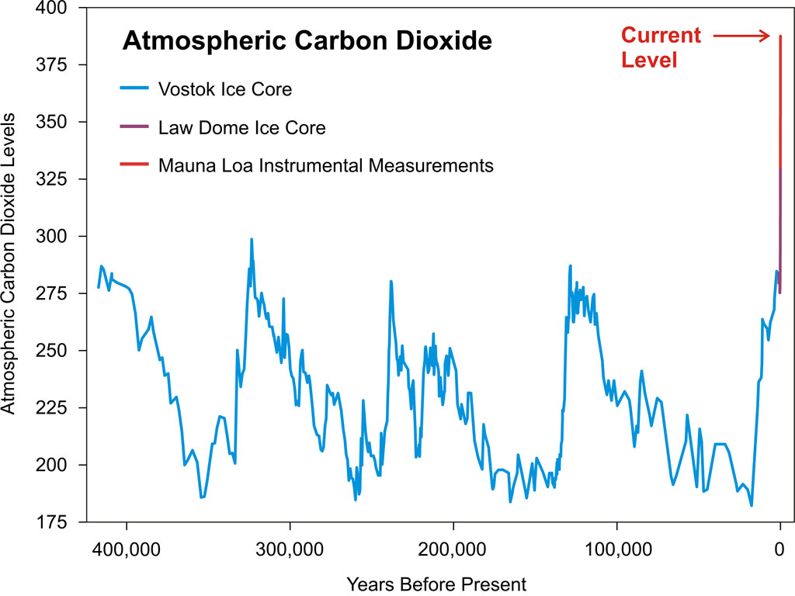
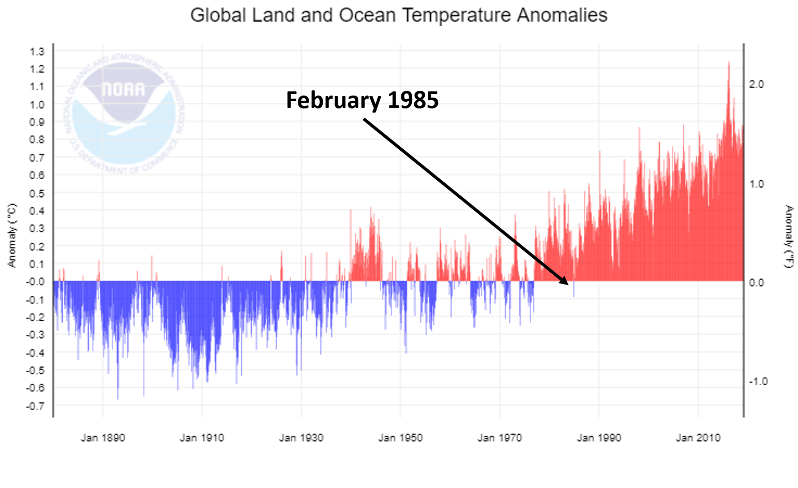
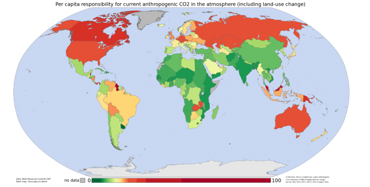
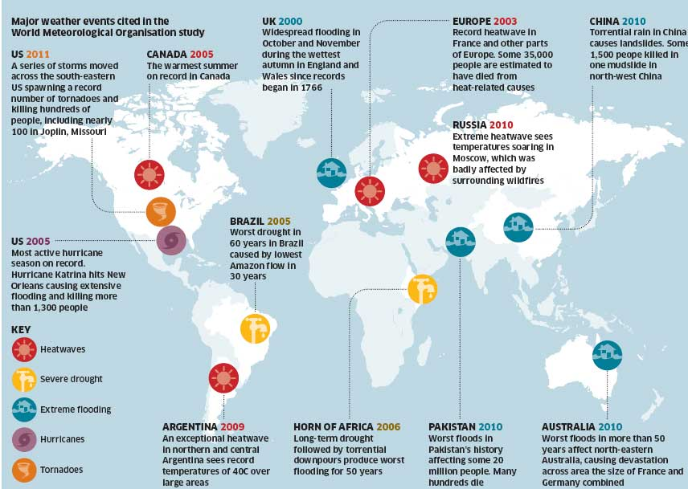
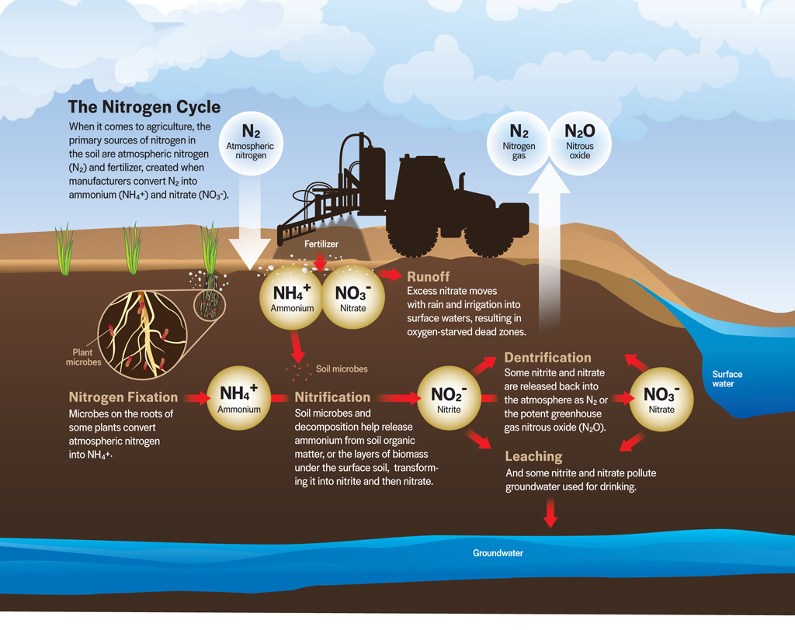

## Whats in a name...

## Global change at unprecedented rates

## Global change at unprecedented rates

## Dutch Elfstedentocht: 1985

## 

## Last 4 years....warmest ever (Ed Hawkins)

http://blogs.reading.ac.uk/climate-lab-book/files/2018/12/spiral_2018_WMO_large.gif

## Warming -> Climate change

## Last 12 years....smallest sea ice extents (Ed Hawkins)

http://blogs.reading.ac.uk/climate-lab-book/files/2017/05/maparctic_sept.gif

## How have humans altered Earth's systems

 

* **Agriculture started ~10,000 yrs ago**
      + Holocene inter-glacial period
      + stable climate period
      + population increased 100x till industrial period

 

* **Sedentary communities**
      + population increased 10x since industrial revolution
      + land cover changes = 50% surface

 

* **Population & consumption affects ecosystems**
    + dramatic since 1950

   

<!--  -->

## The Great Acceleration

# Haber bosch and human population

## Atmospheric C is dynamic

*vegetataion uptake*
~5 year turnover

## C cycle changes: emissions

## Who is respobsible for CO2

 

## Where does it come from?

## Anthropogenic Changes in Energy Budget

 

    + agriculture areas sensitive

    
## Anthropogenic Changes in Water Cycle

 
 
 

* **Societal**
    + small vulnerable pool of freshwater
    + search for clean drinking water

 

* **Irrigation increased 5x in 20^th^ century**
    + draw from lakes, rivers & groundwater
    + Ground water turns over ~ 200 years

 

 

## Agricultural Water Availability: Mediterranean

* **Irrigate to offest impacts on soil moisture**

## Anthropogenic Changes in Nitrogen Cycle

 
 

* **Carbon is disrupted among 4 pools**
    + atmosphere
    + ocean
    + land 
    + sediments/rocks

 

* **Atmospheric C is most dynamic**
    + driven by metabolism of organisms
    + ~5 year turnover
    + https://www.co2.earth/
    
## Greenhouse CO2 Emissions sources

## Greenhouse CO2 Emissions

## How is the USA doing?

## Global storage of CO2

 

* **Power of plants**

## The Other CO2 Problem

## CO2 Effects on Climate

 
 

* **If emisions stopped today:**
    + 50% absorbed by land/water in 30 yrs
    + 30% in atmosphere for centuries
    + 20% in atmospere for 1000 yrs

 

* **Future warming is inevitable**
    + sinks are weakening
    + deep sea sinks and weathering are slow
    

## Climate and Weather changes

## Extremes - Heat Waves

Almost everywhere these heat waves are now warmer than a century ago

## Extremes - Precipitation in the USA

 

## Extremes - Precipitation in the USA

 

## Ocean evaporation going up

## Anthropogenic Changes in Nitrogen Cycle

    

##Nitrogen Leaching and Agriculture

## Is 1.5C Global Target Reachable?

## It is not to late, but the risks are less if we start earlier

## Global change: the pulse of the planet

## Homogenization: USA?

## Historical: Are we experiencing a new mass extinction?

 

## Extinction versus humans

## Ecoregions versus humans

##

##

## 

## Food Insecurity

## What should I do

The average age the night we had splashdown was 28." When Space Shuttle Atlantis left Earth on May 11, 2009, the average NASA civil servant's age was 47.

