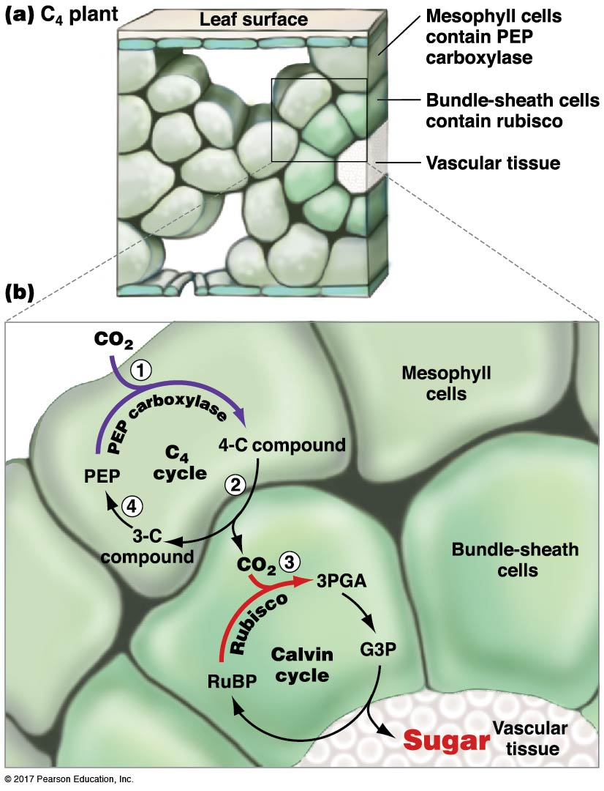
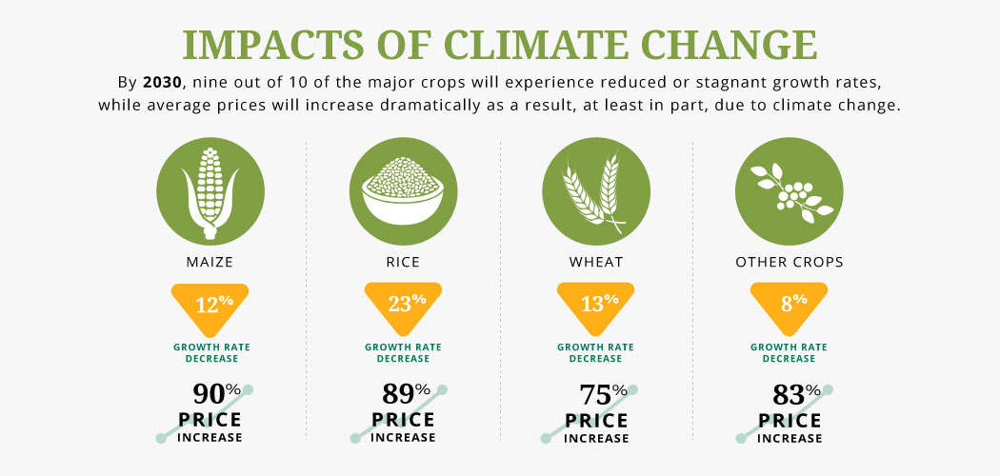
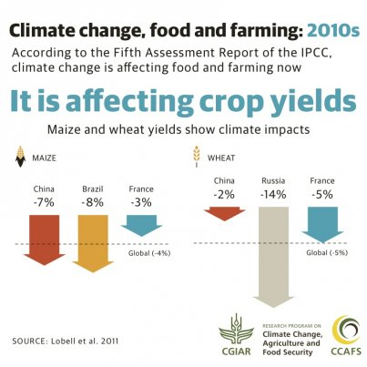

## Review: issues with c3 photosynthesis

## How did we get here?

## How did we get here? (slow = abundant)

## Has rubsico evolved?

RubisCO evolved before the first great oxygenation event in an atmosphere without oxygen (O2), so that its mechanism was not constrained by O2. However, with the rise of atmospheric O2 concentrations to modern-day levels, as a result of the second great oxygenation event, RubisCO had to learn to discriminate between CO2 and O2. Because discrimination usually comes at the cost of reduced catalytic rate, a more specific enzymes almost inevitably becomes a slower catalyst

## Why hasnt rubsico been replaced?

Removing the oxygenation capability breaks rubisco, so any mutation that modifies it is heavily selected against. 

plants evolved the C-4 mechanism to shift the Calvin Cycle away (either in time or location) from high oxygen.

there is an imaginary RuBisC peak nearby that is higher, but the only way to go to that peak is to go down to lower fitness and then evolve up the next peak, then selection will not favor this course and it is unlikely for you to evolve from RuBisCO to RuBisC.

## How to fix photosynthesis.....

evolution rather tends to work in a tinkering fashion by improving and recombining existing parts and pieces.

Plants have evolved multiple photosynthetic pathways in response to low CO2 concentrations, high temperatures, and limitations in the availability of water. This physiological variation is combined with many other morphological and anatomical adaptations to allow plants to exploit a wide variety of aquatic and terrestrial habitats around the world.

## The fall of RubsicCO : C4 photosynthesis

c3 - c4

## C4

certain plants have evolved a mechanism to more efficiently gather carbon dioxide

mesophyll cells at the top, which serves as a carbon dioxide pump to flood RuBisCO in bundle sheath cells and tip the balance in favor of the Calvin Cycle rather than photorespiration.

evolution of a new enzyme, phosphoenolpyruvate carboxlylase (PEP carboxylase or PEPC).

carbon to phosphoenolpyruvate. But rather than attempting to use O=C=O as the substrate, it uses HCO3- (bicarbonate). This is easily distinguished from oxygen gas, and so there is no competitive inhibition and certainly no photorespiration involved with PEPC. This is a very efficient enzyme!

## C4 plants

regeneration of PEP in the C4 pathway (Figure 4) leads to higher costs for ATP than in the C3 pathway. ATP for photosynthetic biochemistry is supplied by the light reactions. The extra cost of C4 biochemistry is a disadvantage where low light occurs, as found in inner-canopy competitive situations in cool, wet forests. It is rare to find C4 plants in such environments.

These plants are specially adapted to thrive in hot and dry environments,

Rubisco works much faster and they are more tolerant to heat and drought through better water use efficiency

##CAM

In CAM (Crassulacean Acid Metabolism) plants, the C-4 and C-3 reactions are separated in time rather than in space. The mesophyll cells carry out the C-4 reactions at night and the C-3 reactions in the daylight (remember that the C-3 reactions depend completely on the light reactions!).

C-4 reactions operating at night use energy from respiration of the previous day's accumulation of starch to drive the fixation of bicarbonate (dissolved carbon dioxide) into C-4 acids 

HOW?
The stomata are open at night in these plants to take in the carbon dioxide to convert to bicarbonate (H2O + CO2 → H2CO3 → H+ + HCO3-.

 

# CAM plants

CAM photosynthesis is found in more than 7% of vascular plant species, and has evolved independently several times

CAM plants is that they often have low photosynthetic capacity, slow growth, and low competitive abilities

Distribution patterns for CAM plants reflect this and are dominated by habitat aridity. Water storing cacti are adapted to enduring long periods with no precipitation.

 tropical environments. Epiphytes are plants that do not have their roots in the ground but instead grow on other plants (primarily trees)

## Why does this matter to you...

* **C4 plants are economically important**
    + corn, sugarcane, sorghum & switchgrass

 

* **However, lots of crops are C3**
    + beans, rice, wheat, potatoes (temperate crops)

 

* **Global water use is set to triple by 2050**
    + 70%  to the agriculture sector
    + 50% transpired through stomatal pores

 

* **?What does this mean?**

## 

## Can science TUNE photosynthesis?

* **Increasing efficient Rubsico in C4 crops**

 

* **Redesigning photosynthesis to cover up for RubisCO's side reaction with O2**

 

* **Turning C3 crops to C4...**
    + https://c4rice.com/

## What limits plant growth and survival?

* ASK* light, water, CO2, nutrients

* How do you test this?

## Plants cannot live on sugar alone

## Nutrients

## N - P - K

## Low concentrations in soil

## PLants use passive and active uptake systems

## Cool plant adaptations

## Plant cognition

 
 
 

* **Do plants sense their environment?**
    + changes in essential nutrients

 

* **If so, what do they do about it?**
    + selectively adapt to the resources which are available

#
<iframe width="560" height="315" src="https://www.youtube.com/embed/GCRNHdGXTi4" frameborder="0" allow="autoplay; encrypted-media" allowfullscreen></iframe>