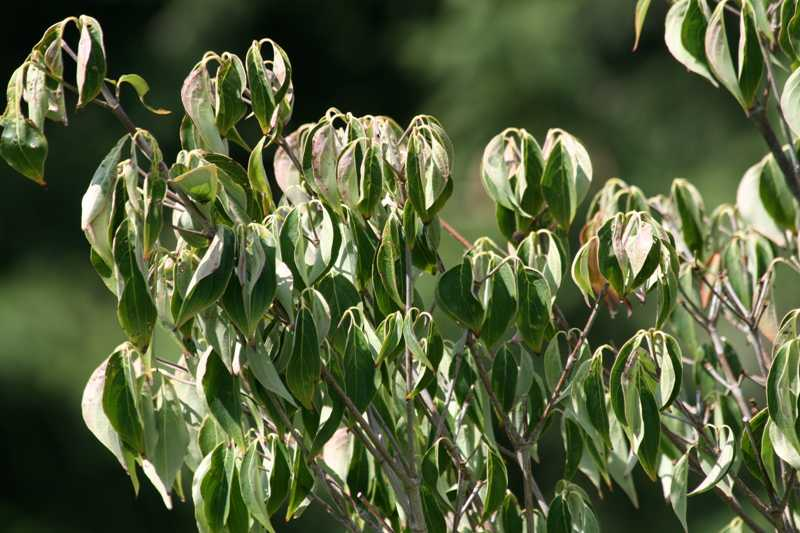
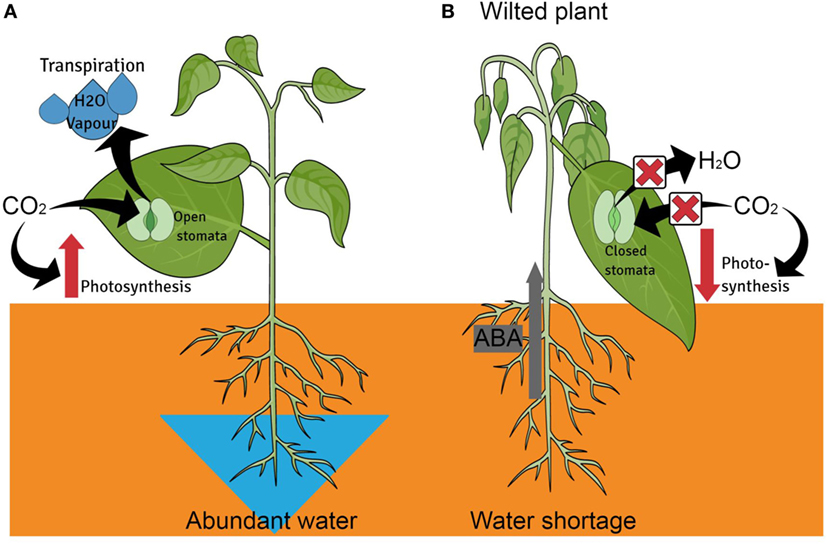
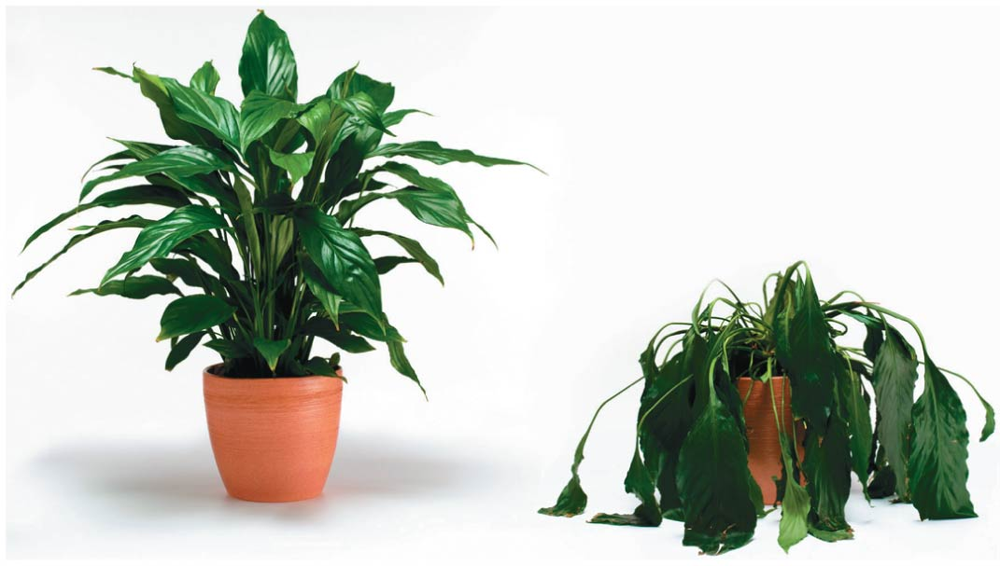
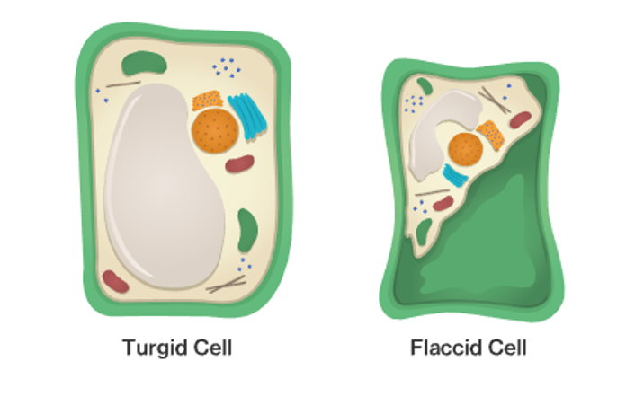

## What limits plant growth and survival?

## Resources for photosynthesis

## Nutritional elements for growth

 
 
 

* **Carbon, Hydrogen & Oxygen**
        + >95% of mass

 

* **Most have multiple functions**
      + Table 36.1
      
 

* **A few are often limiting**

 
 
 
## N - P - K

## 

## Mineral elements come from soil

## Review: root nutrient uptake

## Review: mycorrhizae

## Cool plant nutritional adaptations

## What is the most essential resource for plants?

##

## Turgor pressure

