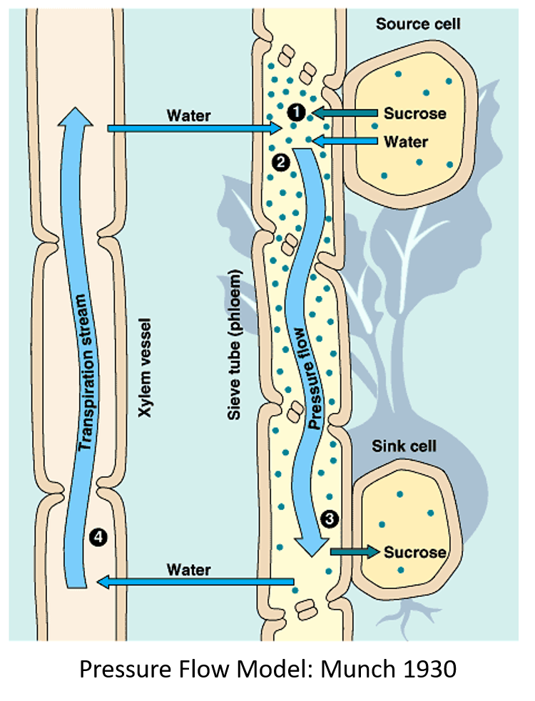

## Defenses

<iframe width="560" height="315" src="https://www.youtube.com/embed/Lzq-wRHCTKc" frameborder="0" allow="autoplay; encrypted-media" allowfullscreen></iframe>

## Wounding triggers transmission of Ca^2+^ to start systemic defense responses

 
Toyota et al. 2018. Science 361: 1112-1115.

## Source & Sink

## Mass Flow

## Water movement and VPD

## What limits plant growth and survival?

* ASK* light, water, CO2, nutrients

* How do you test this?

## Plants cannot live on sugar alone

## Nutrients

## N - P - K

## Low concentrations in soil

## PLants use passive and active uptake systems

## Cool plant adaptations

## Plant cognition

 
 
 

* **Do plants sense their environment?**
    + changes in essential nutrients

 

* **If so, what do they do about it?**
    + selectively adapt to the resources which are available

##
<iframe width="560" height="315" src="https://www.youtube.com/embed/GCRNHdGXTi4" frameborder="0" allow="autoplay; encrypted-media" allowfullscreen></iframe>

## How water moves through a plant

## Ecosystem Water Movements: Soil to Roots

## Ecosystem Water Movements: Soil to Roots

## Rhizosphere and Deep Roots

## Soil Refilling - Hydraullic Lift

## Water Movements through Plants

## Water movement: Stems

 
 
 

* **Root pressure**
 
  
 
* **Transpiration pull**
 
  
 
* **Capillary movement**

 

* **Xylem tissues, Sapwood area, Cavitation**
 
 
 
## Xylem Cavitation

 <iframe width="560" height="315" src="https://www.youtube.com/embed/uWL0EoZh09w?start=145" frameborder="0" allow="autoplay; encrypted-media" allowfullscreen></iframe>

## Water movement: Leaves

## Ecosystem water movement: State Factors

## How does a plant respond to stress

## Bugs

## Drought

##
