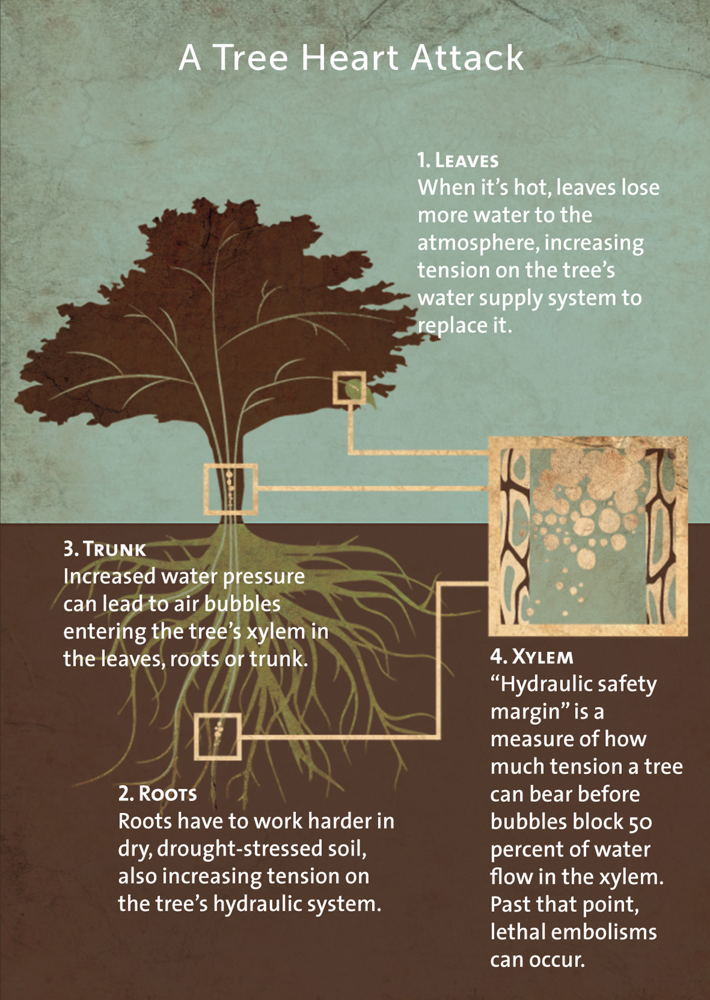

## Plant cognition

 
 
 
 
 

* **Do plants sense their environment?**
* changes in essential resources
*  herbivory

 

* **If so, what do they do about it?**
* do plants process information?

## Sensory cell systems

 
 
 
 
 
 
 
 

* **What external factors elicit responses from plants?**

## Plants in the light

## Plants in the light

<iframe width="560" height="315" src="https://www.youtube.com/embed/GCRNHdGXTi4" frameborder="0" allow="autoplay; encrypted-media" allowfullscreen></iframe>

## Plants competing for light can grow really tall

 
 
 
 

* **Are their limitations to plant height?**
* Redwoods = 116 m
      
 

* **What is the most limiting resource?** 

 

## Plant Water Movements: Soil - Root - Stem - Leaf - **Air**

## Are there limits to moving water?

 
 
 

* **Large trees move hundreds of gallons of water a day**

 

* **Gravity**
* harder and harder to move water
* limits growth to 122-130 m

 

* **Path length of transpiration stream**
* efficiency of xylem 'straws'

 
 
## How can redwoods grow so tall?

 
 

* **Cohesion tension theory**
* plants use water properties to cheat gravity

 

* **Cohesion: H~2~0 stick to other H~2~0 molecules**
* via H bonds

 

* **Adhension: water sticks to non water moelcules**
* stick to sides of plant vascular tissue

 

* **Transpiraton pulls water under tension**

 
 

## How can redwoods grow so tall?

 
 
 

* **H~2~O is pulled in zig zag motion**
* shape of tracheids
* pits and perforations

 

* **Vascular tissue is tough**
+ high resistance of lignified walls

 

##

## Cavitation: When water breaks 

 
## Do plants sense cavitation events and repair them? 

## How do plants avoid water problems #1

## Risky stomatal behavior

## How do plants avoid water problems #2

## How do plants avoid water problems #3

## Remember the acacia tree?

## Plant defenses 

 
## Signalling herbivory

 

<iframe width="560" height="315" src="https://www.youtube.com/embed/Lzq-wRHCTKc" frameborder="0" allow="autoplay; encrypted-media" allowfullscreen></iframe>

## Wounding triggers transmission of Ca^2+^ to start defense response

 

Toyota et al. 2018. Science 361: 1112-1115.

## Protective perfumes

