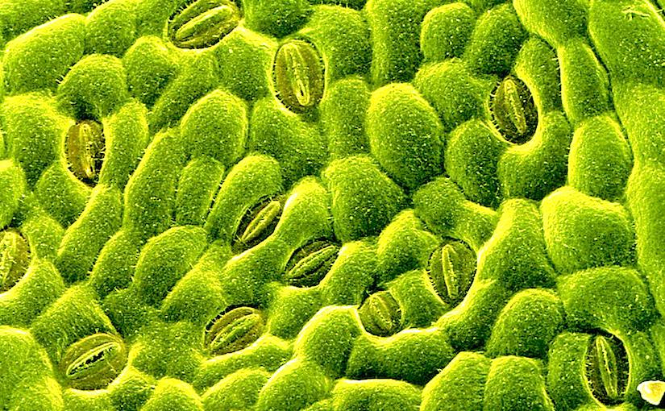
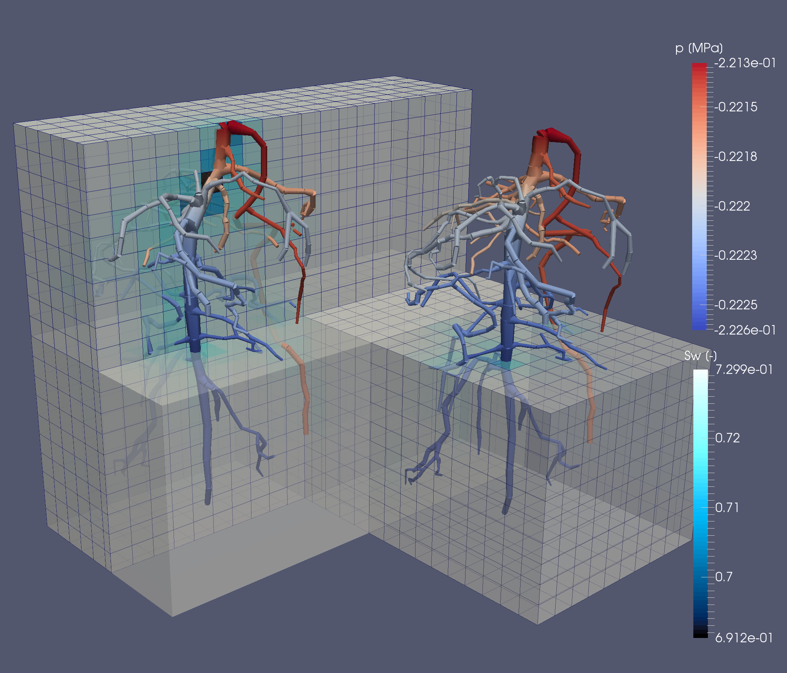
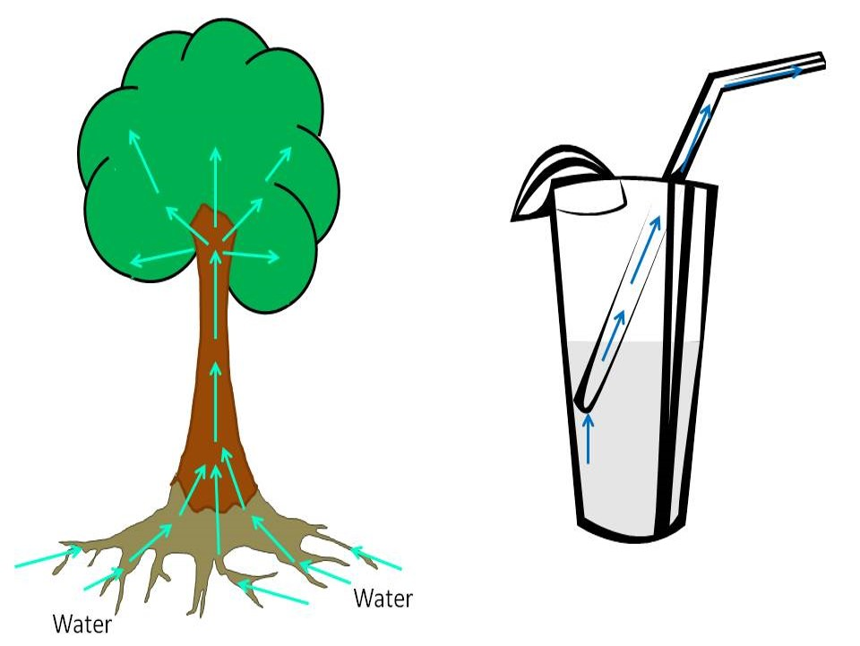

## Plant cognition

 
 
 

* **Do plants sense their environment?**
    + changes in essential nutrients

 

* **If so, what do they do about it?**
    + do plants process information?

## Sensory cell systems

## Plants in the light

## Plants in the light

<iframe width="560" height="315" src="https://www.youtube.com/embed/GCRNHdGXTi4" frameborder="0" allow="autoplay; encrypted-media" allowfullscreen></iframe>

## Plants competing for light can grow really tall

 
 
 

* **Are their limitations to height??""
      + Redwoods = 116 m
      
 

* **What is the most limiting resource?**

 

## Are there limits to moving water?

 
 
 

* **Large trees move 100 gallons of water a day**

 

* **Gravity**
      + harder and harder to move water
      + limits growth to 122-130 m

 

* **Path length of transpiration**
      + length and width of xylem 'straws'
 
 
 
## Plants use water properties to cheat gravity

* **Cohesion tension theory**

Cohesion: H20 stick to other H20 molecules
    + via H bonds
    
Adhension: water sticks to non water moelcules
    + via h bonds
    + stick to sides of plant vascular tissue
    

# H_2_O does not move straight up

* **Negative osmotic pressure with zig zag motion**
      + cheats gravity a little bit

notes: capliary action
tubes provide a little extra leverage and tension relief every time they direct the water column the least bit to the side instead of straight up
 
 
 
## Water movement

## tree heart attack
 
 
 
# What happens when water supply goes wrong? #3 

## Xylem Cavitation

 <iframe width="560" height="315" src="https://www.youtube.com/embed/uWL0EoZh09w?start=145" frameborder="0" allow="autoplay; encrypted-media" allowfullscreen></iframe>
 
# Do plants sense cavitation events and repair them? 

# How do plants avoid water problems #1

## Risky stomatal behavior

# How do plants avoid water problems #2

# How do plants avoid water problems #3

## Water Movements: Soil - Root - Stem - Leaf - Air

notes : air has more empty space to hold water vapor thatn a ligquid (tree sap)
occurs until around 95% humidity

transpiration: air pulls water out when stomata are open, water molecule hang onto each other tightly

## Water movement: Stems

 
 
 

* **Root pressure**

* **Transpiration pull**

* **Xylem tissues, Sapwood area, Cavitation**
 
 
 

## Remember the acacia tree?

 

## Plant defenses 

 

## Defenses

 

<iframe width="560" height="315" src="https://www.youtube.com/embed/Lzq-wRHCTKc" frameborder="0" allow="autoplay; encrypted-media" allowfullscreen></iframe>

## Wounding triggers transmission of Ca^2+^ to start systemic defense responses

 

Toyota et al. 2018. Science 361: 1112-1115.

## Plants in the dark
