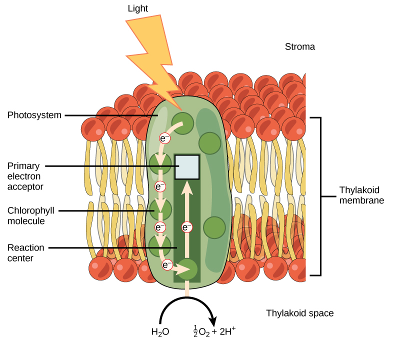
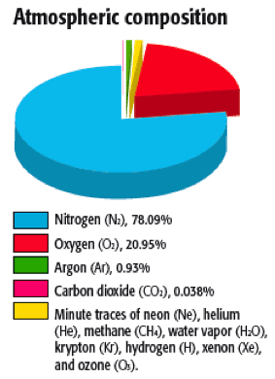
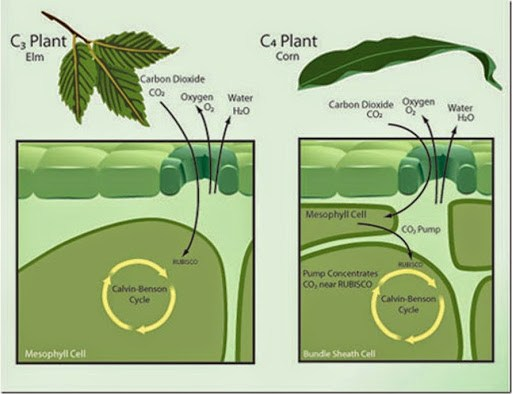
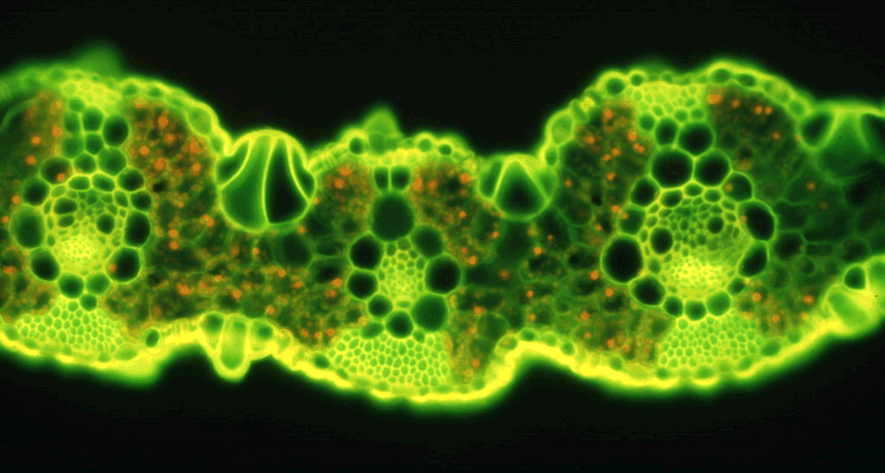
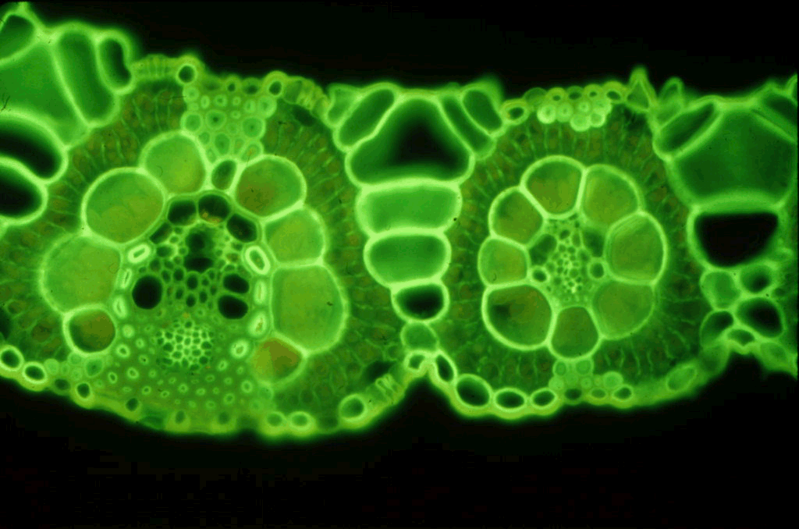
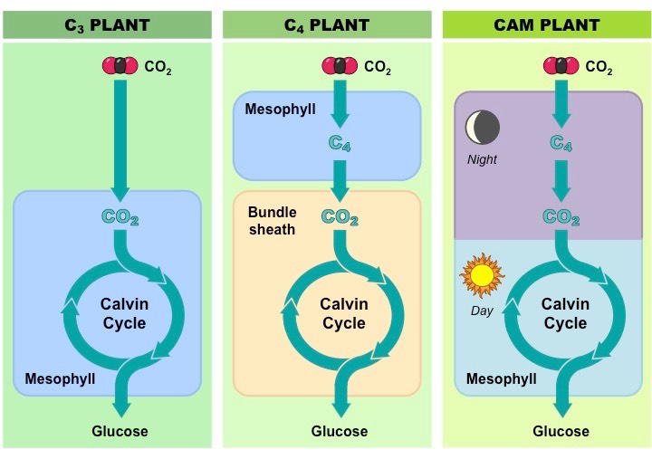
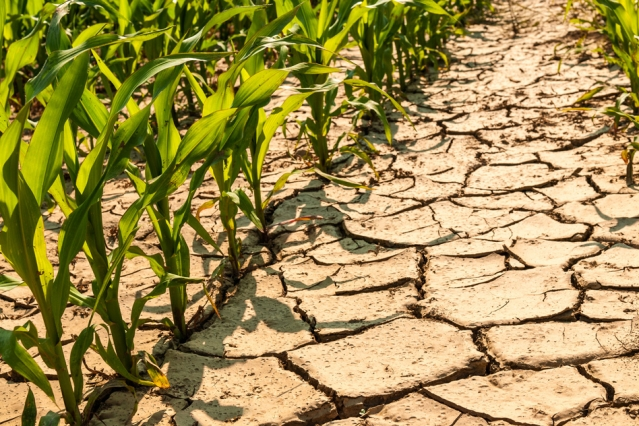

## Review: Light energy to chemical energy

## Review: Calvin cycle

## Review: Issues with C3 photosynthesis

 Like having a really good friend with a disgusting habit 

## Rubisco substrate choice

## Photorespiration inpacts food security

## Rubisco evolution: How did we get here?

## Plant evolution tied to atmospheric shifts in CO~2~:O~2~ 

## Why has Rubsico not been replaced?

 
 

* **Evolution of enzymes subject to strong biophysical constraints**
    * trade-offs between activity and stability
 
  
 
* **Removing the oxygenation capability breaks rubisco**
    * selection against modifying mutations

 

* **RubisCO → RubisC**
    * requires a decrease in fitness 
    * "heartbeat" of photosynthesis

## Evolution tinkers with other parts of photosynthesis

 
 
 

* **Improved and recombined existing parts and pieces**
 
 

* **In response to environmental change**
    * lower [CO~2~]
    * high temperatures 
    * water limitations 

 

* **Allowed plants to exploit new habitats**

## C4 photosynthesis: Evolved many times

## Evolution of C4 photosynthesis

 
 
 
 
 

* **C3 plants use CO~2~ directly in the Calvin cycle**

 

* **C4 plants first fix CO~2~ to PEP**

 

* **Mesophyll cells @ top are CO~2~ pumps**
    * flood Rubsico in **bundle sheath cells** with CO~2~

## Functional change in bundle sheath cells (C3 → C4)

 
 
 
 

* **Calvin cycle now occurs in BSC cells around leaf veins**
    * chloroplasts now present

 
 
 
 

* **BSC cells are less permeable to gases**
    * what does this mean for photorespiration?

## 

## C4 plants concentrate CO~2~ around Rubisco spatially

 
 
 

* **C4 mechanism separates Calvin cycle from high O~2~**

 

* **New enzyme, phosphoenolpyruvate carboxlylase (PEPC)**
    * fixes CO~2~ to PEP
    * no affinity for O~2~
    * 4C malate carries CO~2~ to Calvin cycle

 

* **Hyper efficient with use of CO~2~**
    * How does this impact stomata behavior?

## Why is C4 photosynthesis not dominant?

 
 
 
 

* **Regeneration of PEP expensive (ATP)**
 
 
 
* **Where is needed ATP generated?**

 

* **Where should C4 plants live**
    * efficiency vs dehydration
    

##

 In hot conditions, the benefits of reduced photorespiration likely exceed the ATP cost of moving CO~2~ from the mesophyll cell to the bundle-sheath cell 

## CAM (Crassulacean Acid Metabolism) photosynthesis

## CAM concentrates CO~2~ around Rubisco temporally

 
 
 

* **Stomata open at night only**
 
 
 
* **4C compounds produced in large quantities**
    + store CO~2~ when Rubisco is inactive

 

* **C4 vs CAM**
    * substitute BSC for "night shift"
    

## Yes we CAM!!

 
 
 

* **CAM evolved independently several times**
    + ~16,000 species

 

* **Exist in arid environments or habitats**
    * cacti
    * epiphytes

 

* **Are CAM plants fast or slow growing?**

## C3 vs C4 vs CAM

## Why does this matter to you...

 
 

* **C4 plants are economically important**
    * corn, sugarcane, sorghum & switchgrass

 

* **So are C3 crops**
    * beans, rice, wheat, potatoes (temperate crops)

 

* **Global water use is set to triple by 2050**
    * 70%  to the agriculture sector
    * 50% transpired through stomatal pores

## 

## Can science TUNE photosynthesis?

 
 
 
 

* **↑ efficiency of Rubisco in crops**

 

* **Redesign to mask photorespiration**

 

* **Turning C3 crops to C4...**
    * https://c4rice.com/

