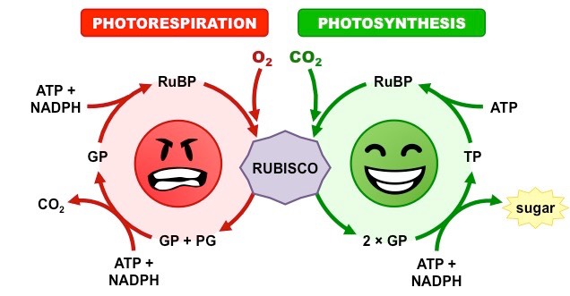

## Review: Issues with C3 photosynthesis

## Has rubisco evolved?

## 

## Why has rubisco not been replaced?

 
 

* **Evolution of enzymes subject to strong biophysical constraints**
* tradeoffs between activity and stability
 
  
 
* **Removing the oxygenation capability breaks rubisco**
* heavy selection against modifying mutations

 

* **RubisCO → RubisC**
* requires a decrease in fitness 
* Studer et al. 2014

## Evolution has tinkered with photosynthesis

 
 
 

* **Improved and recombined existing parts and pieces**
 
 

* **In response to environmental change**
* lower [CO~2~]
* high temperatures 
* water limitations 

 

* **Allowed plants to exploit new habitats**

## Evolution of C4 photosynthesis

 
 

* **C4 mechanism separates Calvin cycle from high O~2~**

 

* **Mesophyll cells @ top are CO~2~ pumps**
* flood rubisco in **bundle sheath cells** with CO~2~

 

* **New enzyme, phosphoenolpyruvate carboxlylase (PEPC)**
* fixes CO~2~ to PEP
* no affinity for O~2~
* 4C malate carries CO~2~ to Calvin cycle

##

## Why has C4 not taken over?

 
 
 
 

* **Regeneration of PEP expensive (ATP)**
 
 
 
* **Where is needed ATP generated?**

 

* **Where should C4 plants live**

##

## CAM (Crassulacean Acid Metabolism) plants

## Yes we CAM!!

 
 
 

* **CAM evolved independently several times**

 

* **Exist in arid environments or habitats**
* cacti
* epiphytes

 

* **Are cam plants fast or slow growing?**

## Why does this matter to you...

 
 

* **C4 plants are economically important**
* corn, sugarcane, sorghum & switchgrass

 

* **So are C3 crops**
* beans, rice, wheat, potatoes (temperate crops)

 

* **Global water use is set to triple by 2050**
* 70%  to the agriculture sector
* 50% transpired through stomatal pores

## 

<!--  -->

## Can science TUNE photosynthesis?

 
 
 

* **↑ efficiency of Rubsico in C4 crops**

 

* **Redesign to mask rubisco's side reaction with O~2~**

 

* **Turning C3 crops to C4...**
* https://c4rice.com/

