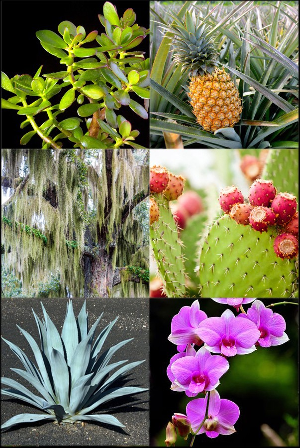

## Review: Issues with C3 photosynthesis

## 

## Has rubsico evolved?

## Why hasnt rubsico been replaced?

 
 

* **Evolution of enzymes is subject to strong biophysical constraints**
      + tradeoffs between activity and stability
 
  
 
* **Removing the oxygenation capability breaks rubisco**
      + heavy selection against modifying mutations

 

* **RubisCO → RubisC**
    + requires a decrease in fitness 
    + Studer et al. 2014

## Evolution has tinkered with photosynthesis

 
 

* **Improved and recombed existing parts and pieces**
 
 

* **In response environmental change**
      + low CO_2_ concentrations 
      + high temperatures 
      + water limitations 

 

* **Allowed plants to exploit new habitats**

## Evolution of C4 photosynthesis

 
 

* **C4 mechanism shifts the Calvin Cycle away from high O_2_**

 

* **Mesophyll cells @ top a CO_2_ pump**
      + flood RuBisCO in bundle sheath cells with CO_2_

 

* **New enzyme evolved, phosphoenolpyruvate carboxlylase (PEPC)**
      + uses HCO_3-_ (bicarbonate) as substrate
      + no affinity for O_2_

## 
 
 
 

* **Regeneration of PEP expensive (ATP)**
 
 
 
* **Where is ATP generated?**

 

* **Where should C4 plants live**

##

## CAM (Crassulacean Acid Metabolism) plants

## Yes we CAM!!

 
 
 

* **CAM photosynthesis evolved independently several times**

 

* **Exist in arid environments or habitats**
      + cacti
      + epiphytes

 

* **Are cam plants fast or slow growing?**

## Why does this matter to you...

 

* **C4 plants are economically important**
    + corn, sugarcane, sorghum & switchgrass

 

* **Lots of crops are also C3**
    + beans, rice, wheat, potatoes (temperate crops)

 

* **Global water use is set to triple by 2050**
    + 70%  to the agriculture sector
    + 50% transpired through stomatal pores

## 

<!--  -->

## Can science TUNE photosynthesis?

 
 
 

* **↑ efficiency of Rubsico in C4 crops**

 

* **Redesign to mask RubisCO's side reaction with O2**

 

* **Turning C3 crops to C4...**
    + https://c4rice.com/

## Notes
RubisCO evolved before the first great oxygenation event in an atmosphere without oxygen (O2), so that its mechanism was not constrained by O2. However, with the rise of atmospheric O2 concentrations to modern-day levels, as a result of the second great oxygenation event, RubisCO had to learn to discriminate between CO2 and O2. Because discrimination usually comes at the cost of reduced catalytic rate, a more specific enzymes almost inevitably becomes a slower catalyst

* **C-4 and C-3 reactions are separated in time**