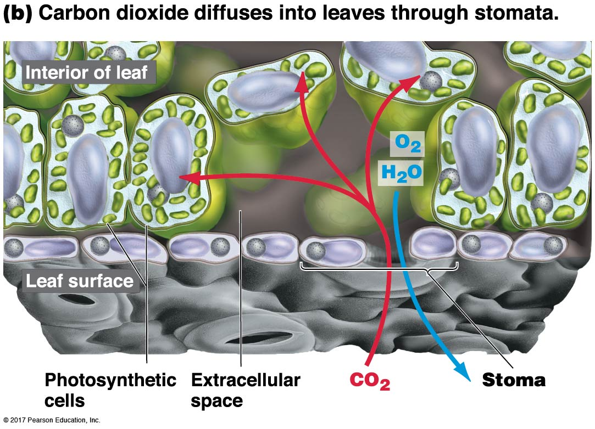
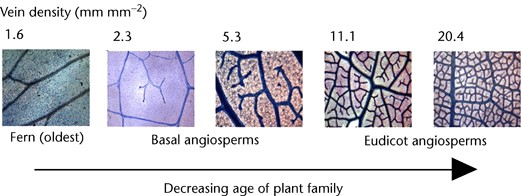
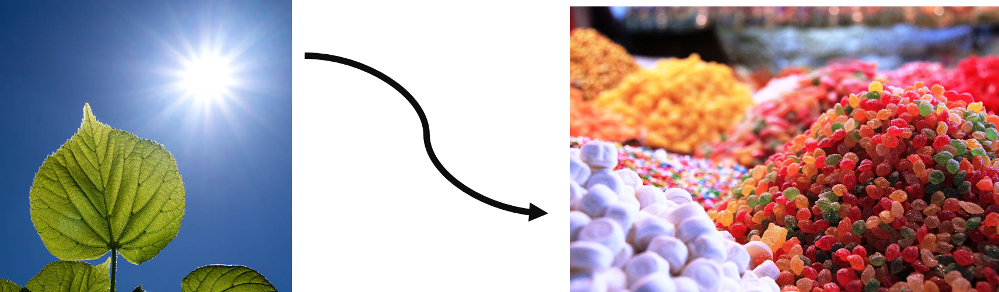
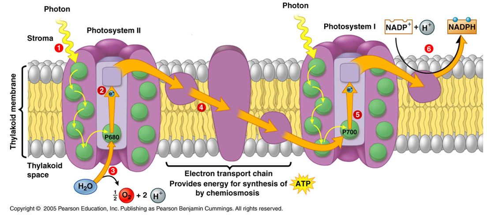

```{r setup, include=FALSE}
knitr::opts_chunk$set(echo = FALSE)
```

##


## Leaf structure and why it matters
<hr>


## Leaves exchange gases via stomata
<hr>


<div class="footer">Chen et al. 2017. Trends in Plant Science 22: 124-139</div>

## How stomata work...
<hr>




## Leaf veins
<hr>
<br/>
<br/>

<div style="float: right; width: 55%;">
* **_Transpiration_ is a by‐product of opening stomatal pores**

<br/>

* **Water transport needs to be sufficient to keep stomata open** 

<br/>

* **Leaf must invest in H[2]) transport**

</div>


## Evolution of leaf vein density
<hr>



## Leaf anatomy and economics
<hr>


## What do we do when we are hungry?
<hr>
<br/>


## What do plants do when they are hungry?
<hr>
    


## What do plants do when they are hungry?
<hr>
    


## Where does this 'Photosynthetic' magic happen?


## Light, pigments & green leaves
<hr>
<br/>


## When chlorophyll absorbs light, 3 things can happen:

- Auto-fluorescence: heat, release of absorbed energy in the form of light

- ENERGY transfer from one chlorophyll to its neighbor

- ELECTRON transfer to a neighboring electron acceptor


## Photosynthesis is the basis for most life on Earth

* Greek = “building with light”
* Autotroph = “self nourishing”
* Photoautotroph = “self nourishing with light”

* 95% of plant biomass comes from Photosynthesis!

* Photosynthesis is an energy pathway


## Stage 1: Light reactions

#Notes
* Transform light energy into chemical energy
* Makes molecules that carry energy (ATP and NADPH) to feed Calvin Cycle.




## Chlorophyll absorbs light and transfers the energy to photosystems

* Cholorphyll is large molcule with structures to capture light energy
Two photosystems (they harvest light energy)
PSII = wavelength 680 
PSI = wavelength 700
“Special Pair” of chlorophyll molecules at the core serve as reaction centers

## Stage 2: Dark Reactions (aka Calvin cycle)

molecule from light reaction to transform CO2 and water
uses Rubisco (enzyme) to capture CO2
6 molecules of CO^2^ enter the cycle : one moleulce of glucose leaves


## Rubisco - the enzyme that dominates carbon fixation


* **most important protein in the world, and by FAR the most abundant**

rate of photosynthesis is usually limited not by light but by the availability of carbon dioxide for fixation by RuBisCO

More than 90% of the inorganic carbon that is converted into biomass is fixed by the enzyme RubisCO

large molecule : 16 polypeptides : 8 active sites

## Why does Rubsico suck so bad...

1) Only performs 3 reactions per second: SLOW

2a) Has an error rate of 20% (toxic compunds that inhibit seveal C metabolism enzymes) that gets worse at high temperatures...

2b) Performs carboxylation (addition of CO2) as well as OXYGENATION (addition of O2) due to the fact that the substrate (ribulose 1,5 bisphosphate) attaches to both. 

    + The oxygenation products are completely wasted, which means it takes nearly twice as much energy for a plant to produce the same amount of sugar than if Rubisco just reacted with CO2. 

3) Photorespiration = no ATP

Why?: 


## Photosynthesis is complicated....

## c3 Photosynthesis how did we get here...

 evolution doesn't necessarily create the best solution.