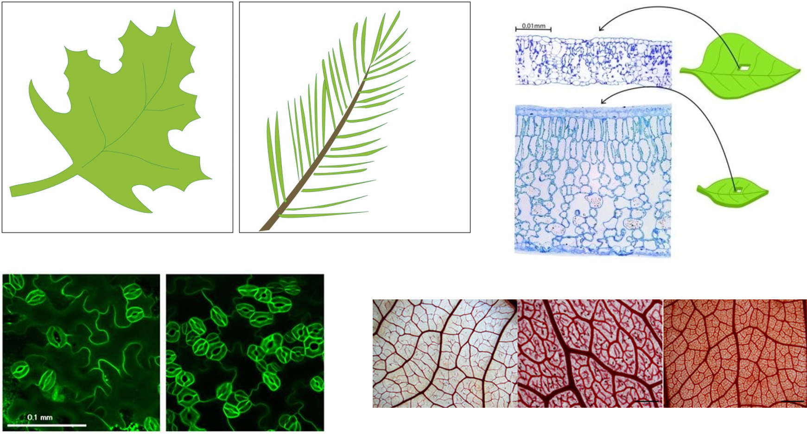
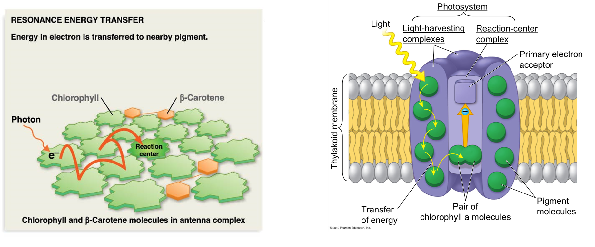
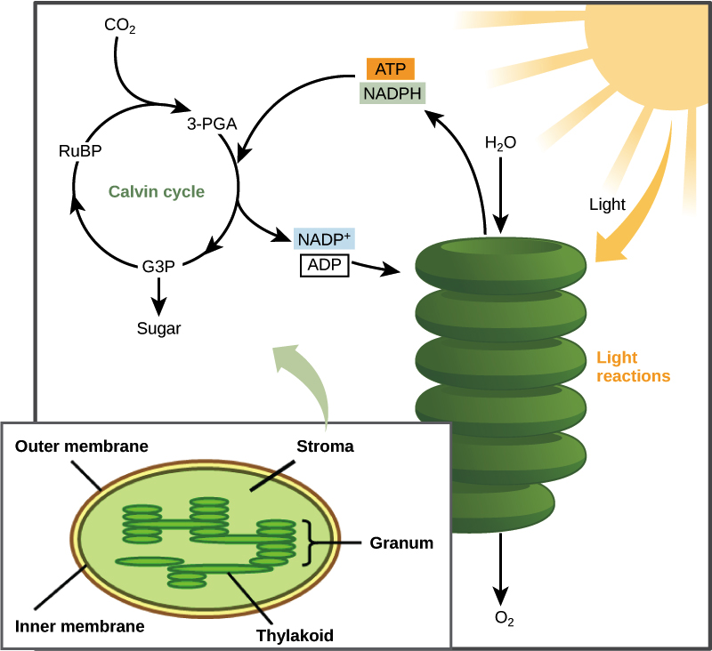
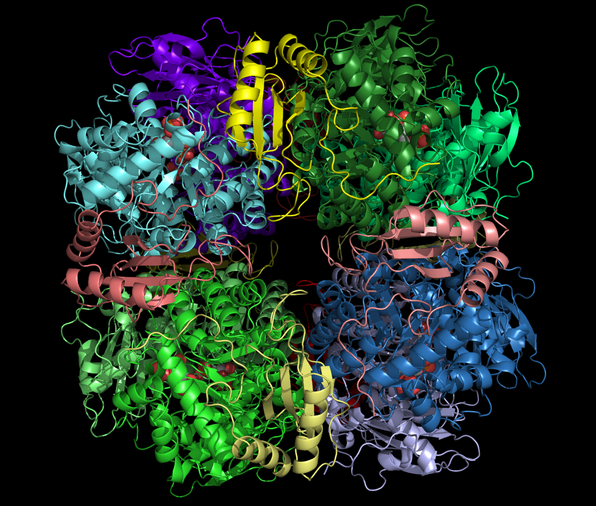
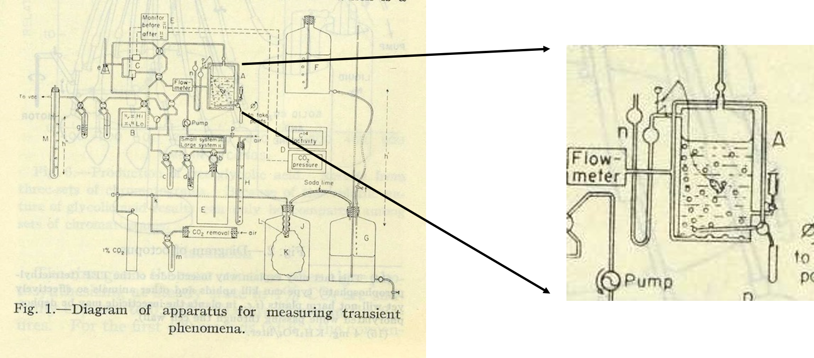

##

## Leaf structure and why it matters

## Leaves exchange gases via stomata

## How stomata work...

## Leaf gas exchange impacts global ecology

## Vascular tissues in leaves are confined to veins

 
 

* **_Transpiration_ is a by‐product of opening stomatal pores**
 

* **H~2~O transport needs to be sufficient to keep stomata open** 
 

* **Venation represents investment in H~2~O supply**

## How leaf veins changed the world....

## Are plants intelligent? Leaf economics theory

## Photosynthesis is complicated....

 

## What do we do when we are hungry?

 

## What do plants do when they are hungry?

    

## Photosynthesis is the basis for most life on Earth

 
 
 

* **Greek = “building with light”**
* **Autotroph = “self nourishing”**
* **Photoautotroph = “self nourishing with light”**

 

* **95% of plant biomass comes from photosynthesis**

 

* **Photosynthesis is an energy pathway**
    * 2 linked reactions

 

 

## Chloroplasts: Where the magic happens

## The nature of light

 

## When light hits chlorophyll a few things can happen

## When pigments absorbing photons an election gets excited

 Photosystems (2) convert light energy to chemical energy  

 
## Light reactions: make ATP + NADPH for Calvin cycle

 

## Light reactions: make ATP + NADPH for Calvin cycle

 

## Light energy to chemical energy 

 

## Dark Reactions (aka Calvin cycle)

## Calvin cycle is a 3-step process

## Making sugars requires several cycles

## Rubisco - the enzyme that dominates carbon fixation

 
 
 
 
 

* **Most abundant enzyme in the world**

 

* **Most CO~2~ converted into biomass is fixed by Rubisco**

 

* **Large molecule : 16 polypeptides : 8 active sites**

## Rubisco: the clunky and slow carbon fixer

 
 
 
 

* **Only 3-10 reactions per second**

 

* **20% error rate**
    * gets worse at high temperatures
        
 

* **Performs carboxylation and OXYGENATION**

## C3 photosynthesis how did we get here...

 
 
 
 

* **Evolution doesn't necessarily create the best solution**

 

* **Oxygenation products are completely wasteful**

 

* **2x energy to produce the same amount of sugar than if Rubisco just reacted with CO~2~**

 

## Calvin Benson won a Nobel prize, is TA won best practical joke

 