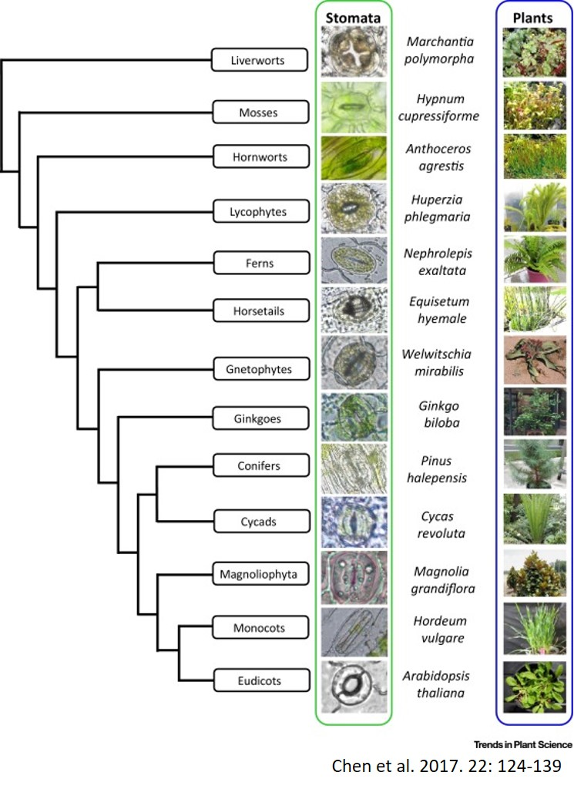
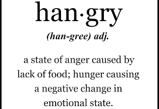
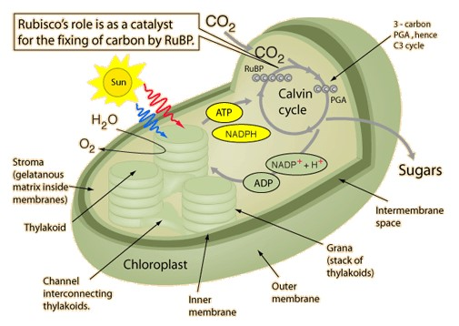

##

## Leaf structure and why it matters

## Leaves exchange gases via stomata

## How stomata work...

## Leaf veins

 
 
 
 

* **_Transpiration_ is a by‐product of opening stomatal pores**

 

* **Water transport needs to be sufficient to keep stomata open** 

 

* **Leaf must invest in H~2~O transport**

## Evolution of leaf vein density

## Leaf structure and economics

## Economic strategies drive leaf form and function

 

## What do we do when we are hungry?

 

## What do plants do when they are hungry?

    

## Photosynthesis is the basis for most life on Earth

 
 
 

* **Greek = “building with light”**
* **Autotroph = “self nourishing”**
* **Photoautotroph = “self nourishing with light”**

 

* **95% of plant biomass comes from photosynthesis**

 

* **Photosynthesis is an energy pathway**

 

 

## Photosynthesis is complicated....

 

## Where does this 'Photosynthetic' magic happen?

## Light, pigments & green leaves

 

## When chlorophyll absorbs light, 3 things can happen:

 
 
 

* **FLUORESCENCE: release of absorbed energy by light & heat**

 

* **ENERGY transfer from one chlorophyll to its neighbor**

 

* **ELECTRON transfer to a neighboring electron acceptor**

 

 
## Light reactions: make ATP + NADPH for Calvin cycle

 

## Light reactions: make ATP + NADPH for Calvin cycle

 

## Light energy to chemical energy 

 

transfer of electorns in energetically downhill

## Stage 2: Dark Reactions (aka Calvin cycle)

## Glucose

## Rubisco - the enzyme that dominates carbon fixation

 
 
 

* **Most abundant protein in the world**

 

* **Most inorganic carbon converted into biomass is fixed by Rubisco**

 

* **large molecule : 16 polypeptides : 8 active sites**

## Why does Rubsico suck so bad...

 

* **photosynthesis is usually limited  the availability of CO_2_ for fixation by RuBisCO

1) Only performs 3 reactions per second: SLOW

2a) Has an error rate of 20% (toxic compunds that inhibit seveal C metabolism enzymes) that gets worse at high temperatures...

2b) Performs carboxylation (addition of CO_2_) as well as OXYGENATION (addition of O_2_) due to the fact that the substrate (ribulose 1,5 bisphosphate) attaches to both. 

3) Photorespiration = no ATP

## C3 photosynthesis how did we get here...

 

* **Evolution doesn't necessarily create the best solution**

* **Oxygenation products are completely wasted, which means it takes nearly twice as much energy for a plant to produce the same amount of sugar than if Rubisco just reacted with CO2**

 