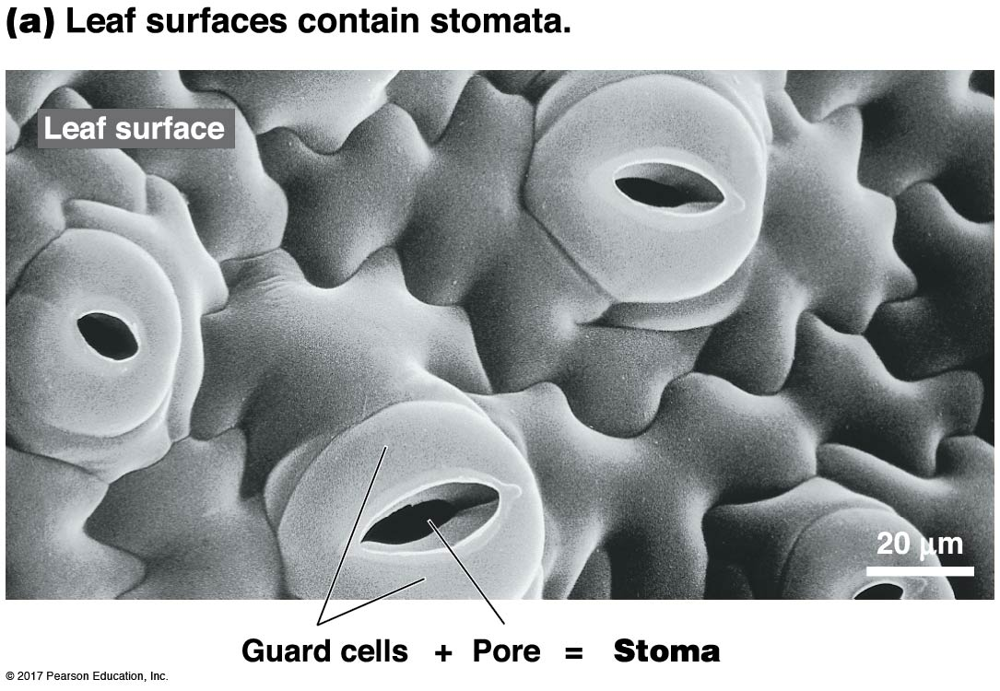
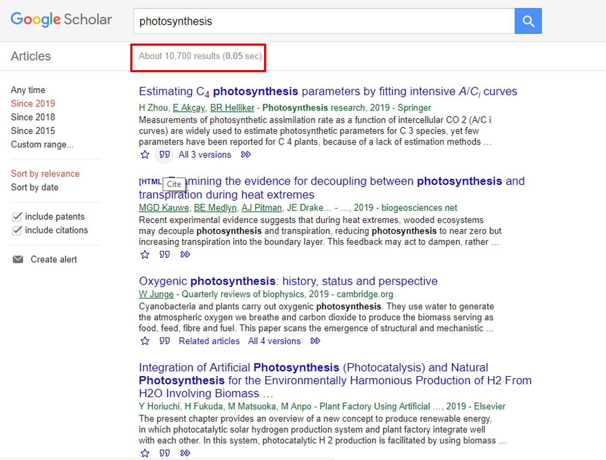

##

## Leaf structure and why it matters

## Leaves exchange gases via stomata

## How stomata work...

## Leaf veins

 
 
 
 

* **_Transpiration_ is a by‐product of opening stomatal pores**

 

* **Water transport needs to be sufficient to keep stomata open** 

 

* **Leaf must invest in H~2~O transport**

## Evolution of leaf vein density

## Leaf structure and economics

## Economic strategies drive leaf form and function

 

## Photosynthesis is complicated....

 

## What do we do when we are hungry?

 

## What do plants do when they are hungry?

    

## Photosynthesis is the basis for most life on Earth

 
 
 

* **Greek = “building with light”**
* **Autotroph = “self nourishing”**
* **Photoautotroph = “self nourishing with light”**

 

* **95% of plant biomass comes from photosynthesis**

 

* **Photosynthesis is an energy pathway**

 

 

## Where does this 'Photosynthetic' magic happen?

## Light, pigments & green leaves

 

## When chlorophyll absorbs light, 3 things can happen:

 
 
 

* **FLUORESCENCE: release of absorbed energy by light & heat**

 

* **ENERGY transfer from one chlorophyll to its neighbor**

 

* **ELECTRON transfer to a neighboring electron acceptor**

 

 
## Light reactions: make ATP + NADPH for Calvin cycle

 

## Light reactions: make ATP + NADPH for Calvin cycle

 

## Light energy to chemical energy 

 

## Dark Reactions (aka Calvin cycle)

## Making glucose requires several cycles

## Rubisco - the enzyme that dominates carbon fixation

 
 
 
 

* **Most abundant protein in the world**

 

* **Most carbon converted into biomass is fixed by Rubisco**

 

* **Large molecule : 16 polypeptides : 8 active sites**

## Why does Rubisco suck so bad...

* **Only performs 3-10 reactions per second: SLOW**

 

* **Has an error rate of 20%**
        + gets worse at high temperatures
        
 

* **Performs carboxylation as well as OXYGENATION **
        + affinity for both 

## C3 photosynthesis how did we get here...

 

* **Evolution doesn't necessarily create the best solution**

 

* **Oxygenation products are completely wasted**

 

* **Nearly 2x energy to produce the same amount of sugar than if Rubisco just reacted with CO_2_**

 

 

 