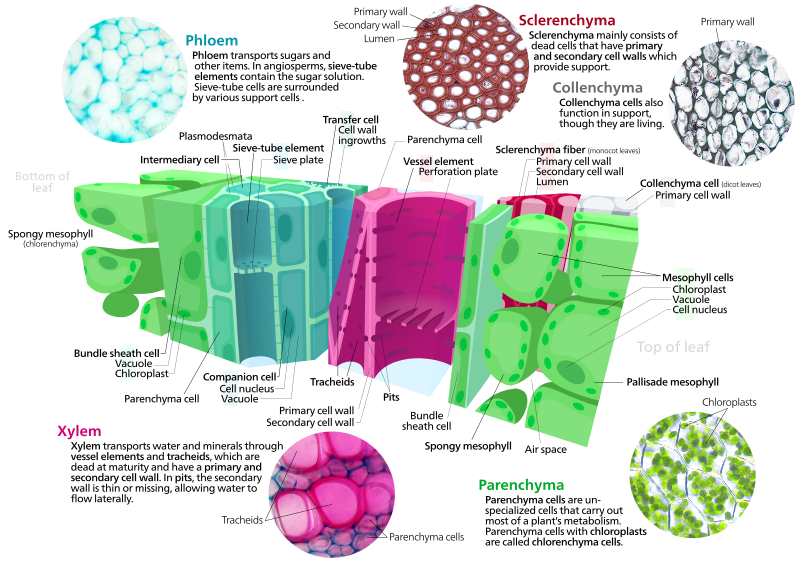
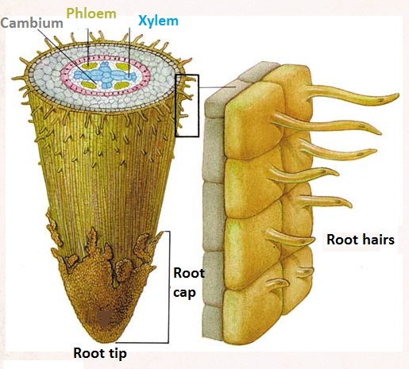
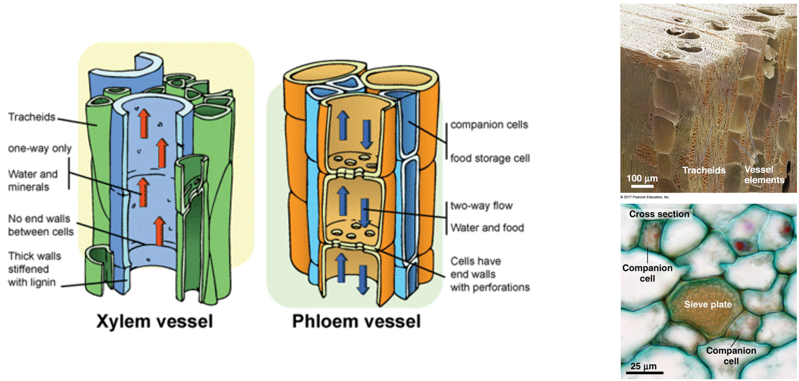
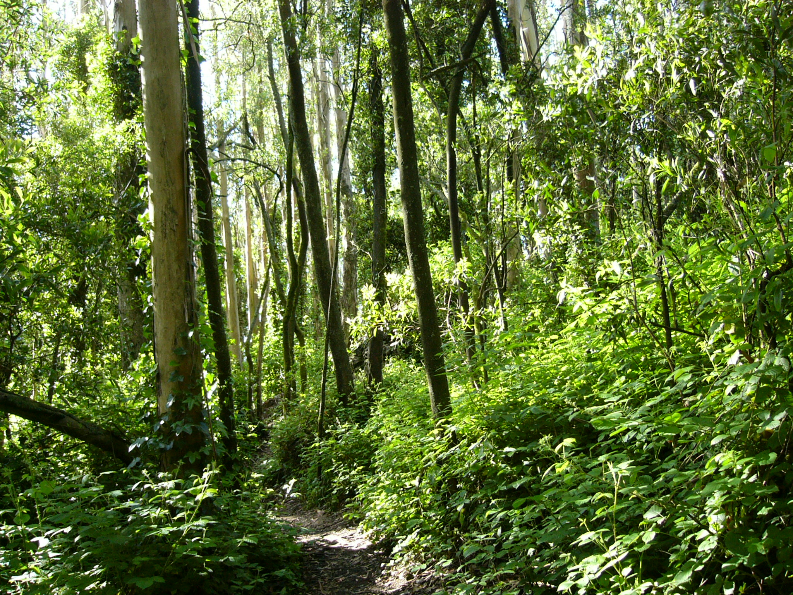
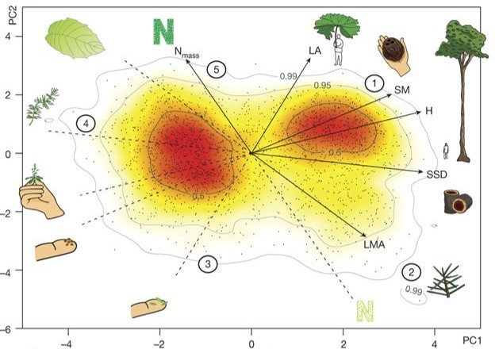

## How do we view plants in the real world?

 

## Are plants as advanced (> or =) as humans?

 

## Plants pull all of this off while...

 

## Plants as sessile organisms

 
 
 
 

* **Mostly defined by their total inability to move**

 

* **Is this a good thing or a bad thing?**

 

* *Their Darwinian struggle for growth, survival and reproduction in very different arenas has resulted in an extremely wide variety of form and function (Diaz et al 2016)*

## Themes in plant form

 
 

* **Plants gather materials to grow**
    * soil
    * atmosphere
    * materials can be limiting

  

* **Above and belowground body plan**
  
  

* **Plants exhibit _indeterminate growth_**
    * "foragers"
    * diversity of size & shape

## Diversity in plant form via uptake and structure

## Diversity in plant form via evolution

## Diversity in plant form via environment

## How do plants create such dynamic structures?

## Plants have 3 tissue systems

## Dynamic root growth integral for plant function

## Root morphology is super diverse

## Roots are a member of the the biotic soil community

## Root exudation: Who's in charge?

## Roots supply key nutrients & water to plant

 

## Vascular tissue system: Moving the good stuff

 

## Primary plant growth through meristems

 

## Cambium produce secondary growth

 

## Annual growth rings

 
 
 
 

* **Plants record what happens on the planet**

 

* **Complete cycle of seasons**
    * record atmospheric conditions

 

* **Agreement on solar storms on a global scale!**
    * Wang et al. 2017. Nature Communications
        
 
 
 
## Plant form: building the perfect plant...

 
## Sessile plants alter form to make a living

