## About Me

 

## Are plants as advanced (> or =) as humans?

 

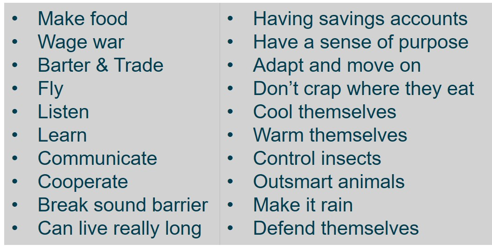

##

<iframe width="560" height="315" src="https://www.youtube.com/embed/Lzq-wRHCTKc" frameborder="0" allow="autoplay; encrypted-media" allowfullscreen></iframe>

## Wounding triggers transmission of Ca^2+^ to start systemic defense responses

 
Toyota et al. 2018. Science 361: 1112-1115.

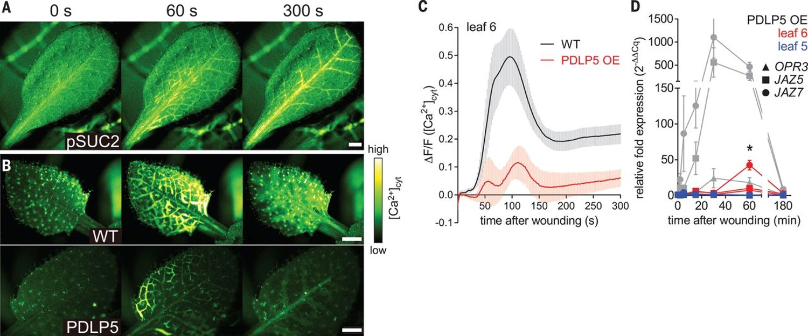

## Despite this, how to we view plants in the real world?

 

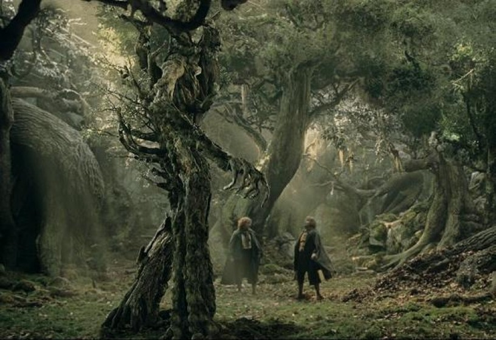

##

 
 
 

* **Plants are nearly universally defined by their total inability to move**

 

* **Is this a good thing or a bad thing?**

 

* **Humans Couldn't Exist Without Plants?**

## Themes in plant form

 

* **Plants must gather materials to grow**
      + soil
      + atmosphere
      + materials can be limiting

  

* **Above and belowground body plan**
  
  

* **Plants exhibit _indeterminate growth_**
      + "foragers"
      + amazing diversity of size & shape

## Diversity of shape exists below our feet

 
McNear Jr. et al. 2013. 4(3):1

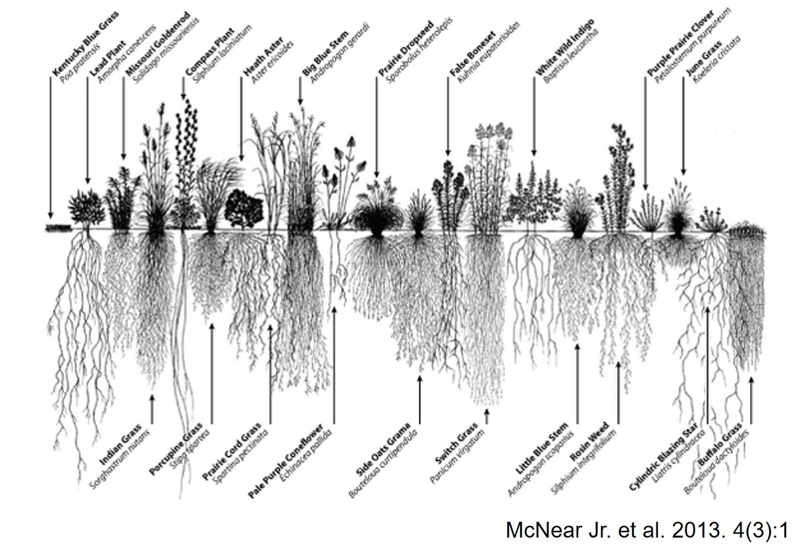

## What drives diversity in plant form?

 
 
 
 
 
 
 
 
 
 

<strong>Why/span></strong>

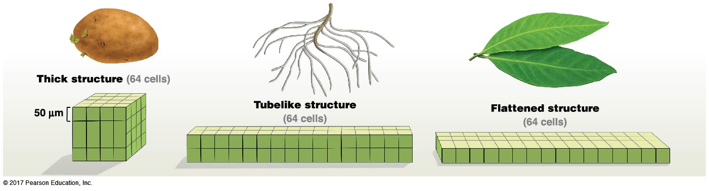

## Consider global patterns in leaf size from Wright el al. 2017...

 

## Also consider evolution...

 
Niklas et al., 1983

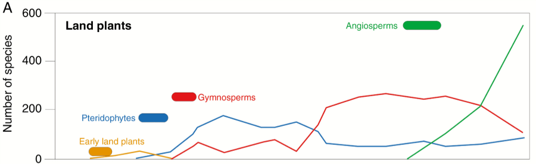

## Diversity of plant cell types form distinct tissues

 

## Complex relationships between roots and plant/ecosystem function

 
**Freschet & Roumet. 2017. Functional Ecology 31: 1506-1518**

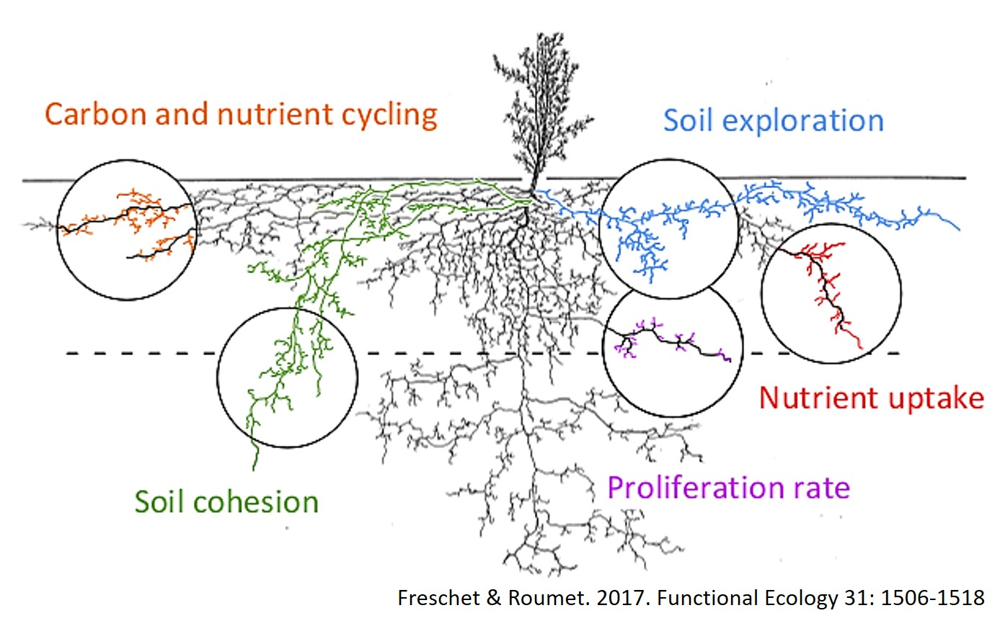

## Resonsible for supplying key nutrients & water to plant

 

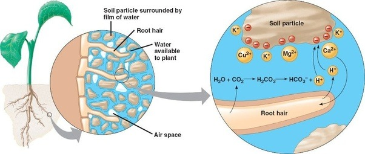

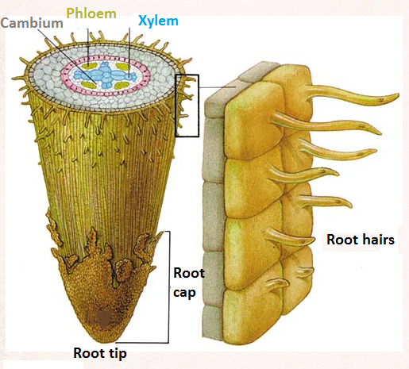

## Roots have their own super information highway

 

**way more than just ancoring trees and absorbing nutrients**
**huge surface area for absorption, warning signals of fungus/insects, release toxins

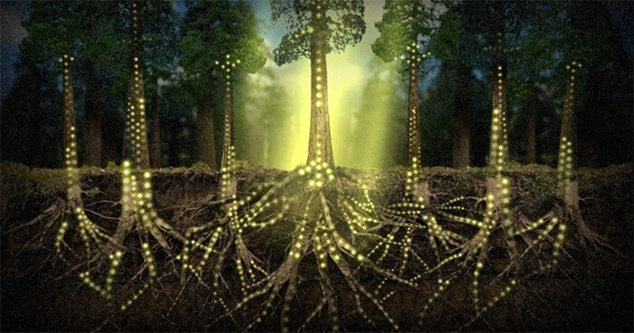

##Plant tissue systems

 
 
 

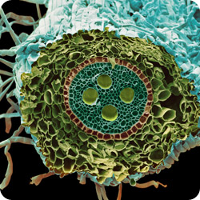

* **Protect and interact with the environment**

  

* **Make and store carbohydrates, structure**
  
  

* **Long term transport**

## Vascular tissue system: Moving the good stuff

 

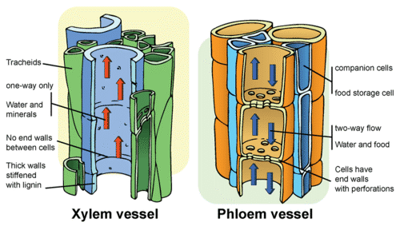

## How it works: Pressure flow model

 

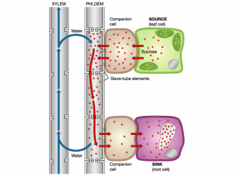

## Woody growth

 

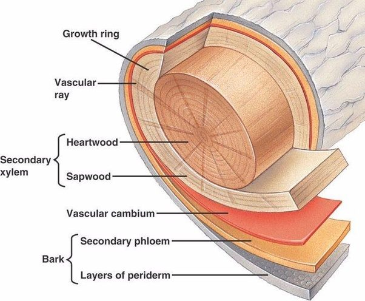

## Cambium produce secondary growth

 

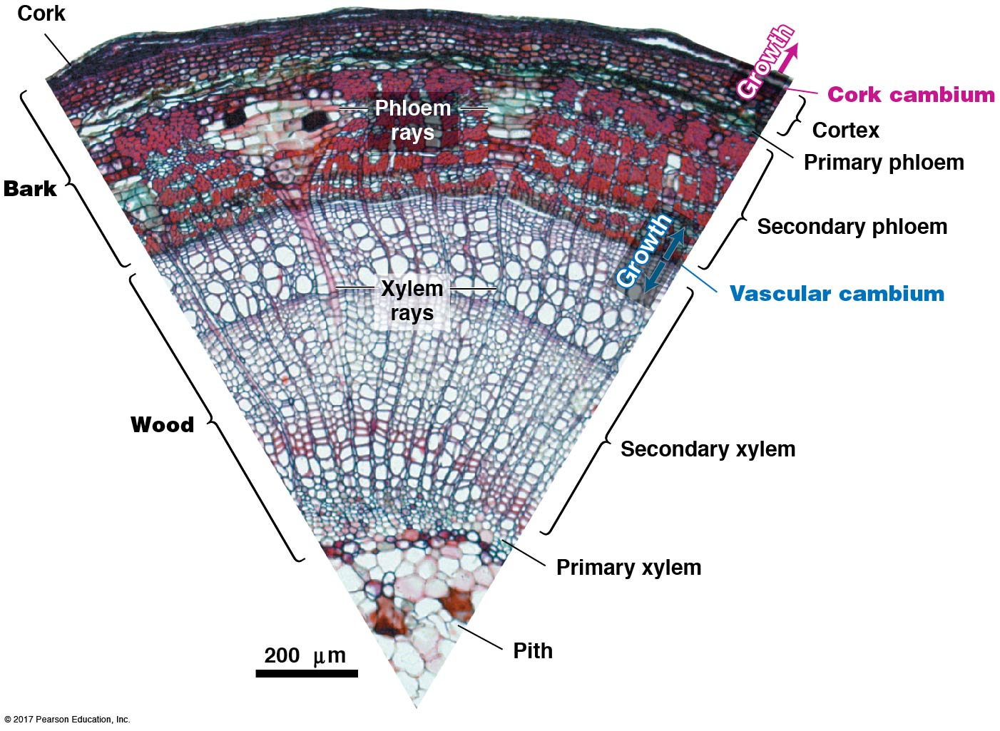

## Annual growth rings

 

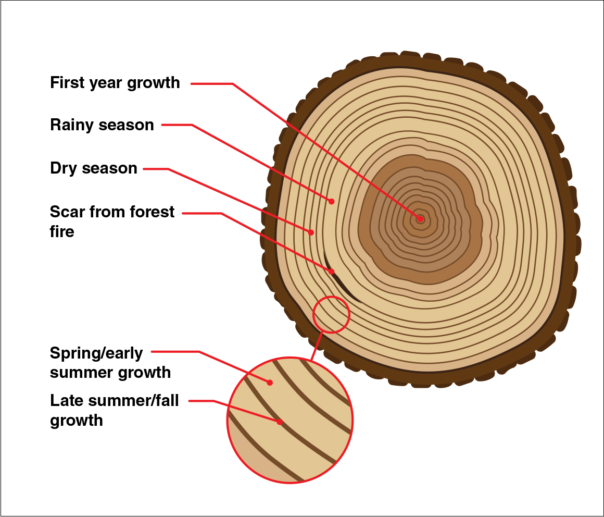

* **Year after year, plants record everything that happens on the planet**

 

* **Complete cycle of seasons: recording atmospheric conditions**

 

* **Agreement on solar storms on a global scale!!**
      + Wang et al. 2017. Nature Communications 8:1487
 
 
      
## Leaves: What drives such a large phenotypic diversity

 

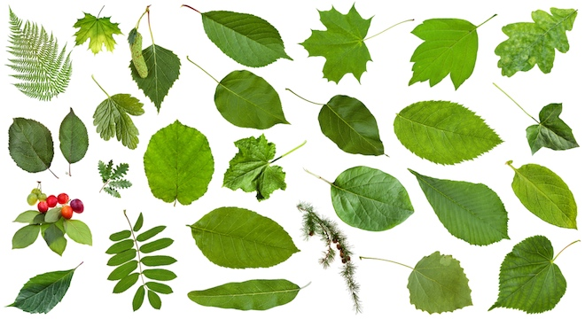

## Classic economic theory

 
 

* **Investment**
      + storage versus use of photosynthetic products

 

* **Marginal cost and revenue **
      + new leaves vs support structures 
      + law of diminishing returns
 

* **Marginal product**
      + profit of photosynthesis vs resource availability
      
 

* **Exchange ratios** 
      + balancing C gain, nutrient use & water loss
 
     
      

## Economic strategies drive leaf form and function

 

