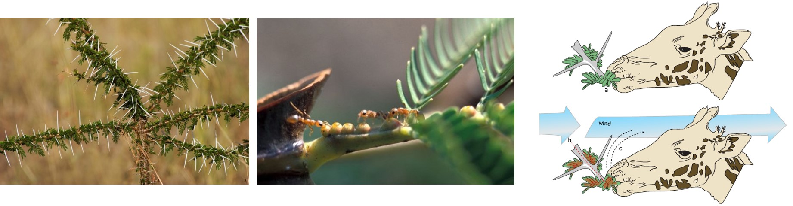
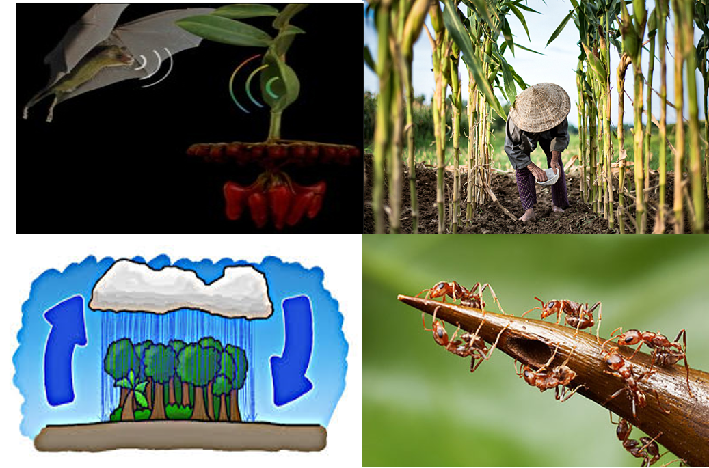
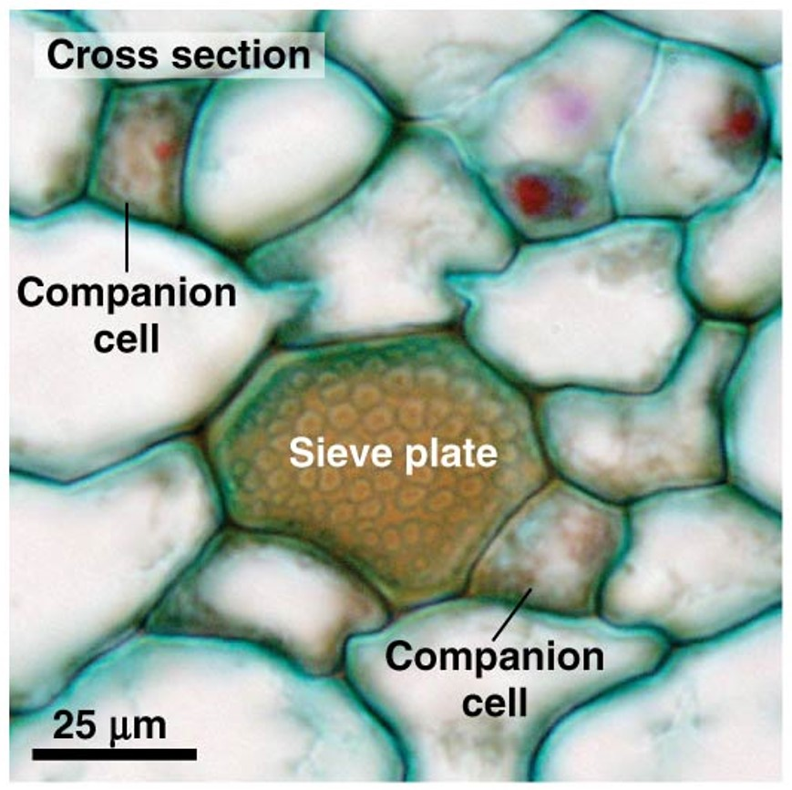

## About Me

 

## How do we view plants in the real world?

 

## Are plants as advanced (> or =) as humans?

 

## How do we view plants in the real world?

 

## Plants pull all of this off while...

 

## Plants as sessile organisms

 
 
 
 

* **Mostly defined by their total inability to move**

 

* **Is this a good thing or a bad thing?**

 

* **Their Darwinian struggle for growth, survival and reproduction in very different arenas has resulted in an extremely wide variety of form and function (Diaz et al 2016)**

## Themes in plant form

 
 

* **Plants gather materials to grow**
      + soil
      + atmosphere
      + materials can be limiting

  

* **Above and belowground body plan**
  
  

* **Plants exhibit _indeterminate growth_**
      + "foragers"
      + amazing diversity of size & shape

## Diversity in plant form via uptake

## Diversity in plant form via evolution

## Diveristy in plant form via environment

## How do plants create such dynamic structures?

##Plant tissue systems

## Roots and and plant function

## Resonsible for supplying key nutrients & water to plant

 

## Resource availability drives root diversity

## Roots have their own super information highway

## Vascular tissue system: Moving the good stuff

 

## Plant growth

 

## Cambium produce secondary growth

 

## Annual growth rings

 
 
 

* **Plants record everything that happens on the planet**

 

* **Complete cycle of seasons**
        + record atmospheric conditions

 

* **Agreement on solar storms on a global scale!**
      + Wang et al. 2017. Nature Communications 8:1487
 
 
 
## Why do plants look so different?

      
## Classic economic theory applied to plants

* **Investment**
      + storage versus use of photosynthetic products

 

* **Marginal cost and revenue **
      + new leaves vs support structures 
      + law of diminishing returns
      
 

* **Marginal product**
      + profit of photosynthesis vs resource availability
      
 

* **Exchange ratios** 
      + balancing C gain, nutrient use & water loss
 
     
      

## Economic strategies drive leaf form and function

 

