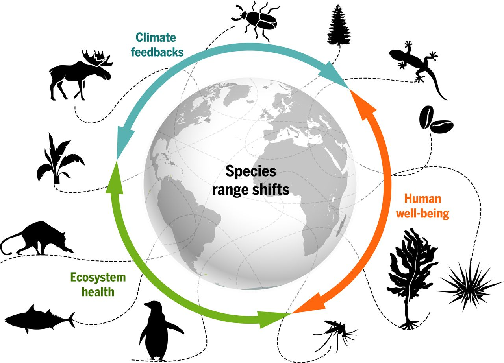
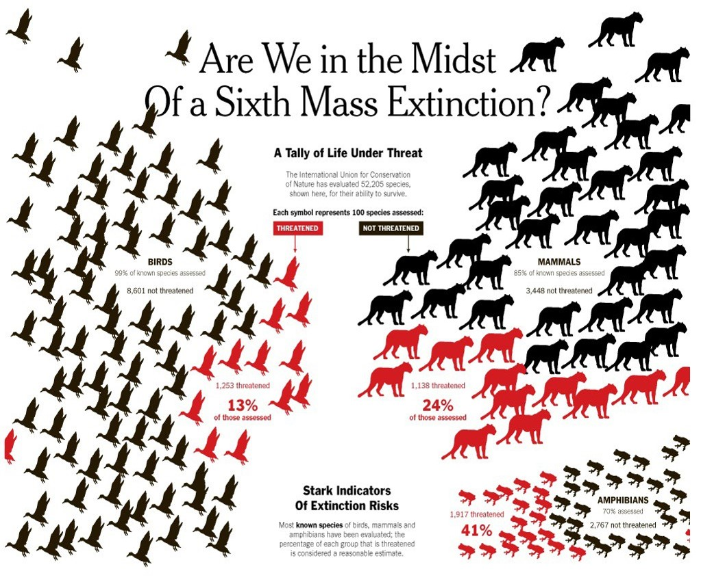

## 

## 

## Biodiversity as insurance

**Diversity buffers against functional changes**

**No one species fills all the roles of an ecosystem**

## Measuring biodiversity (richness and eveness)

  
<!--  -->

## Species diversity declines from tropics and from high elevation

## Species diversity is also a balance

## Species types

## Exotic vs Invasive

## Species Richness: Fish

## Endemics birds in the Andes

## Endemic species of Madagascar

## Biodiversity hotspots: species

## Mapping biodiversity: Plants

## Mapping biodiversity: Oceans

## Mapping biodiversity: Soils

## Threats to biodiversity

 
 
 

* **Species Loss**
    + Extinction

 

*  **Population Loss**
  + Loss of Genetic Variation
  
   
 
* **Habitat Loss**
  

## 

## Invasice species are increasing

 
 
 
 
 

* **Change physical and biotic environment**

 

* **Aquatic ecosystems heavily affected**

 

* **Impacts outweigh natural extinction rates**
 

##

## Hot Topic: Homogenization

 

* **Replacement of native species by exotics**
    + ecosystems lose their uniqueness 

 

* **Taxonomic homogenization: increased similarity of species** 
      + plants, insect, fish, birds & mammals

 

* **Biotic homogenization tied to humans**
    + landscape simplification
    + habitat loss
    + competition and hybridization with invasives

## Homogenization: USA?

## Biodiversity in a changing world

## Historical: Megafauna Extinction

## Historical: Are we experiencing a new mass extinction?

 

##

##

## Island biogeography (Wilson and MacArthur 1967)

## Island biogeography extended

