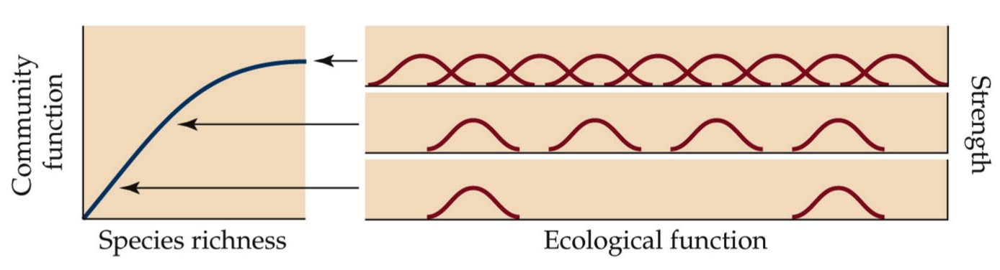
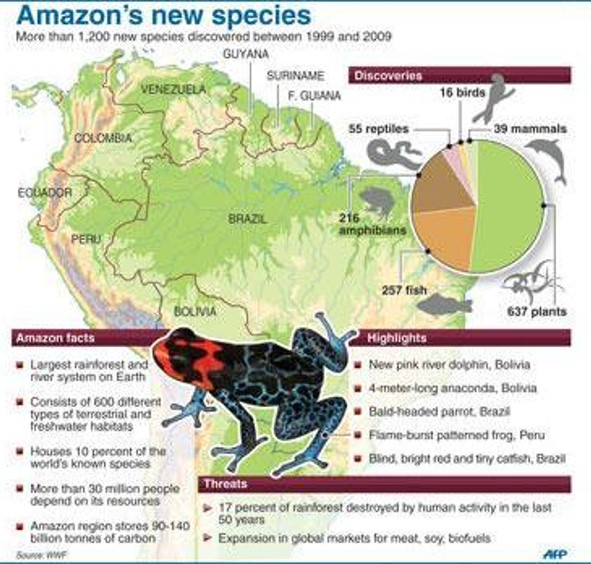

## 

## 

## Biodiversity as insurance

**Diversity buffers against functional changes**

**No one species fills all the roles of an ecosystem**

## Genetic diversity bottlenecked for bees

## Measuring biodiversity (richness and eveness)

  
<!--  -->

## Species diversity is also a balance

## Species types

## Exotic vs Invasive

## Endemic freshwater fish in the USA

## Invasive carp in the USA

##  

## Species diversity declines from tropics

## Species diversity declines at altitude

## Ecoregions: Where hotspots exists

## Hotspots: Andean uplift and bird diversity

## Hotspots: Endemic species of Madagascar

## Mapping biodiversity: Soils

## Mapping biodiversity: Oceans

<!-- ## Biodiversity hotspots: species -->
<!-- 
 -->

<!-- 

<!-- ## Mapping biodiversity: Plants -->
<!-- 
 -->

<!-- 

<!-- ## Mapping biodiversity: Animals -->

<!--  -->

## Threats to biodiversity

## 

## Invasive species are increasing

 
 
 
 

* **Change physical and biotic environment**

 
 

* **Aquatic ecosystems heavily affected**

 
 

* **Impacts outweigh natural extinction rates**
 

<!-- ## -->

<!--  -->

<!-- ## Homogenization -->
<!-- 
 -->
<!--   -->

<!-- 
 -->

<!-- * **Replacement of native species by exotics** -->
<!--     + ecosystems lose their uniqueness  -->

<!--   -->

<!-- * **Taxonomic homogenization** -->
<!--       + increased similarity of species -->
<!--       + plants, insect, fish, birds & mammals -->

<!--   -->

<!-- * **Biotic homogenization tied to humans** -->
<!--     + landscape simplification -->
<!--     + habitat loss -->
<!--     + invasives are highly competitive -->

<!-- 
 -->

<!--  -->

<!-- ## Homogenization: USA? -->
<!-- 
 -->
<!--  -->

<!-- ## Biodiversity in a changing world -->
<!-- 
 -->

<!--  -->

<!-- ## Historical: Megafauna Extinction -->
<!-- 
 -->

<!--  -->

<!--  -->

<!-- ## -->

<!--  -->

<!-- ## Historical: Are we experiencing a new mass extinction? -->
<!-- 
 -->

<!--   -->

<!-- ## Extinction versus humans -->
<!-- 
 -->

<!--  -->

<!-- ## Ecoregions versus humans -->
<!-- 
 -->

<!--  -->

<!-- ## -->
<!--  -->

<!-- ## -->
<!--  -->

<!-- ## Island biogeography (Wilson and MacArthur 1967) -->
<!-- 
 -->

<!--  -->

<!-- ## Island biogeography extended -->
<!-- 
 -->

<!--  -->

<!--  -->