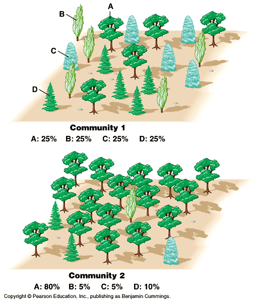
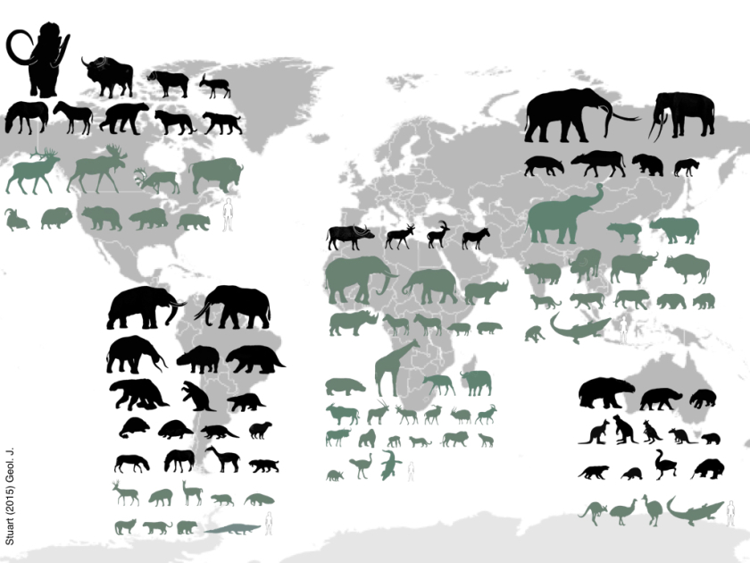

## What is Species Diversity?

 
 

* **# of different species that are represented in a given community**

 

* **3 components**
    + richness = simple count of species
    + evenness = how equal the abundances of the species are
    + taxonomic or phylogenetic diversity

 

* **Gradient ranging from low at the poles to high at the equator**
    + terrestrial and oceans(?)

##

## Keystone species

  + loss of dominant species hurts more
  + keystone species: ecologically distinct
  
## Biodiversity hotspots

## Mapping biodiversity: Plants

## Mapping biodiversity: Animals

## Mapping biodiversity: Oceans?

## Threats to biodiversity

## Hitorical species diversity: Megafauna Extinction

 
 

* **Large herbivores and carnivores declined since the Late Pleistocene**
      + land and oceans
      + human induced effects

 

* **Do megafana impact ecological systems?**
    + consumption and digestion releases methane
    + trampling or browsing alters vegetation: albedo/water cycles 

## Diversity as Insurance

 
 
 

* **Diversity buffers against functional changes**
    + ecosystem stability maintained
    + protects against drastic change to extreme events

 
    
* **6^th^ major extinction event**
      + 100-fold greater than pre-human
      + biologically driven
      + loss of species is irreversible

 
 

##

##
