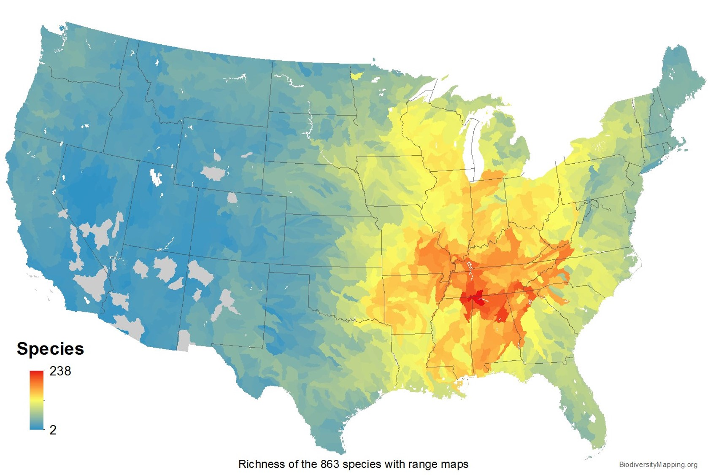
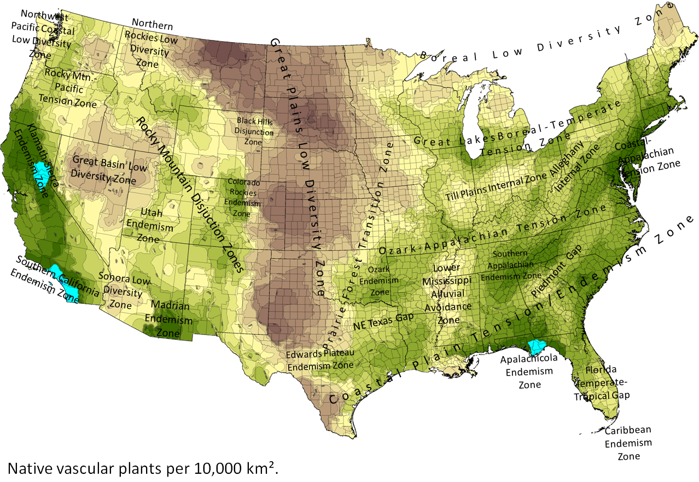
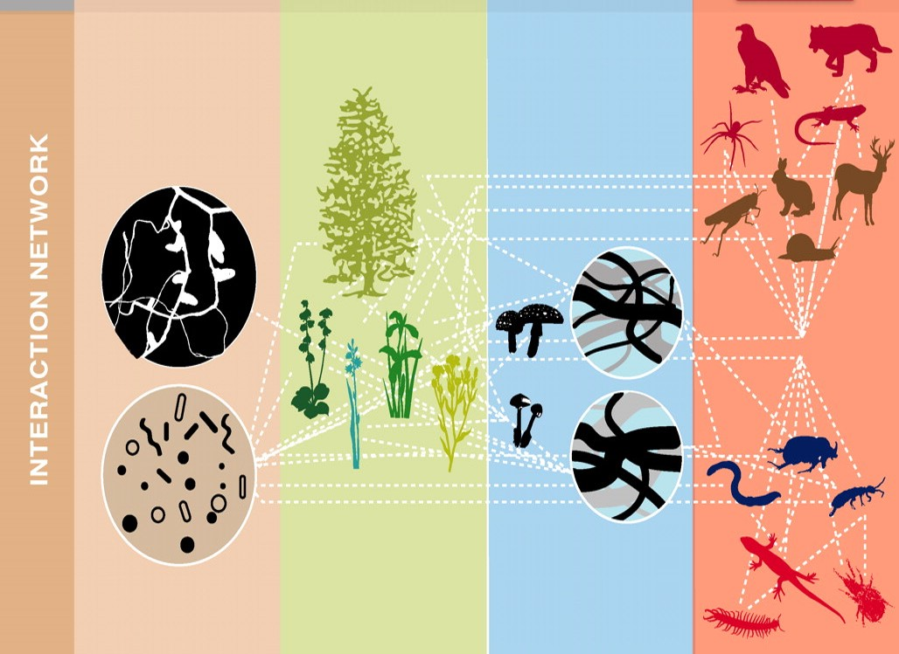
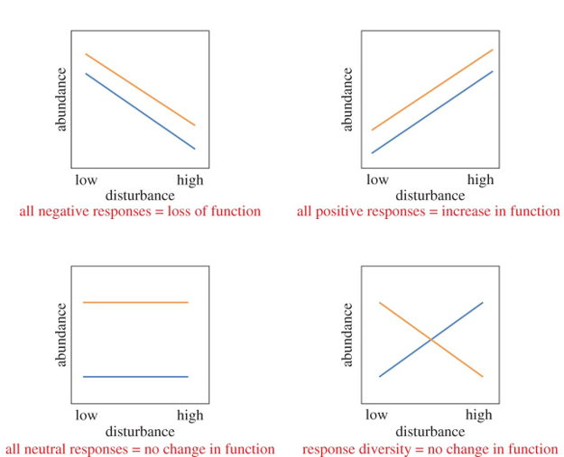

## 

## 

## Theories of Biodiversity (Equilibrium)

## No one species fills all the roles of an ecosystem

## Species diversity genearlly declines from tropics and from high elevation

## Biodivesity is always changing

## How and Why do we measure biodiversity (on board)- what scale?

  + richness = simple count of species
  + evenness = how equal the abundances of the species are
  

    

## Species types

## Native species

## Endemics fish

## Endemics birds

## Endemics species of Madagascar

## Keystone species

  + loss of dominant species hurts more
  + keystone species: ecologically distinct
  
## Biodiversity hotspots: species

## Mapping biodiversity: Plants

## Mapping biodiversity: Oceans?

## Mapping biodiversity: Soils?

## Threats to biodiversity

Species Loss (Extinction)
Population Loss (Loss of Genetic Variation)
Habitat Loss

##

##

## Hot Topic: Invasives

 
 

* **Exotic species can change physical and biotic environment**
    + alter native species communities

 

* **Aquatic ecosystems have been heavily affected**
    + accidental & intentional

 

* **Impacts of invasives outweigh natural extinction rates**
 

## Humans & Invasive Species

## Hot Topic: Homogenization

 

* **Replacement of native species by exotics**
    + ecosystems lose their uniqueness 

 

* **Taxonomic homogenization: increased similarity of species** 
      + plants, insect, fish, birds & mammals

 

* **Biotic homogenization tied to humans**
    + landscape simplification
    + habitat loss
    + competition and hybridization with invasives

## Homogenization: USA?

## Species Effects: Trophic Levels

 

* **Several hierarchical levels in an ecosystem**
      + organisms that share the same function in the food chain

 

* **No single species performs all functional roles within a trophic level**
* Biodiversity is important for ecosysem functioning**
* ecosystems work better as a group than an indivdiual

## Species Effects: Disturbance

 
 

* **Organisms can alter disturbance regimes**
    + impact colonization and species interactions
    + cheat grass promotes fire

 

* **Ecosystem engineers create or modify habitats**
    + physical disturbance alters succession
    + trampling affects vegetation/nutrients
    + plants and flammability (resins)
    + dune plants and soil stability

##

## Response Functional Types

 

* **Species occur together because they can survive, compete and reproduce in the environment the co-occur**
    + not all perfectly adapted
    + networks of trophic interactions

 

* **Species differences in respones broaden ecosystem function**
    + larger threshold of environmental conditions
    + fosters ecosystem resilience
 
   
        
  
    

## Response Diversity

 
 

* **Diversity impactst ecosystem resouce use**
      + Leaching ↓ in more diverse grasslands
      + High diversity may lead to ↑ nutrient use
    
 

* **Complementary patterns of resouce use**
      + grasslands with C~3~ and C~4~ species
      + summer vs winter rains in deserts

 

* **Diverse ecosystems are not always more productive**
    + plantations vs mixed-forests
    + ecosystem processes may saturate

 
 

## Biodiversity in a changing world

## Hitorical species diversity: Megafauna Extinction

 
 

* **Large herbivores and carnivores declined since the Late Pleistocene**
      + land and oceans
      + human induced effects

 

* **Do megafana impact ecological systems?**
    + consumption and digestion releases methane
    + trampling or browsing alters vegetation: albedo/water cycles 

## Diversity as Insurance

 
 
 

* **Diversity buffers against functional changes**
    + ecosystem stability maintained
    + protects against drastic change to extreme events

 
    
* **6^th^ major extinction event**
      + 100-fold greater than pre-human
      + biologically driven
      + loss of species is irreversible

 
 

##

##

