## Species Composition of the Biospere

 

* **Intricate webs of interacting organisms**
    + 2,000,000 species are known 
    + 18,000 plants and animals discovered per year
    + estimated 87% of Eukaryotas unknown

 

* **Reflects billions of ways organisms have adapted, over and over, to a changing planet**

 

* **Humans have altered 75% of ice-free surface**
    + alters species composition
 

 
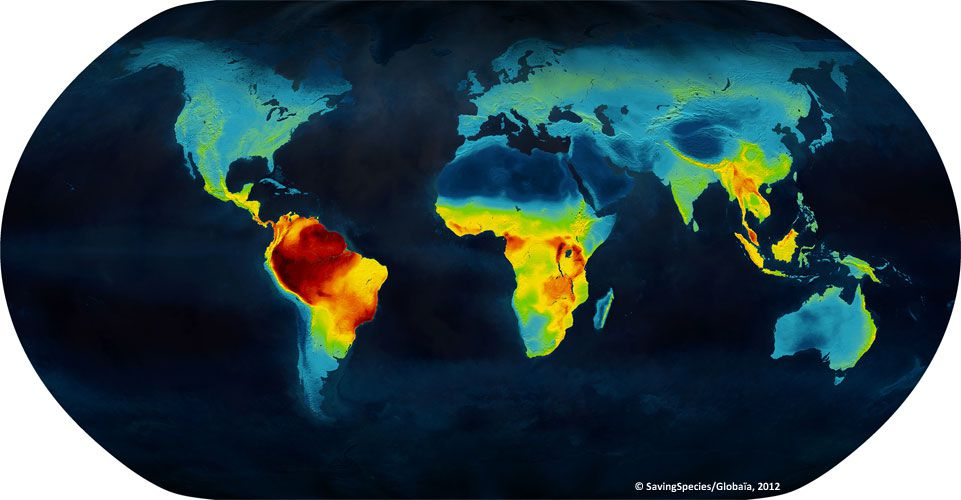

## "Lines of the geography of plants” by Alexander von Humboldt, 1817

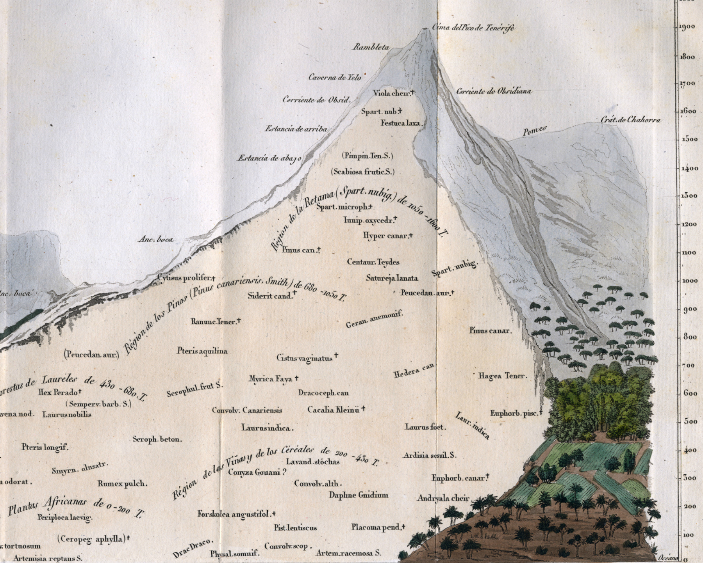

## 

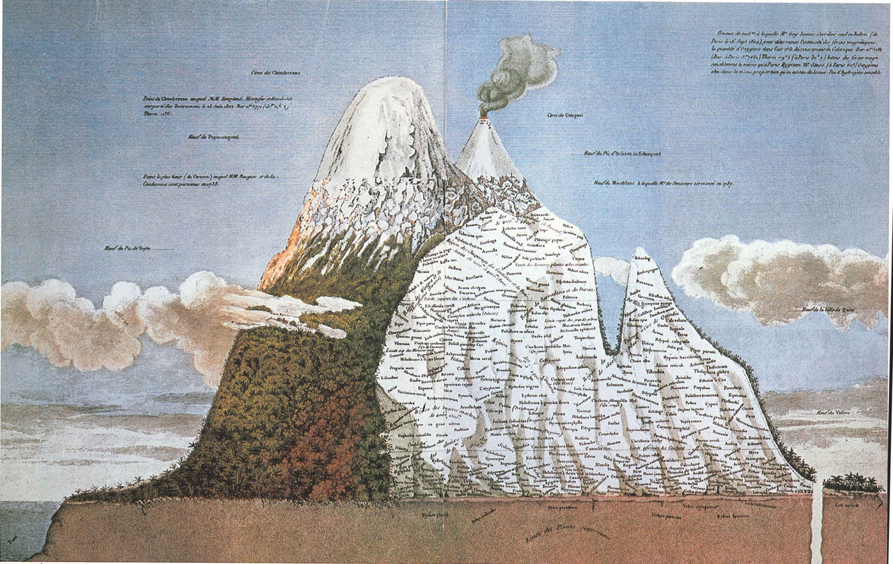

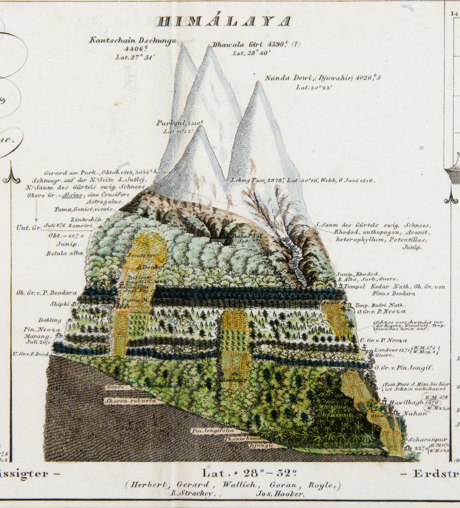

## Species are spatially arranged

## Climate drives broad distribution of biomes

## Species distribution varies within and among biomes

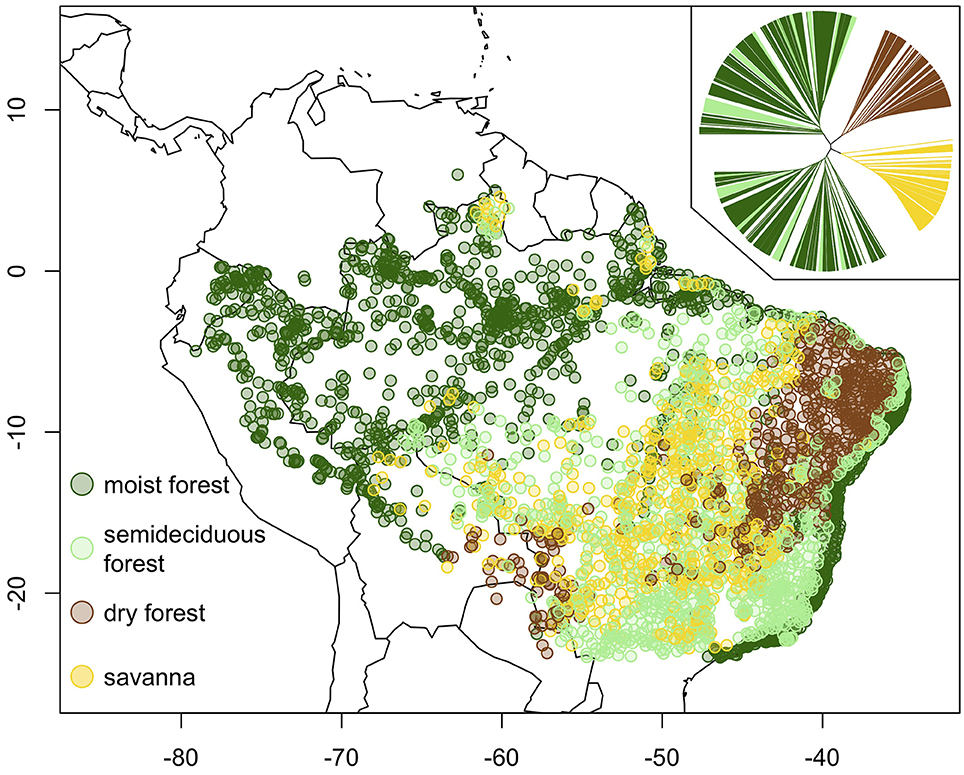

## Species distribution depends on climate + soils

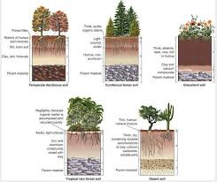

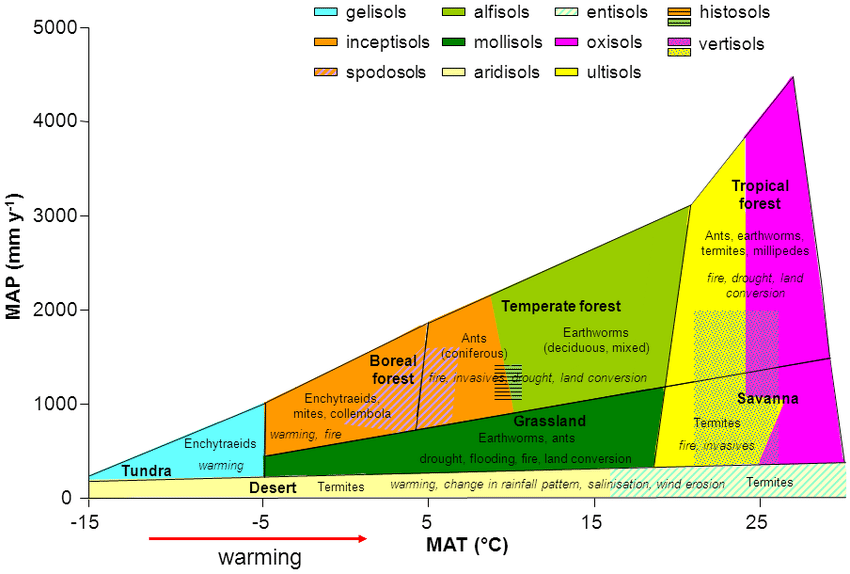

## Seasonal patterns in distribution

## Species distribution likely depends on humans

## Distribution within biological communities

## Species distributions are related to their niche space

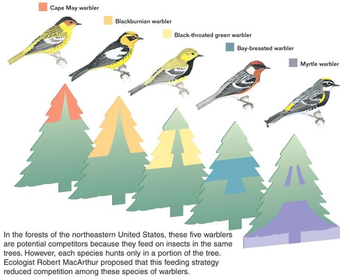

## Niches define the limiting factors for a species

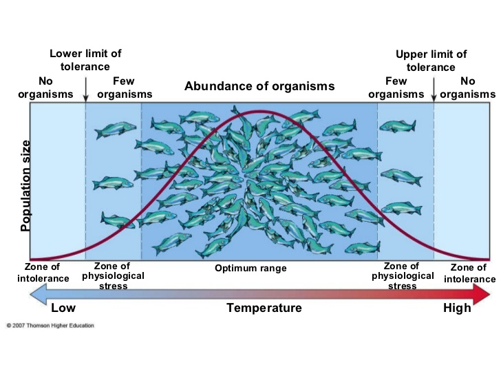

##

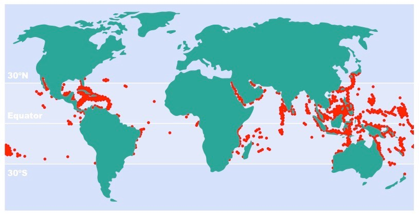

## Ranges versus distributions

## Species ranges: animals

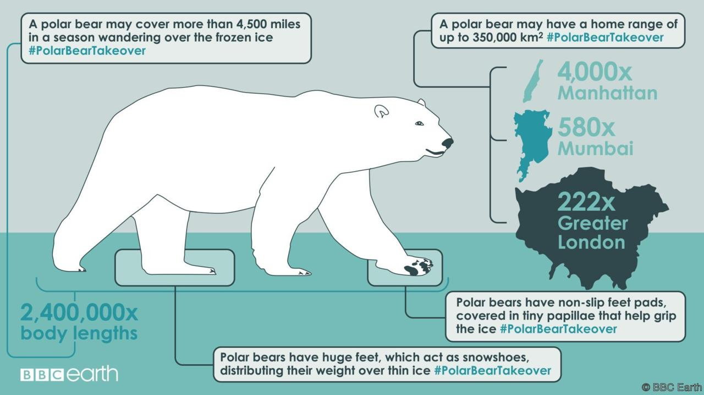

## Species ranges: plants

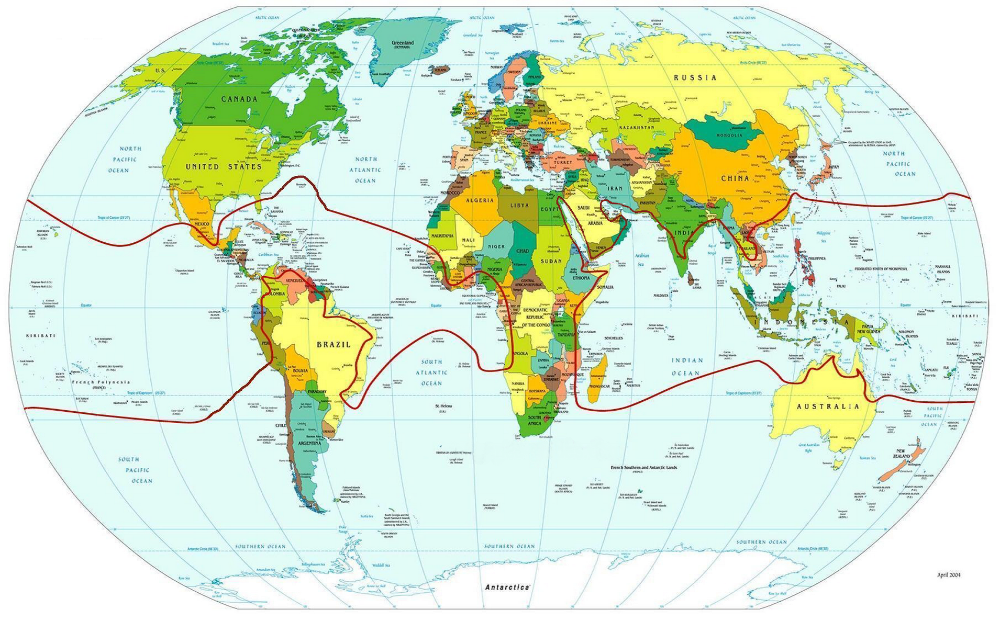

## Species ranges: plants

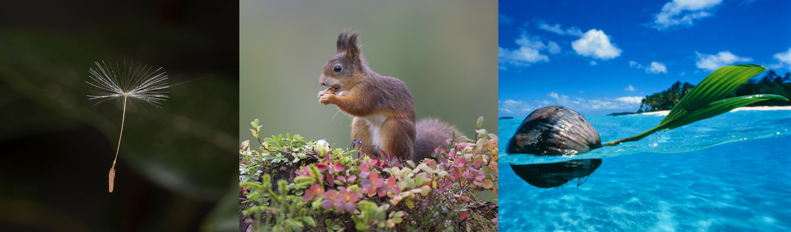

## Can we predict species distributions?

 

## Predicting aids in conservation: salamander

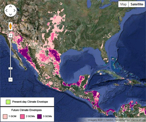 

## Global change: climate refugia (Polar bear)

## Global change: range shifts

## Global change: range expansion

