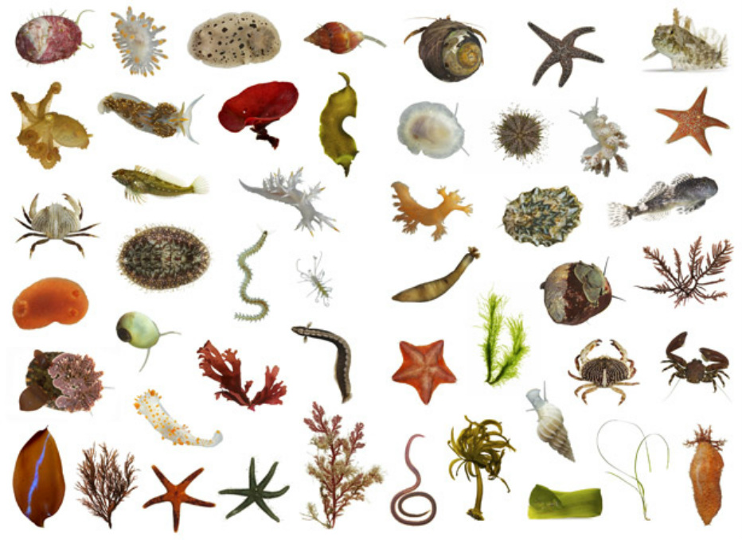
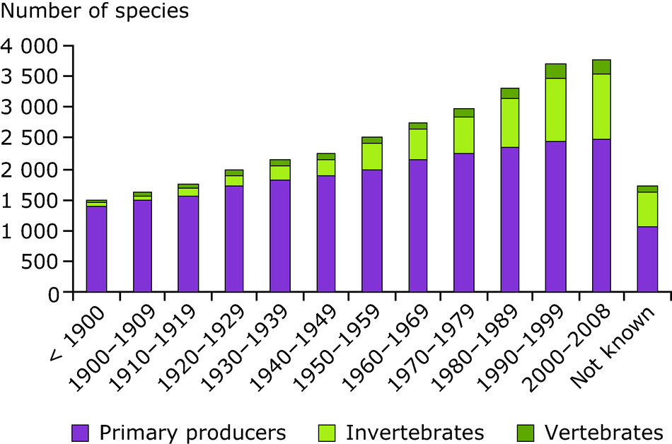
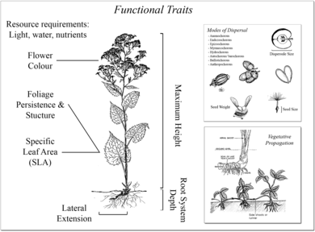
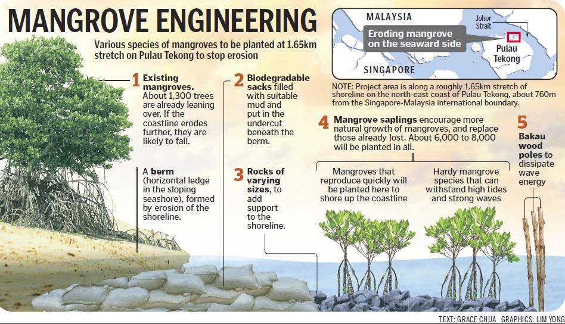

## Species Composition of the Biospere

 

* **Intricate webs of interacting organisms**
    + 2,000,000 species are known 
    + 18,000 plants and animals discovered per year
    + estimated 87% of Eukaryotas unknown

 

* **Reflects billions of ways organisms have adapted, over and over, to a changing planet**

 

* **Humans have altered 75% of ice-free surface**
    + alters species composition
 

 

    
## Biological communities

    
## Hot Topic: Invasives

 
 

* **Exotic species can change physical and biotic environment**
    + alter native species communities

 

* **Aquatic ecosystems have been heavily affected**
    + accidental & intentional

 

* **Impacts of invasives outweigh natural extinction rates**
 

## Humans & Invasive Species

## Hot Topic: Homogenization

 

* **Replacement of native species by exotics**
    + ecosystems lose their uniqueness 

 

* **Taxonomic homogenization: increased similarity of species** 
      + plants, insect, fish, birds & mammals

 

* **Biotic homogenization tied to humans**
    + landscape simplification
    + habitat loss
    + competition and hybridization with invasives

## Homogenization: USA?

## Species in a community interact constantly

## Bird Networks in the Amazon (complexity)

## Species interact in different ways

competition, predation, defense mechanism, symbiotic relationship, parasitic relationship, consumption

## Species relationships may have benefits/costs

## Competition lowers the fitness of both individuals

## Competition explains species niches

## Competition among barnacles

## Warblers: competition avoidance

## Consumption: Herbiory, Predation and Parasitism

## Predator-Prey: Isle Royale

## Consumption leads to Defenses: Plants

## Consumption leads to Defenses: Animals

## Consumption is an agent of natural selection

## Mutualisms

## Species Effects: Trophic Levels

 

* **Several hierarchical levels in an ecosystem**
      + organisms that share the same function in the food chain

 

* **No single species performs all functional roles within a trophic level**
* Biodiversity is important for ecosysem functioning**
* ecosystems work better as a group than an indivdiual

## Functional Traits

## 

## Functional Traits: Ecosystems

 

## Trait Based Ecology

 
 
 

* **Way to link population processes with the underlying environmental gradients or competitive interactions**
    + dictate which species persist together
    
 
 

* **Traits provide a mechanistic basis for how ecosystems function**
      + provide services that they deliver to humanity

## Functional Types

<strong>Groups of species that are "ecologically similar"</strong>

  
 
 

* **Respones Functional Types**
    + C~4~ grasses
    + fire-adapted species
    
 

* **Effect Functional Types**
    + nitrifying bacteria
    + termites

## Species Effects: Biogeochemisty

 

* **Traits that affect nutrient supply have large ecosystem effects**
    + *Morella faya*: N fixing tree in Hawaii
    + Deep-rooted species: *Eucalyptus*
    + Salmon: nutrient transfer

 

* **Soil fertility related to species litter quality**
    + decomposition rates +/-

 

* **Species composition of lakes**
    + filter rates of Zebra mussels
    

## Species Effects: Climate

 
 

* **Micro-climate**
    + boreal mosses insulate soil in summer
    + 'nurse plants' shade baby cacti

 

* **Energy exchange**
    + plant height/density = surface roughness
    + conifers = low albedo
    + overgrazing ↑ albedo
    

## Desertification of Fertile Cresent

## Species Effects: Trophic Interactions

 
 
 

* **Top-down controls: removal of top predators**
    + otters : urchins : kelp
    + over-fishing : urchins : killer whales
    + wolves : elk : vegetation
    + elephants : savannas : forests

 

* **Large impact on lower trophic levels**
    + usually through nutrient cycling

## Species Effects: Disturbance

 
 

* **Organisms can alter disturbance regimes**
    + impact colonization and species interactions
    + cheat grass promotes fire

 

* **Ecosystem engineers create or modify habitats**
    + physical disturbance alters succession
    + trampling affects vegetation/nutrients
    + plants and flammability (resins)
    + dune plants and soil stability

##

## Response Functional Types

 

* **Species occur together because they can survive, compete and reproduce in the environment the co-occur**
    + not all perfectly adapted
    + networks of trophic interactions

 

* **Species differences in respones broaden ecosystem function**
    + larger threshold of environmental conditions
    + fosters ecosystem resilience
 
   
        
  
    
## Bird Networks in the Amazon

## Response Diversity

 
 

* **Diversity impactst ecosystem resouce use**
      + Leaching ↓ in more diverse grasslands
      + High diversity may lead to ↑ nutrient use
    
 

* **Complementary patterns of resouce use**
      + grasslands with C~3~ and C~4~ species
      + summer vs winter rains in deserts

 

* **Diverse ecosystems are not always more productive**
    + plantations vs mixed-forests
    + ecosystem processes may saturate

 
 

## Functional Matrix of Traits

 
 
 

* **Organisms affect ecosystems through multiple traits**
    + traits vary independently
    + eg. many traits affect N cycling

 

* **Each trait can be treated as a continuous variable**
    + each species has a value for that trait

 

## Functional Matrix of Traits

 
 

* **Useful for restoration**
    + species choice can shape ecosystem trajectory
    + multiple traits needed 
    + species interactions determine success

 

* **Trade-offs exist**
    + fast growing species (erosion) susceptible to drought
    + limit trait combinations

 
 

## Linking Environmental Variability with Traits

 
 

* **Traits in an ecosystem are packaged into distinct species**
    + each has a set of 'effects' and 'responses'
    + ecosystems are sensitive when 'packages' are linked

 

* **Species with traits for high N absorption**
    + high photosynthesis and growth
    + rapidly decomposing litter
    + **high sensitivity** to nutrient supply

 

## Species Interactions and Ecosystem Processes

 

* **Interactions among species govern which traits are expressed**
      + modify pathways of energy and material flow
      + mutualisms, competition, predation, etc

 

* **Species effects are often indirect**
    + single pollinator has a small direct effect
    + legumes + C~4~ plants = soil C ↑
    + litter quality in a mixed forest

 

* **Species presence or absense can predict ecosystem functions**

## Complementary Hypothesis

## Redundancy Hypothesis

## Driver and Passenger Hypothesis

