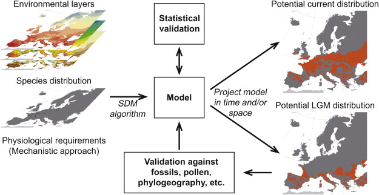
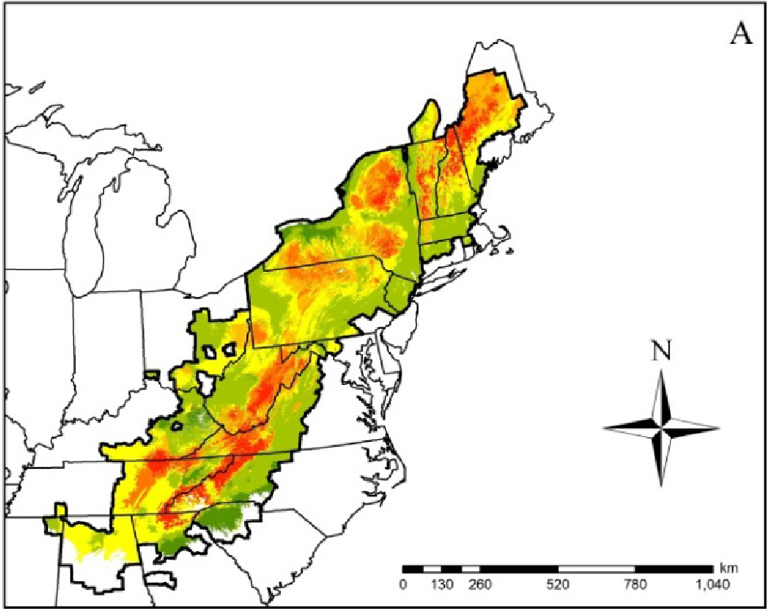
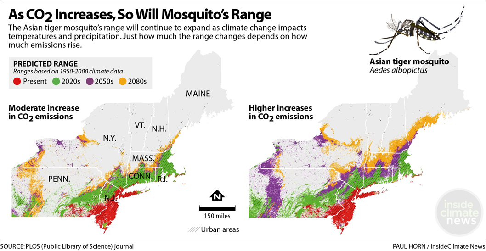

## Species Composition of the Biospere

 

* **Intricate webs of interacting organisms**
    + 2,000,000 species are known 
    + 18,000 plants and animals discovered per year
    + estimated 87% of Eukaryotas unknown

 

* **Reflects billions of ways organisms have adapted, over and over, to a changing planet**

 

* **Humans have altered 75% of ice-free surface**
    + alters species composition
 

 

## Many factors affect species distributions

    
## Biological communities

## Species in a community interact constantly

## Species interact in different ways

## So species distributions are largely related to their niche space

## Niches define the limiting factors for a species

## What factors limit species distributions

## Distibution patterns:

climatic factors consist of sunlight, atmosphere, humidity, temperature, and salinity;
edaphic factors are abiotic factors regarding soil, such as the coarseness of soil, local geology, soil pH, and aeration; and
social factors include land use and water availability.

biotic vs abiotic

 change by season, distribution by humans, in response to the availability of resources
 
## Species ranges: animals

## Species ranges: plants

## Actual species distributions are scattered

## Native species

## Endemics species

## Endemics species of Madagascar

## Historical drivers: Glacia refugia

## Can we predict species distributions
 

disturbance, dispersal and population dynamics. Based on factors of dispersal, disturbance, resources limiting climate, and other species distribution, predictions of species distribution can create a bio-climate range, or bio-climate envelope. 

## Predicting aids in conservations

 

## Species ranges: climate change 

## Species ranges: climate change 

## Species ranges: climate change 

