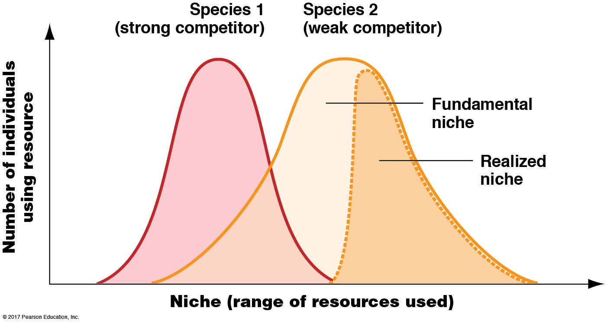
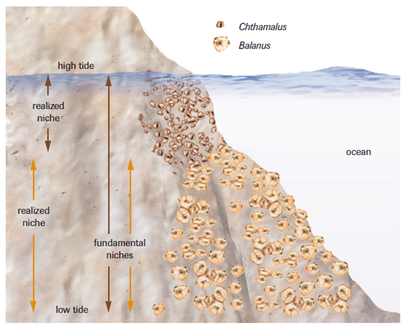
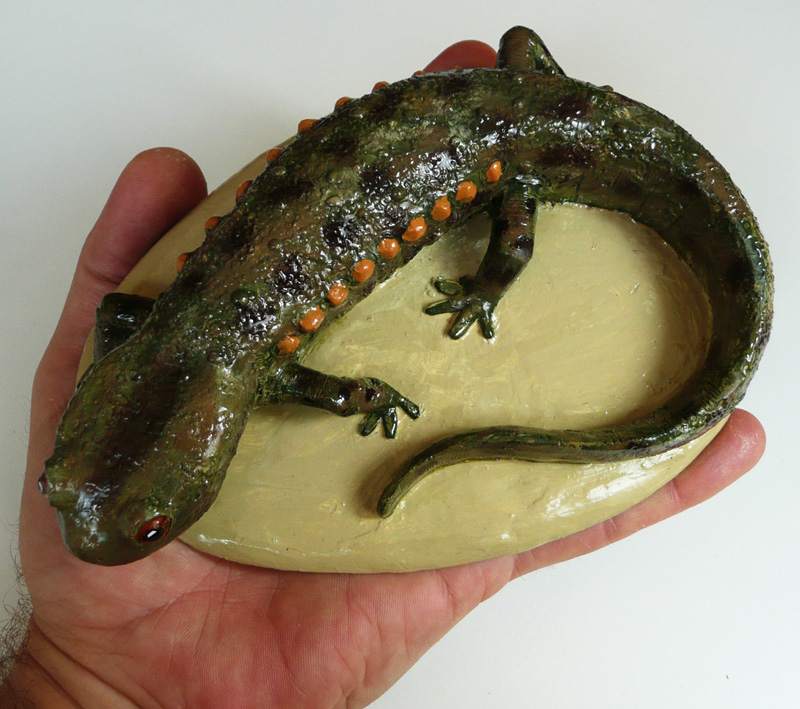

## Species in a community interact constantly

## Species interact in different ways

## Bird Networks in the Amazon (complexity)

## Species relationships may have benefits/costs

## Competition lowers the fitness of both individuals

## Competition explains species niches

## Competition among barnacles

## Warblers: competition avoidance

## Consumption: Herbiory, Predation and Parasitism

## Predator-Prey: Isle Royale

## Consumption leads to Defenses: Plants

## Consumption leads to Defenses: Animals

## Consumption is an agent of natural selection

## Mutualisms

