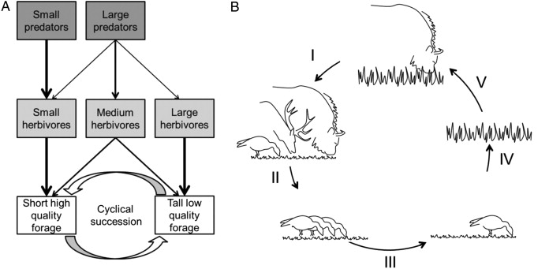

```{r setup, include=FALSE}
knitr::opts_chunk$set(echo = FALSE)
```

## Trophic Dynamics
<hr>


## Trophic Casacdes
<hr>


## Consumers
<hr>


## Levels
<hr>


## Species Effects: Trophic Interactions
<hr>
<br/>
<br/>
<br/>

<div style="float: left; width: 50%;">

* **Top-down controls: removal of top predators**
    + otters : urchins : kelp
    + over-fishing : urchins : killer whales
    + wolves : elk : vegetation
    + elephants : savannas : forests

<br/>

* **Large impact on lower trophic levels**
    + usually through nutrient cycling
</div>


## DDT case study
<hr>

## other case study
<hr>


## NPP
<hr>


## Most productive systems ?
<hr>

