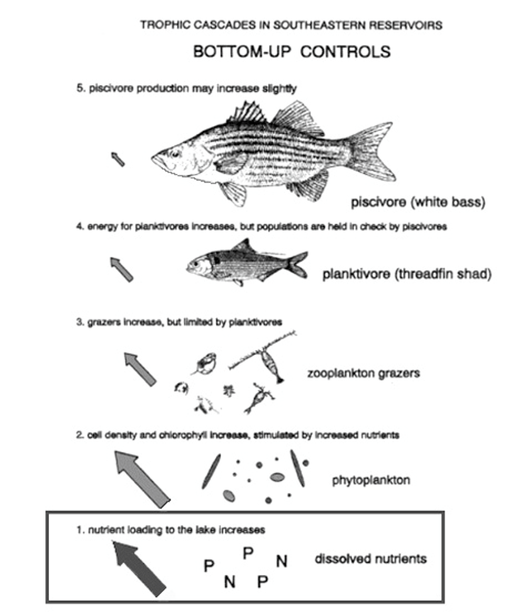
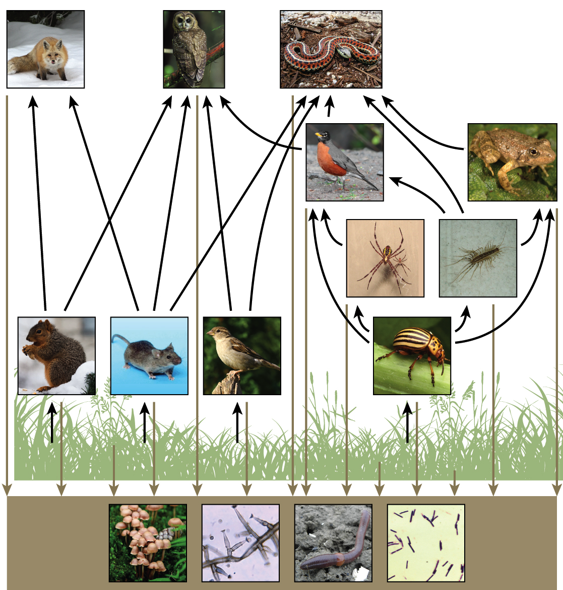

```{r setup, include=FALSE}
knitr::opts_chunk$set(echo = FALSE)
```

## Community Structure 
<hr>


## Diversive communities broaden ecosystem function
<hr>
<br/>

<div style="float: left; width: 45%;">

* **Species occur together**
    + not all perfectly adapted
    + networks of trophic interactions
    + ecosystems work better as a group

<br/>

* **Ecosystems work better as a group**
    + No single species performs all roles
    + larger threshold of environmental conditions
    + fosters ecosystem resilience
 </div>   
        
 

##


<div class="item-absolute">Communites help build resilient ecosystems</div>
</div>

## Interaction networks: Amazon birds
<hr>


##


## Not all species are created equal
<hr>


  
## Reintroduction of wolves in Yellowstone: Top down control
<hr>


##


## Bottom up control: Resources matter
<hr>



## Hierarchical levels in an community: Food webs
<hr>



## Breaking down food webs
<hr>


## Trophic Casacdes: 10% Rule
<hr>


## Energy flow limits length of food chain
<hr>


## Biomagnification
<hr>


## Primary Productivity
<hr>


## Global Net Primary Production
<hr>


## 


## 


## NPP and global change
<hr>


   
